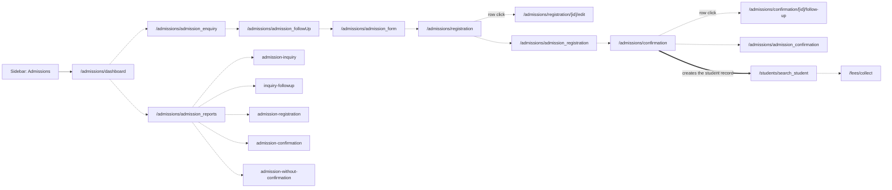
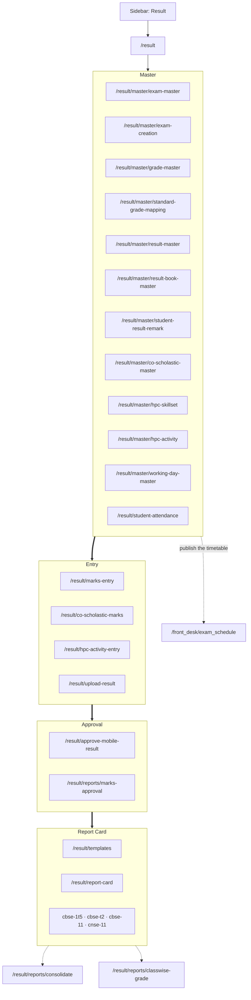
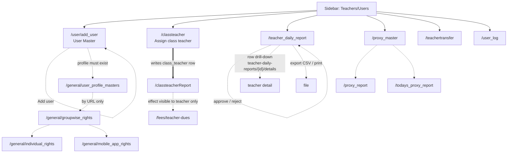

# Admin User Journey and Navigation Map

**Date:** 2026-09-14
**Scope:** Every menu an administrator can reach in the K-12 ERP / Teach Connect
product, the submenu structure beneath each, what the admin does on each screen,
and every path from one menu to another.
**Repos:** frontend `d:\lms_k12` (Next.js 15 App Router, 534 `page.tsx` route files
across 81 top-level route groups), backend `d:\next_lms_erp` (Laravel).
**Method:** direct file reads across both repos, plus a mechanical sweep (route
enumeration, `router.push`/`href` target extraction, menu-migration extraction,
guard grep). Nothing was executed; **no tenant database was queried**. Every menu,
route and guard claim below cites the file that proves it. Claims that depend on
live tenant rows are marked **unverified**.
**Sibling documents:** [teacher-user-journey.md](teacher-user-journey.md),
[student-menu-report.md](student-menu-report.md),
[menu-data-source-audit.md](menu-data-source-audit.md) (which screens render real
data versus hardcoded rows — referenced here with ⚠ rather than re-derived).

---

## 1. How admin navigation is resolved

### 1.1 The chain, which is the same for every role

**1. Login writes the session.**
[contexts/AuthContext.tsx](../contexts/AuthContext.tsx) `persistLoginPayload()`
(lines 146–190) normalises the `/api/api-login` response into a `menuContext`
object — `sub_institute_id`, `user_id`, `user_profile_name`, `user_profile_id`,
`client_id` — and writes it to `localStorage` under `menuContext`, alongside the
fuller `userData` payload. `user_profile_name` is **free text taken straight from
the backend**, not an enum. The same function runs for Google sign-in
(`loginWithGoogle`).

Note what `menuContext` does **not** carry: `is_admin`, `multi_school`. The
backend does return `multi_school` ([ApiLoginController.php:458](../../next_lms_erp/app/Http/Controllers/api/ApiLoginController.php))
but `persistLoginPayload` copies it only into the loose `userData` blob, never
into `menuContext`. This matters in §1.2.

**2. The shell asks the backend what this profile may see.**
[app/hooks/useMenuRights.ts](../app/hooks/useMenuRights.ts) reads that context
(falling back to `getStoredMenuContext()`, which tries six legacy storage keys and
**defaults a missing profile name to `'ADMIN'`**) and POSTs it to
`{API_BASE_URL}/api/menu-rights`. The request body is exactly six fields:
`type: 'API'`, `sub_institute_id`, `user_id`, `user_profile_name`,
`user_profile_id`, `client_id`. **`is_admin` is never sent.** The response carries
three keys — `level 1`, `level 2`, `level 3`.

**3. The backend is the only real filter.**
[MenuRightsController::getMenuRightsLevelWise](../../next_lms_erp/app/Http/Controllers/api/MenuRightsController.php)
joins `tblindividual_rights` (per user) and `tblgroupwise_rights` (per profile)
against `tblmenumaster`, collapses the match to a `GROUP_CONCAT` of menu ids, then
re-queries `tblmenumaster` three times for `level = 1`, `2` and `3`, filtered by
`status = 1`, `FIND_IN_SET(sub_institute_id, m.sub_institute_id)` and
`(menu_type != 'MASTER' OR menu_type IS NULL)`. A menu row with no rights row is
invisible to everybody, admins included.

**4. The rows become a tree.**
[app/data/menuMappers.ts](../app/data/menuMappers.ts) `buildMenuTree()` (line 197)
keeps only `status === 1` rows, sorts by `sort_order`, applies two global
blocklists — `HIDDEN_MENU_LINKS` (hides `student_homework_submission.index` and the
duplicate `question_paper.index`) and `EXAM_MENU_LINKS` (relabels the
`student_homework` link to "Exam") — and resolves every `link` through
[app/data/routeMapper.ts](../app/data/routeMapper.ts) `mapApiLinkToRoute()`, a
1062-line table of legacy Laravel route names to Next.js paths. **Both blocklists
apply to every profile; the frontend applies no admin-specific filtering.**

**5. The tree is rendered.**
[app/components/Sidebar.tsx](../app/components/Sidebar.tsx) draws Level 1 as an
icon rail with a **hardcoded Dashboard entry pinned above it** (lines 274–296,
`href="/dashboard"`), opens Level 2 in a portalled multi-column popup, and hands
the click to [app/components/DashboardShell.tsx](../app/components/DashboardShell.tsx)
`handleLevel2Select` (line 502). Level 3 renders as a horizontal sub-header
([app/components/Level3Subheader.tsx](../app/components/Level3Subheader.tsx)).
[app/components/HeaderMenuSearch.tsx](../app/components/HeaderMenuSearch.tsx) plus
[app/data/menuSearch.ts](../app/data/menuSearch.ts) index *that same tree*, so
search can only ever offer screens the profile already has rights to.

**6. The landing route for a Level-2 click** is decided by `handleLevel2Select`
in this order ([DashboardShell.tsx:502–557](../app/components/DashboardShell.tsx)):

| Order | Condition | Destination |
|---|---|---|
| 1 | Level 1 is the injected `enterprise-brain` node | the section's own `href`, and no master-menu fetch |
| 2 | label is `teach/learn` | `/teach-learn` |
| 3 | label is `new pal`, or the link resolves to `/pal` | `/pal/new` (query string preserved) |
| 4 | label matches [app/data/moduleDashboards.ts](../app/data/moduleDashboards.ts) | the module dashboard — `fees`/`fee` → `/fees/dashboard`, `admissions`/`admission` → `/admissions/dashboard`, `students`/`student` → `/students/dashboard`, `library` → `/library/dashboard`, `hostel` → `/hostel/dashboard`, `transportation`/`transport` → `/Transportation/dashboard` |
| 5 | otherwise | the module's **first Level-3 child** |

This interception is keyed on the **Level-2 label, lowercased** — not on the link —
so a tenant that renames its "Fees" menu row to "Fee Management" loses the
dashboard landing and drops straight to the first Level-3 screen instead.
*(Unverified: depends on tenant menu labels.)*

### 1.2 The admin-only backend branches

These four behaviours exist only on the admin path. Each is documented below with
what the code says **and** whether the Next.js client can actually reach it.

#### (a) `sub_institute_id == 0 && is_admin == 1` — the multi-tenant / super-admin branch

Two separate places take this branch
([MenuRightsController.php:60–71](../../next_lms_erp/app/Http/Controllers/api/MenuRightsController.php)
for the rights lookup, and **:197–228** for the menu render). It differs from the
standard branch in three ways:

- the `tblmenumaster` join filters on **`FIND_IN_SET($client_id, m.client_id)`**
  instead of `FIND_IN_SET($sub_institute_id, m.sub_institute_id)` — so the menu is
  scoped to the *client* (the reseller/estate) rather than to one school;
- it adds **`u.status = 1`** to the `tbluser` predicate, which the standard branch
  omits — a disabled super-admin gets no menu, a disabled school user still does;
- the Level-1 query at **:198–200** omits the `(menu_type != 'MASTER' OR menu_type IS NULL)`
  clause that every other Level-1 query carries, so **MASTER-type Level-1 rows are
  in scope for a super admin** while Level 2 and Level 3 still exclude them
  (:204, :223).

**Two defects make this branch unreachable and non-functional as written:**

1. **The frontend never sends `is_admin`.** [useMenuRights.ts](../app/hooks/useMenuRights.ts)
   posts six fields and `is_admin` is not among them, so `$request->get('is_admin')`
   is `null` and `$is_admin == 1` is false for every request the Next.js client
   makes. A super admin signing into Teach Connect therefore takes the **standard**
   branch, where `FIND_IN_SET(0, m.sub_institute_id)` will match only menu rows
   that literally list `0` in their `sub_institute_id` CSV. **Unverified** what
   that yields on a live estate; on a tenant whose rows carry real institute ids,
   it yields nothing.
2. **The branch never assigns `$res`.** Lines 197–228 populate `$data`,
   `$finalSubMenu` and `$finalSubChildMenu`, but only the `else` branch
   (:262–264) writes `$res['level 1'/'level 2'/'level 3']`. Execution then falls to
   `return response()->json(['status'=>1,'data'=>$res]);` at **:270** with `$res`
   undefined — PHP 8 emits a warning and serialises `null`. So even if `is_admin=1`
   were sent, the response would be `{"status":1,"data":null}` and
   `buildMenuTree([], undefined, undefined)` would render an **empty sidebar**.

**Conclusion: there is no working super-admin menu on the Next.js path.** The
super-admin experience described in the code is currently the standard
single-tenant one.

#### (b) The `MASTER` menu_type splice — ids 37, 41, 42

At [:109–119](../../next_lms_erp/app/Http/Controllers/api/MenuRightsController.php),
when the *current route's* menu row has `menu_type = 'MASTER'`, the controller
appends `,37,41,42` to the rights id list:

- unconditionally for `user_profile_name` in `admin` / `Admin` / `ADMIN`;
- for `SCHOOL ADMIN` / `School Admin` / `school admin` **only when
  `session('multiSchool') == 1`**.

[MasterSetupMenuMiddleware](../../next_lms_erp/app/Http/Middleware/MasterSetupMenuMiddleware.php):49–58
is the Blade-era twin of exactly this splice, and its query (`menu_type = 'MASTER'`,
`parent_menu_id = 0`, `level = 1`) shows what the ids are for: they are the
**Level-1 MASTER-type menu rows** — the master-setup roots that the standard
queries deliberately exclude. **What menus ids 37, 41 and 42 actually name is
unverified**: they appear as bare integers in both files and in no migration,
seeder or fixture in either repo, so the mapping lives only in the tenant's
`tblmenumaster` table.

**What the School Admin loses without `multiSchool`:** those same three
master-setup roots, and with them the entire `menu_type = 'MASTER'` tree — because
every other query in both files filters `menu_type != 'MASTER'`, master menus can
*only* enter through this splice. A School Admin at a single-school tenant sees no
master setup in the sidebar at all.

**Three defects, again, make this unreachable from the Next.js client:**

1. **`/api/menu-rights` runs with no middleware.**
   [routes/api.php:139](../../next_lms_erp/routes/api.php) registers it bare — no
   `api.session`, no auth. No session is hydrated, so `session()->has('multiSchool')`
   is false on every API request. Even under `api.session`, it would still be false:
   [HydratesLegacyApiSession](../../next_lms_erp/app/Http/Middleware/Concerns/HydratesLegacyApiSession.php)
   writes `user_id`, `sub_institute_id`, `syear`, `term_id`, `user_profile_id`,
   `user_profile_name`, `client_id`, `is_admin`, `is_student` and school metadata —
   **`multiSchool` is not among them**. It is only ever set by the Blade login
   ([loginController.php:240, :314](../../next_lms_erp/app/Http/Controllers/loginController.php)).
   So the School Admin splice is dead on the API path in all cases.
2. **The route-name lookup cannot identify the current screen.** `$checkMenu` is
   built from `Route::currentRouteName()` (:38–44), which on an API request is the
   name of the *API* route — and `/api/menu-rights` is registered without `->name()`,
   so it is `null`. `where(['link' => null])` matches nothing, and the fallback
   `whereRaw("link like '%" . $route[0] . "%'")` becomes `link LIKE '%%'`, which
   matches **every row in `tblmenumaster`**. `$checkMenu[0]['menu_type']` is
   therefore whichever row the database returns first, not the screen the user is
   on. *(Unverified — the outcome depends on tenant row order.)*
3. **If that first row *is* `MASTER`, the endpoint returns nothing.** The MASTER
   block's inner guard is `if ($type == "API" && $type == "JSON")` (:121) — a
   condition no single value satisfies. `$res` is never assigned inside it, and :193
   returns `['status'=>1,'data'=>$res]` with `$res` undefined → `data: null` → an
   empty sidebar. (:189 also references `$finalSubSubMenu`, a variable that is never
   defined anywhere in the file — a typo for `$finalSubChildMenu`.)

**Where master setup actually comes from on the Next.js client** is a different
endpoint: `GET /api/master-menu-rights`
([routes/api.php:140](../../next_lms_erp/routes/api.php) →
[`getMasterMenuApi`](../../next_lms_erp/app/Http/Controllers/api/MenuRightsController.php):273),
which reads `rightside_menumaster` joined to the user's rights and is called by
`fetchMasterMenu` in [DashboardShell.tsx:355](../app/components/DashboardShell.tsx)
on every Level-2 selection. That is the blue **Master** flyout in the Level-3
sub-header. It is scoped by `sub_institute_id` + `u.id = user_id` + `u.status = 1`
only — **no profile-name branch, no `multiSchool`, no id splice**. It also injects
three extra children under any item named *Field Settings*: **Excel Import/Export**
(a popup to the legacy `excel_upload/export_xlsx.php`), **Import Data**
(`import.data`) and **Workflow** (`workflow.index`) — see :341–362.

#### (c) `new_sub_institute_id` in session — the school-switch mechanism

In the standard rights query
([:83–87](../../next_lms_erp/app/Http/Controllers/api/MenuRightsController.php)),
the `u.id = $user_id` predicate is applied **only when the session does *not* have
`new_sub_institute_id`**:

```php
->where(function ($q) use ($user_id) {
    if (! session()->has('new_sub_institute_id')) {
        $q->where('u.id', $user_id);
    }
})
```

**Effect on the menu:** with the flag present, the query keeps only
`whereIn('u.sub_institute_id', ...)` — it no longer narrows to one user. The
`GROUP_CONCAT(distinct m.id)` then collapses the rights rows of **every user in the
switched-into school**, so the returned menu is the *union of every profile's menu
grants in that tenant* — teacher menus, student menus, every back-office menu —
regardless of who is signed in. This is a privilege-widening side effect of a
convenience flag, not a scoping mechanism.

The flag is written in exactly one place:
[tblcustomfieldsController::setinstitute](../../next_lms_erp/app/Http/Controllers/settings/tblcustomfieldsController.php):297,
hardcoded to `'1'` beside `session()->put('sub_institute_id', $sub_institute_id)`,
registered as the Blade route `setinstitute`
([routes/settings.php:21](../../next_lms_erp/routes/settings.php)). It is **never
unset anywhere in either repo** — once a Blade session switches school, that
session's menu stays unioned.

**Reachability:** nil from Teach Connect. `/api/menu-rights` has no session, and a
whole-repo grep finds **no school switcher anywhere in the Next.js frontend** — no
call to `setinstitute`, no read of `multi_school`, no institute selector
(`grep -rn "multi_school|multiSchool|setinstitute|switchSchool" app/ contexts/`
returns nothing).

#### (d) MASTER exclusion elsewhere, and the Blade twin

Every non-MASTER query in both
[MenuRightsController](../../next_lms_erp/app/Http/Controllers/api/MenuRightsController.php)
and [MenuMiddleware](../../next_lms_erp/app/Http/Middleware/MenuMiddleware.php)
carries `(menu_type != 'MASTER' OR menu_type IS NULL)`, so master-setup menus
surface only via the splice in (b) — or, on the Next.js client, via
`/api/master-menu-rights`.
[MenuMiddleware](../../next_lms_erp/app/Http/Middleware/MenuMiddleware.php):31–34
short-circuits with `return $next($request)` whenever `type=API` or `type=JSON`,
so **it never gates the Next.js client at all**; it exists for the Blade UI only.

### 1.3 Admin receives the whole `tblmenumaster`

[NewLMS_ApiController::INSERT_RIGHTS](../../next_lms_erp/app/Http/Controllers/api/NewLMS_ApiController.php):958,
which provisions a new tenant, builds `$admin_rights` like this (:975–984):

```php
$adminresult = DB::table('tblmenumaster')
    ->whereRaw("find_in_set(".$sub_institute_id.",sub_institute_id)")
    ->where('status', 1)->get()->toArray();
...
$admin_rights[$aval['name'].'_'.$aval['id']] = $aval['id'];
```

An **unfiltered sweep of every active menu row in the tenant** — in deliberate
contrast to `$lmsteacher_rights` (:984, 45 hand-listed ids) and
`$lmsstudent_rights` (:1034, 30 hand-listed ids) immediately beside it. Every id
so collected is then inserted into `tblgroupwise_rights` with
**`can_view`, `can_add`, `can_edit`, `can_delete` all hardcoded to `'1'`**
(:1085–1093), plus a `tblprofilewise_menu` row.

**So this document maps the engineered product surface, not a filtered view.** For
the teacher document the question was "which of these can they see"; here it is
"what is the whole product, organised as the admin traverses it". No live tenant
grid was queried, so the *presence* of any particular row in any particular
tenant's `tblmenumaster` is **unverified** throughout.

### 1.4 Role resolution, and the fall-through

[app/dashboard/_lib/resolveDashboardRole.ts](../app/dashboard/_lib/resolveDashboardRole.ts):

```ts
const ADMIN_PROFILES = new Set(['super admin', 'admin', 'school admin']);
const TEACHER_PROFILES = new Set(['teacher', 'lms teacher']);
const STUDENT_PROFILES = new Set(['student']);
...
if (TEACHER_PROFILES.has(normalized)) return 'teacher';
if (STUDENT_PROFILES.has(normalized)) return 'student';
if (ADMIN_PROFILES.has(normalized)) return 'admin';
return 'admin';                       // every unrecognised name
```

The final `return 'admin'` means the `ADMIN_PROFILES` set is **decorative**: it
changes nothing, because anything that reaches it would fall through to `admin`
anyway. A tenant profile named **"HOD", "Principal", "Accountant", "Librarian",
"Coordinator", "Warden"** — or a typo like "Admn" — renders
[AdminDashboard.tsx](../app/dashboard/AdminDashboard.tsx), the full school-wide
overview: total students, total staff, total classes, fees collected today,
admissions this year, homework posted, circulars, pending parent messages, the
fee-collection trend chart, students-by-class distribution, recent fee receipts
and upcoming student birthdays. The file's own docblock says this is intentional,
matching `getStoredMenuContext()`'s `'ADMIN'` default.

**Cross-check against the legacy Blade controller.**
[dashboardController.php:108–110](../../next_lms_erp/app/Http/Controllers/dashboardController.php)
gates the admin dashboard on an explicit seven-spelling list —
`'Super Admin' | 'Admin' | 'ADMIN' | 'admin' | 'school admin' | 'SCHOOL ADMIN' | 'School Admin'` —
and then on `$sub_institute_id != 0 && $is_admin == '' || $is_admin == 1`. The
legacy behaviour is therefore **closed** (unrecognised name → not the admin
dashboard) where the Next.js behaviour is **open** (unrecognised name → the admin
dashboard). The two differ, and `resolveDashboardRole`'s docblock claim that it
"mirrors" the legacy set is accurate only for the names it lists, not for the
fall-through.

Note also `resolveDashboardRole` lowercases and trims, so `'Super Admin'`,
`'SCHOOL ADMIN'` etc. all normalise correctly — the case-sensitivity that dogs
the PHP comparisons (`$user_profile_name == 'admin' || == 'Admin' || == 'ADMIN'`,
three literal spellings, missing e.g. `'ADmin'`) does not affect the frontend.

One more identity source: on the API path,
[HydratesLegacyApiSession](../../next_lms_erp/app/Http/Middleware/Concerns/HydratesLegacyApiSession.php)
**overwrites** the profile name — `$userProfileName = ((int)$isAdmin === 1 || === 2) ? 'Super Admin' : $profile->name` —
so for any session-backed endpoint, a JWT carrying `is_admin` 1 or 2 is
`'Super Admin'` regardless of the profile row. `/api/menu-rights` does not run that
middleware, so the menu sees the raw profile name while other endpoints see
`'Super Admin'`.

### 1.5 What distinguishes each admin persona — and what does not

| Persona | Distinguished by code? | The actual mechanism | What it changes |
|---|---|---|---|
| **Super Admin** | **Partly, and it does not work end-to-end** | `sub_institute_id = 0` + `is_admin = 1`, checked at [MenuRightsController:60, :122, :197](../../next_lms_erp/app/Http/Controllers/api/MenuRightsController.php). `is_admin` is a JWT claim ([HydratesLegacyApiSession](../../next_lms_erp/app/Http/Middleware/Concerns/HydratesLegacyApiSession.php)); `is_admin >= 2` additionally means the platform vendor, `'TRIZ'` rather than `'SCHOOL'`, in [onboarding-api.ts:698](../app/general/onboarding/_lib/onboarding-api.ts) | *Intended*: client-scoped cross-tenant menu, `u.status=1`, MASTER Level-1 rows in scope. *Actual on Next.js*: nothing — `is_admin` is never posted, and the branch returns `data: null` (§1.2a) |
| **School Admin** | **In name-string comparisons only** | Three literal spellings at [MenuRightsController:115](../../next_lms_erp/app/Http/Controllers/api/MenuRightsController.php) and [MasterSetupMenuMiddleware:54](../../next_lms_erp/app/Http/Middleware/MasterSetupMenuMiddleware.php), gated on `session('multiSchool') == 1` | *Intended*: the 37/41/42 master-setup splice. *Actual on Next.js*: nothing — `multiSchool` is never in an API session (§1.2b) |
| **Admin** | **In name-string comparisons only** | Same three call sites, unconditional | Same splice; also dead on the API path. Its real distinction is provisioning, not runtime: `INSERT_RIGHTS` gives the `Admin` profile every menu row (§1.3) |
| **Module / back-office admin** (accounts, admissions, HR, library, transport, hostel) | **No. Verified absent** | No constant, guard, middleware or profile set names any of these in either repo. The only module-scoped profile check in the frontend is `isAdminOrHrProfile` in [recruitment-action-drawer.tsx:54](../app/talent-management/recruitment/components/recruitment-action-drawer.tsx) (`name.includes('admin') || name === 'hr' || name.includes('human resource')`), which gates one drawer's edit button, not a menu | **Menu-grant convention only.** An "Accounts Admin" is a tenant-created `tbluserprofilemaster` row with a hand-built `tblgroupwise_rights` set. To the code it is an unrecognised name → `admin` (§1.4) |
| **Fall-through profiles** (HOD, Principal, Librarian, Warden, anything else) | **No — and silently become admin** | [resolveDashboardRole.ts:21](../app/dashboard/_lib/resolveDashboardRole.ts) `return 'admin'` | Full `AdminDashboard`. Menus still come from their own rights rows, so the *sidebar* is correctly scoped; only the dashboard and the ungated cross-menu entry points (§6) are not |

**One further substring gate worth separating out**, because it is the broadest in
the codebase: `isBrainVisibleByLmsSession()` in
[DashboardShell.tsx:60–83](../app/components/DashboardShell.tsx) injects the whole
**Enterprise Brain** Level-1 module client-side — bypassing `tblmenumaster`
entirely — when `is_admin` is 1 or 2, **or** `user_profile_id === 1`, **or** the
profile name *contains* `'admin'`, `'principal'` or `'management'`. So "Vice
Principal", "Accounts Admin", "Admin Assistant" and "Management Trainee" all
receive Enterprise Brain without any menu grant. The server is asked too
(`res.ok && data?.allowed`), but the local check is OR'd in as a fallback, so a
failed or denying server response does not remove the module.

---

## 2. Menu inventory

### How to read this table

**Verified** uses the teacher document's vocabulary:

| Value | Meaning |
|---|---|
| `code` | Route file and any guard read directly in this pass |
| `grant` | The menu appears in a shipped rights baseline (`INSERT_RIGHTS` or a `grant_*` migration) |
| `route-map` | A `link` → route mapping exists in [routeMapper.ts](../app/data/routeMapper.ts); the menu row itself was not observed |
| `swept` | Route file confirmed to exist by enumeration; the file was not opened at depth. Action text is taken from the route's own path segment or its extracted page heading, never invented |

⚠ marks a screen that renders hardcoded data — see
[menu-data-source-audit.md](menu-data-source-audit.md) for the field shapes; not
re-derived here.

**Level-1 placement.** Only these Level-1 containers are evidenced in code:
*Dashboard* (pinned, not a menu row —
[Sidebar.tsx:274](../app/components/Sidebar.tsx)), *Institute ERP*
([moduleDashboards.ts](../app/data/moduleDashboards.ts) docblock names it as the
Level-1 example above Fees), *Student Academics* (id 3), *Teachers/Users* (id 2),
*Reports* (id 4), *LMS / LMS + PAL* (id 230) — the four ids from
[INSERT_RIGHTS](../../next_lms_erp/app/Http/Controllers/api/NewLMS_ApiController.php):984 —
plus *HRIT Management*, *Talent Management*, *Task Management*,
*Capability Intelligence*, *AI & Intelligence*, *AI Administration* and
*Platform Services*, each written as `parent_menu_id => 0, level => 1` by its own
migration, and *Enterprise Brain*, injected client-side. **Every other grouping
below is marked *inferred*** — the module is real, its Level-1 parent is not
observable without the tenant's `tblmenumaster`.

**Persona column.** Because `INSERT_RIGHTS` grants the `Admin` profile *every* menu
row (§1.3), the persona for every row below is **Admin** unless noted. Super Admin
and School Admin differ only in the ways §1.5 records — neither of which functions
on the Next.js client — so the column records where a *tenant convention* would
normally scope a screen, marked *(convention)*.

---

### Pinned above the rail — Dashboard

| Menu path | Route | Persona(s) | What the admin does there | Source file | Verified |
|---|---|---|---|---|---|
| **Dashboard** | `/dashboard` | All | Role-branched landing. Admin gets 8 stat cards (total students, total staff, total classes, fees collected today, admissions this year, homework posted today, circulars today, parent messages awaiting reply), 4 quick actions, a 7-day fee-collection bar chart, students-by-class distribution, recent fee receipts and upcoming student birthdays. **Three of the four quick actions 404** — see §7 | [Sidebar.tsx:274](../app/components/Sidebar.tsx), [dashboard/page.tsx](../app/dashboard/page.tsx), [AdminDashboard.tsx](../app/dashboard/AdminDashboard.tsx) | code |

---

### Level 1 — Institute ERP *(the six modules with dashboard interception)*

#### Institute ERP › Fees

Fees is the only module with its **own in-module category nav** instead of the
global Master flyout: `fees_menu_categories` / `fees_menu_category_items`
([2026_09_05_110000_create_fees_menu_category_tables.php](../../next_lms_erp/database/migrations/2026_09_05_110000_create_fees_menu_category_tables.php),
reordered by [2026_09_05_140000](../../next_lms_erp/database/migrations/2026_09_05_140000_reorder_and_extend_fees_categories.php)),
served by `GET|POST /api/fees/menu-categories` under `['api.session','check_permissions']`
([routes/api.php:153](../../next_lms_erp/routes/api.php)). The ten categories are
**Onboarding, Process Builder, Master Setup, Transactional Data / Operations,
Reports, Intelligence, Help Guide/Support, SOP / Task, Communication, AI Stack** —
each a route of its own. `hideMaster` is set for Fees so the blue Master button is
suppressed ([Level3Subheader.tsx:26–27, :290](../app/components/Level3Subheader.tsx)).

| Menu path (L1 › L2 › L3) | Route | Persona(s) | What the admin does there | Source file | Verified |
|---|---|---|---|---|---|
| Institute ERP › **Fees** *(landing)* | `/fees/dashboard` | Admin, Accounts *(convention)* | Module landing. Four aggregate stat cards plus collection charts from `POST /api/fees-dashboard/summary`. Read-only | [fees/dashboard/page.tsx](../app/fees/dashboard/page.tsx) | code |
| Fees › **Onboarding** | `/fees/onboarding` | Admin | Category landing — module rollout checklist | [fees/onboarding/page.tsx](../app/fees/onboarding/page.tsx) | swept |
| Fees › **Process Builder** | `/fees/process-builder` | Admin | Category landing — fee process definition | [fees/process-builder/page.tsx](../app/fees/process-builder/page.tsx) | swept |
| Fees › **Master Setup** | `/fees/master-setup` | Admin | Category landing listing the six master screens below | [fees/master-setup/page.tsx](../app/fees/master-setup/page.tsx) | swept |
| Fees › Master Setup › Fees Config Master | `/fees/master/fees-config-master` | Admin | Configure the fee-configuration master rows | [fees/master/fees-config-master/page.tsx](../app/fees/master/fees-config-master/page.tsx) | code |
| Fees › Master Setup › Fees Title Master | `/fees/master/new-fees-title-master` | Admin | Create / edit / delete fee titles (heads of charge) | [fees/master/new-fees-title-master/page.tsx](../app/fees/master/new-fees-title-master/page.tsx) | code |
| Fees › Master Setup › Other Fees Title | `/fees/master/other-fees-title` | Admin | Create / edit ad-hoc ("other") fee titles | [fees/master/other-fees-title/page.tsx](../app/fees/master/other-fees-title/page.tsx) | code |
| Fees › Master Setup › Receipt Book Master | `/fees/master/fees-receipt-book-master` | Admin | Define receipt books and their number series | [fees/master/fees-receipt-book-master/page.tsx](../app/fees/master/fees-receipt-book-master/page.tsx) | code |
| Fees › Master Setup › Fees Breakoff | `/fees/master/fees-breakoff` | Admin | Define the fee structure (breakoff) per class/category | [fees/master/fees-breakoff/page.tsx](../app/fees/master/fees-breakoff/page.tsx) | swept |
| Fees › Master Setup › Additional Fees Mapping | `/fees/master/additional-fees-mapping` | Admin | Map additional/optional fee heads onto students | [fees/master/additional-fees-mapping/page.tsx](../app/fees/master/additional-fees-mapping/page.tsx) | swept |
| Fees › **Operations** | `/fees/operations` | Admin | Category landing for the transactional screens | [fees/operations/page.tsx](../app/fees/operations/page.tsx) | swept |
| Fees › Operations › Fees Collect | `/fees/collect` | Admin, Accounts *(convention)* | Search a student, see total payable, take payment, issue a receipt | [fees/collect/page.tsx](../app/fees/collect/page.tsx) | code |
| ↳ *(row drill-down)* Collect for one student | `/fees/collect/[studentId]` | Admin | The per-student collection form; reached by row click and by `router.push('/fees/collect/${studentId}')` | [fees/collect/[studentId]/page.tsx](../app/fees/collect/%5BstudentId%5D/page.tsx) | code |
| Fees › Operations › Other Fees Collect | `/fees/other_fees_collect` | Admin | Collect ad-hoc charges outside the main structure | [fees/other_fees_collect/page.tsx](../app/fees/other_fees_collect/page.tsx) | code |
| Fees › Operations › Other Fees Cancel | `/fees/other_fees_cancel` | Admin | Cancel an "other fees" receipt | [fees/other_fees_cancel/page.tsx](../app/fees/other_fees_cancel/page.tsx) | code |
| Fees › Operations › Cancel / Refund | `/fees/cancel-refund` | Admin | Find receipts and cancel or refund them | [fees/cancel-refund/page.tsx](../app/fees/cancel-refund/page.tsx) | code |
| Fees › Operations › Online Fees Collect | `/fees/online_fees_collect` | Admin | Reconcile gateway-collected payments | [fees/online_fees_collect/page.tsx](../app/fees/online_fees_collect/page.tsx) | code |
| ↳ *(gateway drill-down)* Payment details | `/fees/online-payment/[gateway]` | Admin | Inspect one gateway's payment records | [fees/online-payment/[gateway]/page.tsx](../app/fees/online-payment/%5Bgateway%5D/page.tsx) | code |
| Fees › Operations › Online Fees Settings | `/fees/online-fees-settings` | Admin | Configure the payment gateway credentials and options | [fees/online-fees-settings/page.tsx](../app/fees/online-fees-settings/page.tsx) | code |
| Fees › Operations › Map Year | `/fees/map_year` | Admin | Map the fee structure onto an academic year | [fees/map_year/page.tsx](../app/fees/map_year/page.tsx) | code |
| Fees › Operations › Update Fees Structure | `/fees/update-fees-breakoff` | Admin | Bulk-revise an already-assigned fee structure | [fees/update-fees-breakoff/page.tsx](../app/fees/update-fees-breakoff/page.tsx) | code |
| Fees › Operations › NACH S1 export | `/fees/NACH_s1excel_export` | Admin | Export the NACH mandate registration sheet | [fees/NACH_s1excel_export/page.tsx](../app/fees/NACH_s1excel_export/page.tsx) | code |
| Fees › Operations › NACH S2 import | `/fees/NACH_s2excel_import` | Admin | Import the bank's mandate response | [fees/NACH_s2excel_import/page.tsx](../app/fees/NACH_s2excel_import/page.tsx) | code |
| Fees › Operations › NACH S3 export | `/fees/NACH_s3excel_export` | Admin | Export the NACH debit instruction sheet | [fees/NACH_s3excel_export/page.tsx](../app/fees/NACH_s3excel_export/page.tsx) | code |
| Fees › Operations › NACH S4 import | `/fees/NACH_s4excel_import` | Admin | Import the debit result file | [fees/NACH_s4excel_import/page.tsx](../app/fees/NACH_s4excel_import/page.tsx) | code |
| Fees › **Reports** | `/fees/reports` | Admin | Category landing listing the nine reports below | [fees/reports/page.tsx](../app/fees/reports/page.tsx) | swept |
| Fees › Reports › Fees Collection Report | `/fees/reports/fees-collection` | Admin | Collections by date range, class, head; export | [fees/reports/fees-collection/page.tsx](../app/fees/reports/fees-collection/page.tsx) | code |
| Fees › Reports › Fees Defaulter Report | `/fees/reports/fees-defaulter` | Admin | Outstanding dues by student/class — the dues list | [fees/reports/fees-defaulter/page.tsx](../app/fees/reports/fees-defaulter/page.tsx) | code |
| Fees › Reports › Datewise Summary | `/fees/reports/datewise-summary` | Admin | Day-by-day collection totals | [fees/reports/datewise-summary/page.tsx](../app/fees/reports/datewise-summary/page.tsx) | code |
| Fees › Reports › Fees Structure Report | `/fees/reports/fees-structure` | Admin | The configured structure per class/category | [fees/reports/fees-structure/page.tsx](../app/fees/reports/fees-structure/page.tsx) | code |
| Fees › Reports › Fees Type Wise | `/fees/reports/fees-type-wise` | Admin | Collections broken down by fee head | [fees/reports/fees-type-wise/page.tsx](../app/fees/reports/fees-type-wise/page.tsx) | code |
| Fees › Reports › Fees Cancel Report | `/fees/reports/fees-cancel` | Admin | Audit of cancelled receipts | [fees/reports/fees-cancel/page.tsx](../app/fees/reports/fees-cancel/page.tsx) | code |
| Fees › Reports › Other Fees Report | `/fees/reports/other-fees` | Admin | Ad-hoc charge collections | [fees/reports/other-fees/page.tsx](../app/fees/reports/other-fees/page.tsx) | code |
| Fees › Reports › Other Fees Cancel | `/fees/reports/other-fees-cancel` | Admin | Audit of cancelled ad-hoc receipts | [fees/reports/other-fees-cancel/page.tsx](../app/fees/reports/other-fees-cancel/page.tsx) | code |
| Fees › Reports › Student Breakoff | `/fees/reports/student-breakoff` | Admin | One student's full fee breakdown | [fees/reports/student-breakoff/page.tsx](../app/fees/reports/student-breakoff/page.tsx) | code |
| Fees › **Communication** | `/fees/communication` | Admin | Category landing for fee notices | [fees/communication/page.tsx](../app/fees/communication/page.tsx) | swept |
| Fees › Communication › Fees Circular | `/fees/circulars` | Admin | Pick months and classes, generate and send a fee circular. Backed by `fees-circular/*` and `fees-circular-master/*` under `['api.session','check_permissions']` | [fees/circulars/page.tsx](../app/fees/circulars/page.tsx), [routes/api.php:439–447](../../next_lms_erp/routes/api.php) | code |
| Fees › **Intelligence** | `/fees/intelligence` | Admin | Category landing — fee analytics | [fees/intelligence/page.tsx](../app/fees/intelligence/page.tsx) | swept |
| Fees › **AI Stack** | `/fees/ai-stack` | Admin | Category landing — AI services for Fees | [fees/ai-stack/page.tsx](../app/fees/ai-stack/page.tsx) | swept |
| Fees › **SOP / Task** | `/fees/sop-task` | Admin | Category landing — fee SOPs and tasks | [fees/sop-task/page.tsx](../app/fees/sop-task/page.tsx) | swept |
| Fees › **Help Guide / Support** | `/fees/help-guide-support` | Admin | Category landing — module help | [fees/help-guide-support/page.tsx](../app/fees/help-guide-support/page.tsx) | swept |
| *(teacher-scoped, reachable by admin)* Fee dues (my class) | `/fees/teacher-dues` | Teacher; Admin has the grant | Class-teacher dues view; scoped by `class_teacher.teacher_id` server-side, so an admin sees an empty panel | [fees/teacher-dues/page.tsx](../app/fees/teacher-dues/page.tsx) | code |

#### Institute ERP › Admissions

| Menu path | Route | Persona(s) | What the admin does there | Source file | Verified |
|---|---|---|---|---|---|
| Institute ERP › **Admissions** *(landing)* | `/admissions/dashboard` | Admin, Front Office *(convention)* | Module landing — admission funnel counts | [admissions/dashboard/page.tsx](../app/admissions/dashboard/page.tsx) | code |
| Admissions › **Admission Enquiry** | `/admissions/admission_enquiry` | Admin | Create and edit an enquiry record | [admissions/admission_enquiry/page.tsx](../app/admissions/admission_enquiry/page.tsx) | code |
| Admissions › **Enquiry (placeholder)** | `/admission-Enquiry` | Admin | ⚠ Empty placeholder page, no data source | [admission-Enquiry/page.tsx](../app/admission-Enquiry/page.tsx) | code |
| Admissions › **Follow-up** | `/admissions/admission_followUp` | Admin | Scheduled follow-up calls and the communication log. ⚠ hardcoded tasks and logs | [admissions/admission_followUp/page.tsx](../app/admissions/admission_followUp/page.tsx) | code |
| Admissions › **Admission Form** | `/admissions/admission_form` | Admin | Build and publish the application form templates. ⚠ hardcoded templates | [admissions/admission_form/page.tsx](../app/admissions/admission_form/page.tsx) | code |
| Admissions › **Registration** | `/admissions/registration` | Admin | The registration queue — applicants who have paid/registered | [admissions/registration/page.tsx](../app/admissions/registration/page.tsx) | swept |
| ↳ *(row drill-down)* Edit registration | `/admissions/registration/[id]/edit` | Admin | Edit one registration against its enquiry number | [admissions/registration/[id]/edit/page.tsx](../app/admissions/registration/%5Bid%5D/edit/page.tsx) | code |
| Admissions › **In Registration** | `/admissions/admission_registration` | Admin | Registration working list | [admissions/admission_registration/page.tsx](../app/admissions/admission_registration/page.tsx) | code |
| Admissions › **Confirmation** | `/admissions/confirmation` | Admin | Confirm an admission — the step that creates the student record | [admissions/confirmation/page.tsx](../app/admissions/confirmation/page.tsx) | code |
| ↳ *(row drill-down)* Confirmation follow-up | `/admissions/confirmation/[id]/follow-up` | Admin | Follow-up actions on one confirmed admission | [admissions/confirmation/[id]/follow-up/page.tsx](../app/admissions/confirmation/%5Bid%5D/follow-up/page.tsx) | swept |
| Admissions › **Admission Confirmation** | `/admissions/admission_confirmation` | Admin | Confirmation working list | [admissions/admission_confirmation/page.tsx](../app/admissions/admission_confirmation/page.tsx) | swept |
| Admissions › **Reports** | `/admissions/admission_reports` | Admin | Report hub — five reports below | [admissions/admission_reports/page.tsx](../app/admissions/admission_reports/page.tsx) | code |
| ↳ Admission Inquiry report | `/admissions/admission_reports/admission-inquiry` | Admin | Enquiries by period/source | [.../admission-inquiry/page.tsx](../app/admissions/admission_reports/admission-inquiry/page.tsx) | swept |
| ↳ Inquiry Follow-up report | `/admissions/admission_reports/inquiry-followup` | Admin | Follow-up activity audit | [.../inquiry-followup/page.tsx](../app/admissions/admission_reports/inquiry-followup/page.tsx) | swept |
| ↳ Registration report | `/admissions/admission_reports/admission-registration` | Admin | Registrations by period/class | [.../admission-registration/page.tsx](../app/admissions/admission_reports/admission-registration/page.tsx) | swept |
| ↳ Confirmation report | `/admissions/admission_reports/admission-confirmation` | Admin | Confirmed admissions | [.../admission-confirmation/page.tsx](../app/admissions/admission_reports/admission-confirmation/page.tsx) | swept |
| ↳ Without-confirmation report | `/admissions/admission_reports/admission-without-confirmation` | Admin | Registered but never confirmed — the leakage report. Backed by `admission_without_confirmation_report_v2` | [.../admission-without-confirmation/page.tsx](../app/admissions/admission_reports/admission-without-confirmation/page.tsx), [routes/api.php:387](../../next_lms_erp/routes/api.php) | swept |

#### Institute ERP › Students

| Menu path | Route | Persona(s) | What the admin does there | Source file | Verified |
|---|---|---|---|---|---|
| Institute ERP › **Students** *(landing)* | `/students/dashboard` | Admin | Module landing — enrolment summary | [students/dashboard/page.tsx](../app/students/dashboard/page.tsx) | code |
| Students › **Search Student** | `/students/search_student` | Admin | Find a student and open their profile | [students/search_student/page.tsx](../app/students/search_student/page.tsx) | code |
| Students › **Health & Medical** | `/students/health_medical` | Admin | Health profiles register. ⚠ 8 hardcoded rows | [students/health_medical/page.tsx](../app/students/health_medical/page.tsx) | code |
| Students › **Discipline** | `/students/discipline` | Admin | Incident register for the term. ⚠ 5 hardcoded rows | [students/discipline/page.tsx](../app/students/discipline/page.tsx) | code |
| Students › **Houses & Groups** | `/students/house` | Admin | House points and membership. ⚠ 4 hardcoded houses | [students/house/page.tsx](../app/students/house/page.tsx) | code |
| Students › **Student Documents** | `/students/student_documents` | Admin | Document verification tracker. ⚠ 6 hardcoded rows | [students/student_documents/page.tsx](../app/students/student_documents/page.tsx) | code |
| Students › **ID Cards** | `/students/ICards` | Admin | ID-card preview and print. ⚠ 1 hardcoded record | [students/ICards/page.tsx](../app/students/ICards/page.tsx) | code |
| Students › **Leave** | `/students/leave` | Admin | Student leave applications | [students/leave/page.tsx](../app/students/leave/page.tsx) | swept |
| Students › **Requests** | `/students/requests` | Admin | Student change-request queue; approve/reject | [students/requests/page.tsx](../app/students/requests/page.tsx) | code |
| ↳ *(CTA)* Raise a request | `/students/requests/new` | Admin | New student change request | [students/requests/new/page.tsx](../app/students/requests/new/page.tsx) | code |

#### Institute ERP › Library

| Menu path | Route | Persona(s) | What the admin does there | Source file | Verified |
|---|---|---|---|---|---|
| Institute ERP › **Library** *(landing)* | `/library/dashboard` | Admin, Librarian *(convention)* | Module landing — issue counts, items by material type, recent issues, from `POST /api/library-dashboard/summary` | [library/dashboard/page.tsx](../app/library/dashboard/page.tsx) | code |
| Library › **Book Resources** | `/library/book_resources` | Admin | The catalogue — add, edit, classify titles and copies | [library/book_resources/page.tsx](../app/library/book_resources/page.tsx) | code |
| Library › **Scan Book** | `/library/scan_book` | Admin | Barcode issue/return at the counter | [library/scan_book/page.tsx](../app/library/scan_book/page.tsx) | code |
| Library › **Quick Return** | `/library/quick_return` | Admin | Fast return without a full scan cycle | [library/quick_return/page.tsx](../app/library/quick_return/page.tsx) | code |
| Library › **Print Barcode** | `/library/print_barcode` | Admin | Generate and print copy barcodes | [library/print_barcode/page.tsx](../app/library/print_barcode/page.tsx) | code |
| Library › **Add Book Remark** | `/library/add_book_remark` | Admin | Record a condition/handling remark against a copy | [library/add_book_remark/page.tsx](../app/library/add_book_remark/page.tsx) | code |
| Library › **Issue / Overdue Report** | `/library/issue_overdue_report` | Admin | Who holds what, and what is overdue | [library/issue_overdue_report/page.tsx](../app/library/issue_overdue_report/page.tsx) | code |
| Library › **Lost & Damage Report** | `/library/lost_damage_report` | Admin | Lost/damaged copies and recovery | [library/lost_damage_report/page.tsx](../app/library/lost_damage_report/page.tsx) | code |
| Library › **Pending Scan Report** | `/library/pending_scan_report` | Admin | Copies not yet barcoded | [library/pending_scan_report/page.tsx](../app/library/pending_scan_report/page.tsx) | code |
| Library › **Scanned Book Report** | `/library/scanned_book_report` | Admin | Scan activity audit | [library/scanned_book_report/page.tsx](../app/library/scanned_book_report/page.tsx) | code |
| Library › **Report** | `/library/report` | Admin | General library reporting screen | [library/report/page.tsx](../app/library/report/page.tsx) | code |
| *(cross-module)* Book List | `/lms/book-list` | Admin | Legacy `book_list.index` **and** `frontdesk/book_list` both resolve here — the LMS-side book list | [routeMapper.ts](../app/data/routeMapper.ts) | route-map |

#### Institute ERP › Hostel

Every Hostel screen exists **twice**, once hyphenated and once underscored (12
pairs). See §7 — only the underscored spellings correspond to legacy `link`
values; the hyphenated set has no `routeMapper` entry and no observed inbound link.

| Menu path | Route (underscored / hyphenated) | Persona(s) | What the admin does there | Source file | Verified |
|---|---|---|---|---|---|
| Institute ERP › **Hostel** *(landing)* | `/hostel/dashboard` | Admin, Warden *(convention)* | Module landing — occupancy summary | [hostel/dashboard/page.tsx](../app/hostel/dashboard/page.tsx) | code |
| Hostel › *(module root)* | `/hostel` | Admin | Hostel module root | [hostel/page.tsx](../app/hostel/page.tsx) | swept |
| Hostel › Hostel Master | `/hostel/hostel_master` · `/hostel/hostel-master` | Admin | Define hostels | both `page.tsx` present | swept |
| Hostel › Building Master | `/hostel/building_master` · `/hostel/building-master` | Admin | Define buildings within a hostel | both present | swept |
| Hostel › Floor Master | `/hostel/floor_master` · `/hostel/floor-master` | Admin | Define floors | both present | swept |
| Hostel › Room Master | `/hostel/room_master` · `/hostel/room-master` | Admin | Define rooms and capacity | both present | swept |
| Hostel › Room Type Master | `/hostel/room_type_master` · `/hostel/room-type-master` | Admin | Define room types/tariffs | both present | swept |
| Hostel › Type Master | `/hostel/type_master` · `/hostel/type-master` | Admin | Define hostel types | both present | swept |
| Hostel › Admission Category Master | `/hostel/admission_category_master` · `/hostel/admission-category-master` | Admin | Define hostel admission categories | both present | swept |
| Hostel › Room Allocation | `/hostel/hostel_room_allocation` · `/hostel/hostel-room-allocation` | Admin | Allocate a student to a room | both present | swept |
| Hostel › Visitor Details | `/hostel/visitor_details` · `/hostel/visitor-details` | Admin | Log hostel visitors | both present | swept |
| Hostel › Available Room Report | `/hostel/available_room_report` · `/hostel/available-room-report` | Admin | Vacancy report | both present | swept |
| Hostel › Hostel Report | `/hostel/hostel_report` · `/hostel/hostel-report` | Admin | Occupancy/roster report | both present | swept |
| Hostel › Visitor Report | `/hostel/visitor_report` · `/hostel/visitor-report` | Admin | Visitor audit | both present | swept |

#### Institute ERP › Transportation

| Menu path | Route | Persona(s) | What the admin does there | Source file | Verified |
|---|---|---|---|---|---|
| Institute ERP › **Transportation** *(landing)* | `/Transportation/dashboard` | Admin, Transport *(convention)* | Module landing — fleet/route summary | [Transportation/dashboard/page.tsx](../app/Transportation/dashboard/page.tsx) | code |
| Transportation › Add Vehicle | `/Transportation/add_vehicle` | Admin | Register a vehicle (`add_vehicle.index`) | [add_vehicle/page.tsx](../app/Transportation/add_vehicle/page.tsx) | route-map |
| Transportation › Add Driver / Conductor | `/Transportation/add_driver_conductor` | Admin | Register drivers and conductors (`add_driver.index`) | [add_driver_conductor/page.tsx](../app/Transportation/add_driver_conductor/page.tsx) | route-map |
| Transportation › Add Route | `/Transportation/add_route` | Admin | Define a route (`add_route.index`) | [add_route/page.tsx](../app/Transportation/add_route/page.tsx) | route-map |
| Transportation › Add Stop | `/Transportation/add_stop` | Admin | Define stops (`add_stop.index`) | [add_stop/page.tsx](../app/Transportation/add_stop/page.tsx) | route-map |
| Transportation › Add Shift | `/Transportation/add_shift` | Admin | Define transport shifts (`transport_shift.index`) | [add_shift/page.tsx](../app/Transportation/add_shift/page.tsx) | route-map |
| Transportation › Transport Rate | `/Transportation/add_transport_rate` | Admin | Set fares per stop/route (`transport_rate.index`) | [add_transport_rate/page.tsx](../app/Transportation/add_transport_rate/page.tsx) | code + route-map |
| Transportation › Map Route–Bus | `/Transportation/map_route_bus` | Admin | Assign vehicles to routes (`map_route_bus.index`) | [map_route_bus/page.tsx](../app/Transportation/map_route_bus/page.tsx) | route-map |
| Transportation › Map Route–Stop | `/Transportation/map_route_stop` | Admin | Sequence stops on a route (`map_route_stop.index`) | [map_route_stop/page.tsx](../app/Transportation/map_route_stop/page.tsx) | route-map |
| Transportation › Student Transport Mapping | `/Transportation/student_transport_mapping` | Admin | Assign students to route + stop (`map_student.index`) | [student_transport_mapping/page.tsx](../app/Transportation/student_transport_mapping/page.tsx) | code + route-map |
| Transportation › Van-wise Report | `/Transportation/van_wise_report` | Admin | Per-vehicle rider list (`van_wise_report.index`) | [van_wise_report/page.tsx](../app/Transportation/van_wise_report/page.tsx) | route-map |
| Transportation › Van Summary Report | `/Transportation/van_summery_report` | Admin | Vehicle-detail summary (`van_wise_students_detail_report.index`) | [van_summery_report/page.tsx](../app/Transportation/van_summery_report/page.tsx) | route-map |
| Transportation › *(module root)* | `/Transportation/transportation` | Admin | Transport module root screen | [transportation/page.tsx](../app/Transportation/transportation/page.tsx) | swept |

---

### Level 1 — Student Academics *(menu id 3)*

| Menu path | Route | Persona(s) | What the admin does there | Source file | Verified |
|---|---|---|---|---|---|
| Student Academics › **Student** (259) › Add Student (81) | `/student/add_student` | Admin | Create a student record (`add_student.index`) | [student/add_student/page.tsx](../app/student/add_student/page.tsx) | grant + route-map |
| Student Academics › Student › Search/Edit Student (80) | `/students/search_student` | Admin | Find and edit a student | [students/search_student/page.tsx](../app/students/search_student/page.tsx) | grant |
| Student Academics › Student › Bulk Student Update (82) | `/student/bulk_student_update` | Admin | Bulk-edit student fields | [student/bulk_student_update/page.tsx](../app/student/bulk_student_update/page.tsx) | grant |
| Student Academics › Student › Student root | `/student` | Admin | Student module root | [student/page.tsx](../app/student/page.tsx) | swept |
| Student Academics › Student › Add House | `/student/add_house` | Admin | Define houses (`add_house.index`) | [student/add_house/page.tsx](../app/student/add_house/page.tsx) | route-map |
| Student Academics › Student › Discipline | `/student/dicipline` | Admin | Record discipline incidents (`dicipline.index`) | [student/dicipline/page.tsx](../app/student/dicipline/page.tsx) | route-map |
| Student Academics › Student › Student Health (89) | `/student/student_health` | Admin | Health record entry | [student/student_health/page.tsx](../app/student/student_health/page.tsx) | grant |
| Student Academics › Student › Height/Weight (88) | `/student/student_health` *(same module)* | Admin | Anthropometric entry; menu id 88 in the teacher baseline | [INSERT_RIGHTS:1026](../../next_lms_erp/app/Http/Controllers/api/NewLMS_ApiController.php) | grant |
| Student Academics › Student › Vaccination | `/student/student_vaccination` | Admin | Vaccination record | [student/student_vaccination/page.tsx](../app/student/student_vaccination/page.tsx) | swept |
| Student Academics › Student › Infirmary | `/student/student_infirmary` | Admin | Infirmary visit log | [student/student_infirmary/page.tsx](../app/student/student_infirmary/page.tsx) | swept |
| Student Academics › Student › Quota | `/student/student_quota` | Admin | Reservation/quota assignment | [student/student_quota/page.tsx](../app/student/student_quota/page.tsx) | swept |
| Student Academics › Student › Optional Subject | `/student/student_optional_subject` | Admin | Elective choice per student | [student/student_optional_subject/page.tsx](../app/student/student_optional_subject/page.tsx) | swept |
| Student Academics › Student › Certificate | `/student/student_certificate` | Admin | Issue certificates (bonafide, TC, etc.) | [student/student_certificate/page.tsx](../app/student/student_certificate/page.tsx) | swept |
| Student Academics › Student › Certificate Report | `/student/student_certificate_report` | Admin | Certificates issued | [student/student_certificate_report/page.tsx](../app/student/student_certificate_report/page.tsx) | swept |
| Student Academics › Student › Student I-Card | `/student/student_icard` | Admin | Generate student ID cards | [student/student_icard/page.tsx](../app/student/student_icard/page.tsx) | swept |
| Student Academics › Student › Teacher I-Card | `/student/teacher_icard` | Admin | Generate teacher ID cards | [student/teacher_icard/page.tsx](../app/student/teacher_icard/page.tsx) | swept |
| Student Academics › Student › User I-Card | `/student/user_icard` | Admin | Generate staff ID cards | [student/user_icard/page.tsx](../app/student/user_icard/page.tsx) | swept |
| Student Academics › Student › My I-Card | `/student/my_icard` | Self | The signed-in user's own card | [student/my_icard/page.tsx](../app/student/my_icard/page.tsx) | swept |
| Student Academics › Student › Homework view | `/student/student_hw` | Admin | Student-side homework view | [student/student_hw/page.tsx](../app/student/student_hw/page.tsx) | swept |
| Student Academics › Student › Curriculum | `/student/curriculum/[subjectId]` | Admin | Per-subject curriculum view | [student/curriculum/[subjectId]/page.tsx](../app/student/curriculum/%5BsubjectId%5D/page.tsx) | swept |
| Student Academics › **Attendance** › Student Attendance | `/student/student_attendance` | Admin | Mark/correct attendance | [student/student_attendance/page.tsx](../app/student/student_attendance/page.tsx) | swept |
| Student Academics › Attendance › Daywise | `/student/daywise_student_attendance` | Admin | Day-level attendance oversight | [student/daywise_student_attendance/page.tsx](../app/student/daywise_student_attendance/page.tsx) | swept |
| Student Academics › Attendance › Monthwise | `/student/monthwise_student_attendance` | Admin | Month-level attendance oversight | [student/monthwise_student_attendance/page.tsx](../app/student/monthwise_student_attendance/page.tsx) | swept |
| Student Academics › Attendance › Yearly | `/student/yearly_student_attendance` | Admin | Year-level attendance oversight | [student/yearly_student_attendance/page.tsx](../app/student/yearly_student_attendance/page.tsx) | swept |
| Student Academics › Attendance › Attendance Dashboard | `/attendance/attendance_dashboard` | Admin | Attendance overview with trend chart. ⚠ 10 hardcoded students and a fabricated trend series | [attendance/attendance_dashboard/page.tsx](../app/attendance/attendance_dashboard/page.tsx) | code |
| Student Academics › **Academic Setup** › Create Subject (138) | `/academic_setup/create_subject` | Admin | Define subjects (`subject_master.index`) | [academic_setup/create_subject/page.tsx](../app/academic_setup/create_subject/page.tsx) | grant + route-map |
| Student Academics › Academic Setup › Standard–Division Mapping | `/academic_setup/standard_division_mapping` | Admin | Map standards to divisions (`std_div_map.index`) | [.../standard_division_mapping/page.tsx](../app/academic_setup/standard_division_mapping/page.tsx) | route-map |
| Student Academics › Academic Setup › Subject–Standard Mapping (40) | `/academic_setup/subject_standard_mapping` | Admin | Map subjects onto standards (`sub_std_map.index`) | [.../subject_standard_mapping/page.tsx](../app/academic_setup/subject_standard_mapping/page.tsx) | grant + route-map |
| Student Academics › Academic Setup › Subject–Elective Mapping | `/academic_setup/subject-elective-mapping` | Admin | Define elective groups (`subject_elective.index`) | [.../subject-elective-mapping/page.tsx](../app/academic_setup/subject-elective-mapping/page.tsx) | route-map |
| Student Academics › Academic Setup › Create Periods | `/academic_setup/create_periods` | Admin | Define the period grid (`period_master.index`) | [.../create_periods/page.tsx](../app/academic_setup/create_periods/page.tsx) | route-map |
| Student Academics › Academic Setup › Create Batch | `/academic_setup/create_batch` | Admin | Define batches (`batch_master.index`) | [.../create_batch/page.tsx](../app/academic_setup/create_batch/page.tsx) | route-map |
| Student Academics › Academic Setup › Division Capacity | `/academic_setup/division_capacity_mapping` | Admin | Set per-division seat capacity (`division_capacity_master.index`) | [.../division_capacity_mapping/page.tsx](../app/academic_setup/division_capacity_mapping/page.tsx) | route-map |
| Student Academics › **Timetable** › Create Timetable (22) | `/front_desk/create-timetable` | Admin | Build the timetable (`timetable.index`) | [front_desk/create-timetable/page.tsx](../app/front_desk/create-timetable/page.tsx) | grant + route-map |
| Student Academics › Timetable › Classwise Timetable | `/front_desk/classwisetimetable` | Admin | View/print a class's timetable | [.../classwisetimetable/page.tsx](../app/front_desk/classwisetimetable/page.tsx) | route-map |
| Student Academics › Timetable › Facultywise Timetable | `/front_desk/facultywisetimetable` | Admin | View/print a teacher's timetable | [.../facultywisetimetable/page.tsx](../app/front_desk/facultywisetimetable/page.tsx) | route-map |
| Student Academics › Timetable › Exam Schedule (141) | `/front_desk/exam_schedule` | Admin | Publish the exam timetable (`exam_schedule.index`) | [.../exam_schedule/page.tsx](../app/front_desk/exam_schedule/page.tsx) | grant + route-map |
| Student Academics › **Front Desk** › Circular | `/front_desk/circular` | Admin | Compose and publish circulars (`circular.index`) | [front_desk/circular/page.tsx](../app/front_desk/circular/page.tsx) | route-map |
| ↳ Circular Report | `/front_desk/circular/report` | Admin | Circular delivery/readership audit | [front_desk/circular/report/page.tsx](../app/front_desk/circular/report/page.tsx) | route-map |
| Student Academics › Front Desk › Calendar | `/front_desk/calendar` | Admin | School calendar (`calendar.index`) | [front_desk/calendar/page.tsx](../app/front_desk/calendar/page.tsx) | route-map |
| Student Academics › Front Desk › Leave Application | `/front_desk/leave_application` | Admin | Staff/student leave applications (`leave_application.index`) | [front_desk/leave_application/page.tsx](../app/front_desk/leave_application/page.tsx) | route-map |
| Student Academics › Front Desk › Parent Communication | `/front_desk/parent_communication` | Admin | Parent contact log (`parent_communication.index`) | [front_desk/parent_communication/page.tsx](../app/front_desk/parent_communication/page.tsx) | route-map |
| Student Academics › Front Desk › Photo/Video Gallery | `/front_desk/photo_video_gallary` | Admin | Publish gallery media (`photo_video_gallary.index`) | [front_desk/photo_video_gallary/page.tsx](../app/front_desk/photo_video_gallary/page.tsx) | route-map |
| Student Academics › **Utility** *(module root)* | `/Utility` | Admin | Utility module root | [Utility/page.tsx](../app/Utility/page.tsx) | code |
| Student Academics › Utility › Rollover | `/Utility/rollover` | Admin | Roll students into the next academic year (`rollover.index`) | [Utility/rollover/page.tsx](../app/Utility/rollover/page.tsx) | code + route-map |
| Student Academics › Utility › Breakoff Rollover | `/Utility/breakoff-rollover` | Admin | Roll the fee structure forward (`breakoff_rollover.index`) | [Utility/breakoff-rollover/page.tsx](../app/Utility/breakoff-rollover/page.tsx) | code + route-map |
| Student Academics › Utility › Student Transfer | `/Utility/student-transfer` | Admin | Transfer a student between schools (`student_transfer.index`) | [Utility/student-transfer/page.tsx](../app/Utility/student-transfer/page.tsx) | code + route-map |
| Student Academics › Utility › Transfer Student | `/Utility/transfer-student` | Admin | Second transfer screen (`transfer_student.index`) — see §7 on the pair | [Utility/transfer-student/page.tsx](../app/Utility/transfer-student/page.tsx) | code + route-map |
| Student Academics › Utility › Update All Data | `/Utility/update-all-data` | Admin | Bulk student update (`student_bulk_update.index`, `update_all_data.index`) | [Utility/update-all-data/page.tsx](../app/Utility/update-all-data/page.tsx) | code + route-map |
| Student Academics › Utility › Custom Module | `/Utility/custom-module` | Admin | Tenant-defined custom tables (`custom_module.tables`) | [Utility/custom-module/page.tsx](../app/Utility/custom-module/page.tsx) | code + route-map |

---

### Level 1 — Teachers/Users *(menu id 2)*

| Menu path | Route | Persona(s) | What the admin does there | Source file | Verified |
|---|---|---|---|---|---|
| Teachers/Users › **Users** (105) › User Master | `/user/add_user` | Admin | **User Master** — list staff, "Add user", edit, deactivate. Legacy `add_user`, `add_user.index`, `add_user.create` all resolve here | [user/add_user/page.tsx](../app/user/add_user/page.tsx) | code + grant + route-map |
| Teachers/Users › Users › *(2 further user screens)* | `/user/*` | Admin | Two more routes under `app/user/` | route enumeration | swept |
| Teachers/Users › **Class Teacher** › Assign Class Teacher | `/classteacher` | Admin | **Assign class teacher** — pick standard/division/teacher and write the `class_teacher` row for the year; searchable list. This is the admin tool that creates the rows the teacher dashboard reads | [classteacher/page.tsx](../app/classteacher/page.tsx) | code |
| Teachers/Users › Class Teacher › Class Teacher Report | `/classteacherReport` | Admin | Verify assignments — filter by section and teacher, search, export (`classteacherreport.index`/`.create`) | [classteacherReport/page.tsx](../app/classteacherReport/page.tsx) | code + route-map |
| Teachers/Users › **Supervision** › Teacher Daily Report | `/teacher_daily_report` | Admin | Review teachers' daily reports; **approve (✓) / reject (✗)**, search, print, export CSV (`teacher_daily_report.index`) | [teacher_daily_report/page.tsx](../app/teacher_daily_report/page.tsx) | code + route-map |
| Teachers/Users › Supervision › Proxy Management | `/proxy_master` | Admin | **Proxy management** — assign cover teachers for absences | [proxy_master/page.tsx](../app/proxy_master/page.tsx) | code |
| Teachers/Users › Supervision › Proxy Report | `/proxy_report` | Admin | Proxy assignment history (`proxy_report.index`) | [proxy_report/page.tsx](../app/proxy_report/page.tsx) | route-map |
| Teachers/Users › Supervision › Today's Proxy Report | `/todays_proxy_report` | Admin | Today's cover assignments (`todays_proxy_report.index`) | [todays_proxy_report/page.tsx](../app/todays_proxy_report/page.tsx) | route-map |
| Teachers/Users › **Teacher Transfer Utility** (221) | `/teachertransfer` | Admin | **Teacher Transfer Utility** — move a teacher's classes/subjects to another teacher | [teachertransfer/page.tsx](../app/teachertransfer/page.tsx) | code + grant |
| Teachers/Users › **User Log** | `/user_log` | Admin | Search the user activity log by user (`user_log.index`). Backed by `user-logs/bootstrap` + `user-logs/search` | [user_log/page.tsx](../app/user_log/page.tsx), [routes/api.php:392](../../next_lms_erp/routes/api.php) | code + route-map |

---

### Level 1 — Reports *(menu id 4)*

| Menu path | Route | Persona(s) | What the admin does there | Source file | Verified |
|---|---|---|---|---|---|
| Reports › **Student Report** (91/92) | `/student/report/student_report` | Admin | The main student listing report | [student/report/student_report/page.tsx](../app/student/report/student_report/page.tsx) | grant |
| Reports › In-active Student Report (295) | `/student/report/inactive_student_report` | Admin | Students no longer enrolled (`inactive_student_report.index`) | [.../inactive_student_report/page.tsx](../app/student/report/inactive_student_report/page.tsx) | grant + route-map |
| Reports › Agewise Report | `/student/report/agewise_report` | Admin | Age distribution (`agewise.index`) | [.../agewise_report/page.tsx](../app/student/report/agewise_report/page.tsx) | route-map |
| Reports › Missing Document Report | `/student/report/missing_document_report` | Admin | Students with incomplete documents (`missing_document_report.index`) | [.../missing_document_report/page.tsx](../app/student/report/missing_document_report/page.tsx) | route-map |
| Reports › Student Discipline Report | `/student/report/student_discipline_report` | Admin | Discipline incidents (`dicipline_report.index`, also `front_desk/dicipline_report`) | [.../student_discipline_report/page.tsx](../app/student/report/student_discipline_report/page.tsx) | route-map |
| Reports › Student Health Report | `/student/report/student_health_report` | Admin | Health/medical roll-up | [.../student_health_report/page.tsx](../app/student/report/student_health_report/page.tsx) | swept |
| Reports › Student Request Report | `/student/report/student_request_report` | Admin | Change-request audit | [.../student_request_report/page.tsx](../app/student/report/student_request_report/page.tsx) | swept |
| Reports › Student Strength Report | `/student/report/student_strength_report` | Admin | Headcount by class/division | [.../student_strength_report/page.tsx](../app/student/report/student_strength_report/page.tsx) | swept |
| Reports › **Dynamic Report Builder** | `/reports/dynamic-report-builder` | Admin | Build an ad-hoc report across modules | [reports/dynamic-report-builder/page.tsx](../app/reports/dynamic-report-builder/page.tsx) | swept |
| Reports › **Students Marks** | `/reports/students-marks` | Admin | Marks reporting | [reports/students-marks/page.tsx](../app/reports/students-marks/page.tsx) | swept |
| Reports › **Nomenclature** | `/reports/nomenclature` | Admin | Naming/label configuration for reports | [reports/nomenclature/page.tsx](../app/reports/nomenclature/page.tsx) | swept |
| Reports › **Broken Link Finder** | `/reports/broken-link-finder` | Admin | Diagnostic — finds broken links in the app | [reports/broken-link-finder/page.tsx](../app/reports/broken-link-finder/page.tsx) | swept |
| Reports › **SQAA Master** | `/sqaa_master` | Admin | SQAA accreditation master (`sqaa_master.index`) | [sqaa_master/page.tsx](../app/sqaa_master/page.tsx) | route-map |
| Reports › **SQAA Document Report** | `/sqaa_document_report` | Admin | SQAA evidence report (`sqaa_document_report.index`) | [sqaa_document_report/page.tsx](../app/sqaa_document_report/page.tsx) | route-map |
| Reports › **SQAA** *(module)* | `/sqaa/*` | Admin | SQAA workspace | route enumeration | swept |

---

### Level 1 — LMS + PAL *(menu id 230)*

The teacher document covers this Level 1 in depth; it is reproduced here only to
the extent an admin governs it, plus the **admin-only** sub-modules the teacher
baseline does not grant.

| Menu path | Route | Persona(s) | What the admin does there | Source file | Verified |
|---|---|---|---|---|---|
| LMS + PAL › **Teach/Learn** (269) | `/teach-learn` | All staff | Module landing (explicit special case in `handleLevel2Select`). Has its own ten-category nav mirroring Fees' — `teach_learn` rows in `fees_menu_categories` (Onboarding, Process Builder, Master Setup, Operations, Reports, Intelligence, Help Guide/Support, SOP/Task, Communication, AI Stack), served by `/api/teach-learn/menu-categories` | [teach-learn/page.tsx](../app/teach-learn/page.tsx), [2026_09_10_150001_seed_teach_learn_menu_categories.php](../../next_lms_erp/database/migrations/2026_09_10_150001_seed_teach_learn_menu_categories.php), [routes/api.php:157](../../next_lms_erp/routes/api.php) | code + grant |
| LMS + PAL › Teach/Learn › All Courses (270) | `/course-master` | All staff | Course catalogue and lesson-plan entry. ⚠ 24 hardcoded courses | [course-master/page.tsx](../app/course-master/page.tsx) | code + grant |
| LMS + PAL › **LMS Dashboard** | `/lms/dashboard` | All staff | LMS landing (`lmsdashboard.index`) | [lms/dashboard/page.tsx](../app/lms/dashboard/page.tsx) | route-map |
| LMS + PAL › LMS › Global Mapping (275) | `/lms/global-mapping` | Admin | **LMS Global Mapping** — the cross-tenant content mapping admins own (`lmsmapping.index`) | [lms/global-mapping/page.tsx](../app/lms/global-mapping/page.tsx) | code + grant |
| LMS + PAL › LMS › Leader Board Master (311) | `/lms/leader-board-master` | Admin | Configure gamification scoring rules (`lb_master.index`) | [lms/leader-board-master/page.tsx](../app/lms/leader-board-master/page.tsx) | code + grant |
| LMS + PAL › LMS › Leader Board (290) | `/lms/leader-board` | All | The board itself (`lmsleaderboard.index`) | [lms/leader-board/page.tsx](../app/lms/leader-board/page.tsx) | grant + route-map |
| LMS + PAL › LMS › Homework (90) | `/lms/homework` | Staff | Post and manage homework | [lms/homework/page.tsx](../app/lms/homework/page.tsx) | grant |
| ↳ Homework review (218) | `/lms/homework/review`, `/lms/homework/review/[id]` | Staff | Review and grade submissions | [lms/homework/review/page.tsx](../app/lms/homework/review/page.tsx) | code + grant |
| ↳ Homework report / submission report | `/lms/homework/report`, `/lms/homework/submission-report` | Admin | Completion and submission audits | routeMapper | route-map |
| LMS + PAL › LMS › Assignment (312) | `/lms/lmsAssignment` | Staff | Author assignments | [lms/lmsAssignment/page.tsx](../app/lms/lmsAssignment/page.tsx) | grant + route-map |
| ↳ Assignment submission (313) / Annotate (314) | `/lms/lmsAssignment_submission`, `/lms/lmsAnnotate_assignment/[id]` | Staff | Collect and annotate submissions | routeMapper | grant + route-map |
| LMS + PAL › LMS › Exam (242) | `/lms/exam` | Staff | Exam hub. The `student_homework` link is **relabelled "Exam"** and `question_paper.index` is hidden by `HIDDEN_MENU_LINKS` | [lms/exam/page.tsx](../app/lms/exam/page.tsx), [menuMappers.ts:163–181](../app/data/menuMappers.ts) | code + grant |
| LMS + PAL › LMS › Reports (309/310) | `/lms/reports`, `/lms/student-analysis`, `/lms/question-wise-report` | Admin | LMS progress reporting. ⚠ `/lms/reports` is entirely hardcoded — five static arrays, no API | [lms/reports/page.tsx](../app/lms/reports/page.tsx) | code + grant |
| LMS + PAL › LMS › Curriculum Planning (327) | `/lms/lesson-plan`, `/lms/monthly-plan`, `/lms/syllabus-plan`, `/lms/book-list`, `/lms/teacher-diary` | Staff | Lesson/monthly/syllabus planning, book list, teacher diary | routeMapper | grant + route-map |
| LMS + PAL › LMS › Engagement (301) | `/lms/activity-stream`, `/lms/message`, `/lms/social-collaborative` | All | Activity stream, messaging (⚠ "Not yet available" placeholder), social/collaborative | [lms/message/page.tsx](../app/lms/message/page.tsx) | grant + route-map |
| LMS + PAL › LMS › Teacher Dashboard / Timetable | `/lms/teacher-dashboard`, `/lms/teacher-timetable` | Teacher; admin has the grant | Teacher's own workspace; scoped server-side so an admin sees empty panels | routeMapper | route-map |
| LMS + PAL › **New PAL** *(landing)* | `/pal/new` | Admin | PAL workspace overview. `handleLevel2Select` special-cases the label `new pal` and the `/pal` route | [pal/new/page.tsx](../app/pal/new/page.tsx), [DashboardShell.tsx:524](../app/components/DashboardShell.tsx) | code |
| New PAL › **Administration** | `/pal/new/administration` | Admin | **PAL V4 control plane** — intelligence layers, adaptive loop, mastery model, HPC stages, progression rubric, knowledge graph, AI agents, student model, career pathway (`new_pal.administration`) | [pal/new/administration/page.tsx](../app/pal/new/administration/page.tsx), [2026_08_14_160100_add_administration_submodule_menu.php](../../next_lms_erp/database/migrations/2026_08_14_160100_add_administration_submodule_menu.php) | code + grant |
| ↳ One subsystem | `/pal/new/administration/[subsystem]` | Admin | Configure one architecture subsystem. Write authority is decided per request by `ArchitectureRegistry::mayWrite`, **not** by the menu grant | [pal/new/administration/[subsystem]/page.tsx](../app/pal/new/administration/%5Bsubsystem%5D/page.tsx) | code |
| New PAL › **Content Model** | `/pal/new/content-model` | Admin | Content intelligence model (`new_pal.content_model`) | [pal/new/content-model/page.tsx](../app/pal/new/content-model/page.tsx) | code + grant |
| ↳ Authoring / Misconceptions / Review queue | `/pal/new/content-model/authoring`, `/misconceptions`, `/review` | Admin | Author content, curate the misconception library, work the review queue | route enumeration | code |
| New PAL › **Framework** | `/pal/frameworks` | Admin | Curricular frameworks (`new_pal.frameworks`) — moved under Curriculum Planning by [2026_09_08_100000_move_framework_menu_under_curriculum.php](../../next_lms_erp/database/migrations/2026_09_08_100000_move_framework_menu_under_curriculum.php) | [pal/frameworks/page.tsx](../app/pal/frameworks/page.tsx) | code + grant |
| New PAL › **Unified Learning Units** | `/pal/ulu` | Admin | ULU definitions (`new_pal.ulu`) | [pal/ulu/page.tsx](../app/pal/ulu/page.tsx) | code + grant |
| New PAL › **Pedagogy Engine** | `/pal/pedagogy-engine` | Admin | Rule-driven pedagogy configuration (`new_pal.pedagogy_engine`) | [pal/pedagogy-engine/page.tsx](../app/pal/pedagogy-engine/page.tsx) | code + grant |
| New PAL › **ESO** | `/pal/eso` and `/pal/eso/*` | Admin, Student | Evidence-of-student-outcome workspace (`new_pal.eso`): learning path, per-concept mastery, chapter view | [pal/eso/*](../app/pal/eso/) | code + grant |
| New PAL › **Gamification** | `/pal/new/gamification` | Admin | Badges, streaks, challenge mode, team challenges, career quest, personal bests, session summary (`new_pal.gamification`) | [pal/new/gamification/*](../app/pal/new/gamification/) | code + grant |
| New PAL › **Coherence Map** | `/pal/new/coherence-map` | Admin | Concept coherence map. **Known broken** — the Neo4j-backed `/api/pal/coherence/*` endpoints fail auth; pre-existing and unrelated to the navigation layer | [pal/new/coherence-map/page.tsx](../app/pal/new/coherence-map/page.tsx) | code |
| New PAL › **Reports** | `/pal/reports/attainment` | Admin | Coverage and attainment (`new_pal.reports`) | [pal/reports/attainment/page.tsx](../app/pal/reports/attainment/page.tsx) | code + grant |
| New PAL › **Intelligence** | `/pal/intelligence` | Admin | PAL intelligence overview | [pal/intelligence/page.tsx](../app/pal/intelligence/page.tsx) | code |
| New PAL › Personalize Marks | `/pal/personalize-marks` | Admin | Per-student mark personalisation | [pal/personalize-marks/page.tsx](../app/pal/personalize-marks/page.tsx) | code |
| New PAL › PAL Report / Result | `/pal/report`, `/pal/result` | Admin | `palreport.index`; result view | routeMapper | route-map |
| LMS + PAL › **H5P** | `/h5p/*` | Admin | Author interactive content: flash cards, interactive video, MCQ levels, scenario-based learning, H5P model registry, HTML contents (`h5p.index`, `h5p_model.index`, …) | [h5p/*](../app/h5p/) | code + route-map |
| LMS + PAL › **Exam** *(standalone)* | `/exam/exam-master`, `/exam/exam-creation`, `/exam/marks-entry`, `/exam/progress-report`, `/exam/online`, `/exam/online/[paperId]`, `/exam/online/[paperId]/result` | Admin | Exam master, AI question-paper generation (`generate_ai_questionpaper`), marks entry, exam-wise progress report, online exam delivery and results | [exam/*](../app/exam/) | code + route-map |
| LMS + PAL › **Quiz** | `/quiz/*` | Admin | Quiz authoring. ⚠ entirely hardcoded subjects, chapters and seed question | [quiz/create/page.tsx](../app/quiz/create/page.tsx) | code |
| LMS + PAL › **Subjects / Chapters** | `/subjects`, `/subjects/categories`, `/chapters` | Admin | ⚠ all three are fully hardcoded demo screens (21 subjects, 6 categories, 5 chapters) | [subjects/](../app/subjects/), [chapters/page.tsx](../app/chapters/page.tsx) | code |
| LMS + PAL › **Learning Outcome** | `/learning-outcome/lo-master`, `/indicator-mapping`, `/reports` | Admin | Define learning outcomes, map indicators, LO marks report (`lo_master.index`, `indicator_mapping.index`, `lo_marks_report.index`) | [learning-outcome/*](../app/learning-outcome/) | route-map |

---

### Level 1 — Result *(inferred placement; the module is real)*

**The Result module was reorganised and its legacy mappings were not.** `app/result/`
ships **24 routes, all in the organised hyphenated form** — `/result/master/*`,
`/result/reports/*`, `/result/report-card/*`, plus `/result/marks-entry`,
`/result/co-scholastic-marks`, `/result/hpc-activity-entry`, `/result/hpc-entry-v1`,
`/result/upload-result`, `/result/approve-mobile-result`,
`/result/student-attendance`, `/result/student-result-remarks`, `/result/templates`.
There are **no flat underscored route files** — `/result/exam_master`,
`/result/marks-entry`, `/result/consolidate_report` and 28 others exist only as
`routeMapper` *targets*. A full comparison of all 540 route-map targets against all
534 route files found **exactly 31 targets with no matching route file, and every
one of them is in Result** (§7.3).

**Consequence:** whether a Result menu row works depends on the exact `link` string
in `tblmenumaster`. `exam_type_master.index` and `result/exam_type_master` reach the
live `/result/master/exam-master`; `exam_master.index` reaches `/result/exam_master`,
which **404s**. Both mappings sit in the same file. Which links a tenant uses is
**unverified**.

`/result/master/[slug]` is a catch-all, so organised master screens without their
own folder (exam-creation, result-master, result-book-master, co-scholastic-master,
hpc-skillset, hpc-activity, working-day-master, standard-grade-mapping,
student-result-remark) are served by it.

| Menu path | Working route | Dead legacy target | What the admin does there | Verified |
|---|---|---|---|---|
| Result *(hub)* | `/result` | — | Module hub (`result`, `result.index`) | code + route-map |
| Result › Master › Exam Master | `/result/master/exam-master` | `/result/exam_master` ✗ | Define exams and exam types | code + route-map |
| Result › Master › Exam Creation | `/result/master/exam-creation` *(via `[slug]`)* | `/result/exam_creation` ✗ | Create an exam instance for a term | route-map |
| Result › Master › Grade Master | `/result/master/grade-master` | `/result/grade_master` ✗ | Define grade bands | code + route-map |
| Result › Master › Standard–Grade Mapping | `/result/master/standard-grade-mapping` *(via `[slug]`)* | `/result/std_grd_maping` ✗ | Map grade scales to standards | route-map |
| Result › Master › Result Master | `/result/master/result-master` *(via `[slug]`)* | `/result/result_master` ✗ | Result computation rules | route-map |
| Result › Master › Result Book Master | `/result/master/result-book-master` *(via `[slug]`)* | `/result/result_book_master` ✗ | Report-card book definitions | route-map |
| Result › Master › Student Result Remark | `/result/master/student-result-remark` *(via `[slug]`)* | `/result/result_remark_master` ✗ | Remark bank | route-map |
| Result › Master › Co-scholastic Master / Setup | `/result/master/co-scholastic-master`, `/co-scholastic-setup` *(via `[slug]`)* | `/result/co_scholastic_master` ✗ | Co-scholastic areas and setup | route-map |
| Result › Master › HPC Skillset / Activity | `/result/master/hpc-skillset`, `/hpc-activity` *(via `[slug]`)* | `/result/result_skillset` ✗, `/result/result_activity_master` ✗ | Holistic Progress Card skillsets and activities | route-map |
| Result › Master › Working Day Master | `/result/master/working-day-master` *(via `[slug]`)* | `/result/working_day_master` ✗ | Working days per term — the attendance denominator | route-map |
| Result › Master › Student Attendance Master | `/result/student-attendance` | `/result/student_attendance_master` ✗ | Attendance figures for the report card | code + route-map |
| Result › Entry › Marks Entry | `/result/marks-entry` | `/result/marks-entry` ✗ | Enter subject marks | code + route-map |
| Result › Entry › Co-scholastic Marks | `/result/co-scholastic-marks` | `/result/co_scholastic_marks_entry` ✗ | Enter co-scholastic grades | code + route-map |
| Result › Entry › HPC Activity Entry | `/result/hpc-activity-entry`, `/result/hpc-entry-v1` | `/result/result_activity_marks` ✗, `/result/result_activity_marks_V1` ✗ | HPC activity marks, two generations | code + route-map |
| Result › Entry › Upload Result | `/result/upload-result` | `/result/upload_result` ✗ | Bulk-upload results | code + route-map |
| Result › Approval › Approve Mobile Result | `/result/approve-mobile-result` | `/result/approve_mobile_result` ✗ | **Approve marks submitted from the mobile app** | code + route-map |
| Result › Approval › Marks Approval Report | `/result/reports/marks-approval` | `/result/marks_approval_report` ✗ | Which marks are approved, by whom | code + route-map |
| Result › Report Card › Student Result | `/result/report-card` | `/result/student-result` ✗ | Generate the report card | code + route-map |
| Result › Report Card › CBSE 1–5 / T2 / 11 / CNSE 11 | `/result/report-card/cbse-1t5`, `/cbse-t2`, `/cbse-11`, `/cnse-11` | `/result/cbse_result` ✗, `/result/cbse_result_t2` ✗, `/result/cbse_11_result` ✗, `/result/cnse_11_result` ✗ | Board-specific report-card formats | code + route-map |
| Result › Report Card › Templates | `/result/templates` | `/result/result-template` ✗ | Report-card template designer | code + route-map |
| Result › Reports *(hub)* | `/result/reports` | `/result/result_report` ✗ | The result report (`show_result_report`) | code + route-map |
| Result › Reports › Consolidate | `/result/reports/consolidate` | `/result/consolidate_report` ✗ | **Consolidated result across subjects and terms** | code + route-map |
| Result › Reports › Classwise Grade | `/result/reports/classwise-grade` | `/result/classwise_grade_report` ✗ | Grade distribution per class | code + route-map |
| Result › Reports › WRT / WRT Progress | `/result/reports/wrt`, `/wrt-progress` | `/result/WRT_report` ✗, `/result/WRT_progress_report` ✗ | Weekly Review Test reporting | code + route-map |
| Result › Reports › Student Result Remarks | `/result/student-result-remarks` | `/result/student_result_remarks` ✗ | Per-student remarks | code + route-map |

---

### Level 1 — Finance & Operations *(inferred placement)*

| Menu path | Route | Persona(s) | What the admin does there | Source file | Verified |
|---|---|---|---|---|---|
| **Inventory** › Master Setup | `/Inventory/inventory_master_setup` | Admin | Inventory module configuration | [Inventory/inventory_master_setup/page.tsx](../app/Inventory/inventory_master_setup/page.tsx) | swept |
| Inventory › Item Master | `/Inventory/inventory_item_master` | Admin | Define stock items | — | swept |
| Inventory › Item Category / Sub-category Master | `/Inventory/item_category_master`, `/item_sub_category_master` | Admin | Item classification | — | swept |
| Inventory › Tax Master | `/Inventory/tax_master` | Admin | Tax rates for purchase | — | swept |
| Inventory › Vendor Master | `/Inventory/vendor_master` | Admin | Supplier records | — | swept |
| Inventory › Requisition Form | `/Inventory/requisition_form` | Admin | Raise a purchase requisition | — | swept |
| Inventory › Requisition Approval | `/Inventory/requisition_form_approved` | Admin | **Approve requisitions** | — | swept |
| Inventory › Item Quotation | `/Inventory/item_quotation` | Admin | Collect vendor quotations | — | swept |
| Inventory › Negotiate PO | `/Inventory/negotiate_po` | Admin | Negotiate before issuing the PO | — | swept |
| Inventory › Generate PO | `/Inventory/generate_po` | Admin | Issue the purchase order | — | swept |
| Inventory › Direct Purchase | `/Inventory/item_direct_purchase` | Admin | Purchase without a PO cycle | — | swept |
| Inventory › Item Receivable | `/Inventory/item_receivable` | Admin | **Item Receivable** — goods receipt | [Inventory/item_receivable/page.tsx](../app/Inventory/item_receivable/page.tsx) | code |
| Inventory › Allocation | `/Inventory/inventory_allocation` | Admin | Issue stock to a department/person | — | swept |
| Inventory › Return / Defective | `/Inventory/inventory_return`, `/inventory_defective` | Admin | Returns and defect handling | — | swept |
| Inventory › Reports | `/Inventory/item_wise_report`, `/staff_wise_report`, `/overall_item_report`, `/requisition_report`, `/item_delivery_status_report` | Admin | Five inventory reports | — | swept |
| **Bazar** › Bulk Upload | `/bazar/bulk-upload` | Admin | Bulk upload sheet (`bulk_upload_sheet.index`) | [bazar/bulk-upload/page.tsx](../app/bazar/bulk-upload/page.tsx) | route-map |
| Bazar › Bulk Upload Report | `/bazar/bulk-upload-report` | Admin | Upload audit (`bazar_report.index`) | [bazar/bulk-upload-report/page.tsx](../app/bazar/bulk-upload-report/page.tsx) | route-map |
| **Inward/Outward** › Add Inward | `/inward_outward/add_inward` | Admin | Log inbound correspondence (`add_inward.index`) | — | route-map |
| Inward/Outward › Add Outward | `/inward_outward/add_outward` | Admin | Log outbound correspondence (`add_outward.index`) | — | route-map |
| Inward/Outward › Place Master | `/inward_outward/add_place_master` | Admin | Define places (`add_place_master.index`) | — | route-map |
| Inward/Outward › Physical File Location | `/inward_outward/add_physical_file_location` | Admin | Define file storage locations | — | route-map |
| Inward/Outward › Inward / Outward Reports | `/inward_outward/show_inward_report`, `/show_outward_report` | Admin | Correspondence audits | — | route-map |
| **Admin Services** *(hub)* | `/admin-services` | Admin | Admin-services landing | [admin-services/page.tsx](../app/admin-services/page.tsx) | code |
| Admin Services › Front Desk | `/admin-services/front-desk` | Admin, Front Office *(convention)* | Visitor/enquiry desk board. Its API returns an `is_admin` flag that unlocks the admin view of the board (`frontdesk.index`) | [admin-services/front-desk/page.tsx](../app/admin-services/front-desk/page.tsx), [_lib/frontdesk.ts:112](../app/admin-services/_lib/frontdesk.ts) | code + route-map |
| Admin Services › Front Desk Report | `/admin-services/front-desk-report` | Admin | Desk activity audit (`frontdesk_report_index`) | — | code + route-map |
| Admin Services › Add Visitor | `/admin-services/add-visitor` | Admin | Visitor master (`add_visitor_master.index`) | — | code + route-map |
| Admin Services › Visitor Report | `/admin-services/visitor-report` | Admin | Visitor audit (`show_visitor_report`) | — | code + route-map |
| Admin Services › Complaint Management | `/admin-services/complaint-management` | Admin | Log and resolve complaints (`complaint.index`) | — | code + route-map |
| Admin Services › Complaint Report | `/admin-services/complaint-report` | Admin | Complaint audit | — | code + route-map |
| Admin Services › Consent Master | `/admin-services/consent-master` | Admin | Define parental consent forms (`add_consent_master.index`) | — | code + route-map |
| Admin Services › Consent Report | `/admin-services/consent-report` | Admin | Consent responses (`report_consent_master.index`) | — | code + route-map |
| Admin Services › Delete Consent Master | `/admin-services/delete-consent-master` | Admin | **Destructive** — remove a consent master (`delete_consent_master.index`) | — | code + route-map |
| Admin Services › Petty Cash | `/admin-services/petty-cash` | Admin | Record petty-cash transactions (`pettycash.index`) | — | code + route-map |
| Admin Services › Petty Cash Master | `/admin-services/petty-cash-master` | Admin | Petty-cash heads (`pettycashmaster.index`) | — | code + route-map |
| Admin Services › Petty Cash Report | `/admin-services/petty-cash-report` | Admin | Petty-cash audit | — | code + route-map |
| Admin Services › PTM Time Slot Master | `/admin-services/ptm-time-slot-master` | Admin | Define parent-teacher-meeting slots | — | code + route-map |
| Admin Services › PTM Attended Status | `/admin-services/ptm-attended-status` | Admin | Mark PTM attendance | — | code + route-map |
| Admin Services › PTM Report | `/admin-services/ptm-report` | Admin | PTM audit (`ptm_report.index`) | — | code + route-map |
| **Easy Com** › Send SMS Parents / Staff | `/easy_com/send_sms_parents`, `/send_sms_staff` | Admin | **Communication blast** — compose and send SMS to parents or staff | [easy_com/*](../app/easy_com/) | code + route-map |
| Easy Com › Send Email Parents | `/easy_com/send_email_parents` | Admin | Email blast to parents | — | code + route-map |
| Easy Com › Send WhatsApp Parents | `/easy_com/send_whatsapp_parents` | Admin | WhatsApp blast (`whatsapp_send_message.create`) | — | code + route-map |
| Easy Com › Send Notification Parents | `/easy_com/send_notification_parents` | Admin | Push-notification blast | — | code + route-map |
| Easy Com › SMS API / Manage SMS API | `/easy_com/sms_api`, `/manage_sms_api` | Admin | Configure the SMS gateway credentials | — | code + route-map |
| Easy Com › SMTP | `/easy_com/smtp` | Admin | Configure outbound mail (`smtp_setting.index`, legacy `settings/smtp_setting`) | — | code + route-map |
| Easy Com › WhatsApp API | `/easy_com/whatsapp_api` | Admin | Configure WhatsApp credentials (`whatsapp_user_details.index`) | — | code + route-map |
| Easy Com › Reports | `/easy_com/send_sms_report`, `/email_report`, `/whatsapp_report`, `/notification_report`, `/register_parent_report` | Admin | Delivery audits per channel, plus parent-registration status | — | code + route-map |

---

### Level 1 — People & HR

**HRIT Management** is an evidenced Level 1
([2026_08_17_110000_add_hrit_management_menu.php](../../next_lms_erp/database/migrations/2026_08_17_110000_add_hrit_management_menu.php),
`parent_menu_id => 0, level => 1`), with Level 2 = the three management areas and
Level 3 = their screens. **Talent Management** and **Capability Intelligence** are
likewise `level => 1` in their own migrations; their sub-rows are `level => 2`.

| Menu path | Route | Persona(s) | What the admin does there | Source file | Verified |
|---|---|---|---|---|---|
| **HRIT Management** › Attendance Management › Attendance Tracking | `/hrit/attendance-management/attendance-tracking` | Admin, HR *(convention)* | Staff punch-in/out tracking (`hrit.attendance.tracking`) | [hrit/attendance-management/attendance-tracking/page.tsx](../app/hrit/attendance-management/attendance-tracking/page.tsx) | grant + route-map |
| ↳ Attendance Reports | `/hrit/attendance-management/attendance-reports` | Admin | Early-going, department and employee reports. ⚠ three hardcoded mock datasets | [.../attendance-reports/page.tsx](../app/hrit/attendance-management/attendance-reports/page.tsx) | code + grant |
| ↳ Attendance Policy | `/hrit/attendance-management/attendance-policy` | Admin | **Attendance Policy & Lock Information** — set the policy and lock periods | [.../attendance-policy/page.tsx](../app/hrit/attendance-management/attendance-policy/page.tsx) | code + route-map |
| ↳ Attendance Regularization | `/hrit/attendance-management/attendance-regularization` | Admin | Approve regularisation requests; `?apply=1` opens the apply form | [.../attendance-regularization/page.tsx](../app/hrit/attendance-management/attendance-regularization/page.tsx) | code + route-map |
| ↳ Request Center | `/hrit/attendance-management/request-center` | Admin | **Request Management** — the combined approval queue | [.../request-center/page.tsx](../app/hrit/attendance-management/request-center/page.tsx) | code + route-map |
| HRIT › Leave Management › Leave Dashboard | `/hrit/leave-management/leave-dashboard` | Admin | Leave overview (`hrit.leave.dashboard`) | [.../leave-dashboard/page.tsx](../app/hrit/leave-management/leave-dashboard/page.tsx) | code + grant |
| ↳ Leave Requests | `/hrit/leave-management/leave-requests` | Admin | **Approve/reject leave**; `?apply=1` opens the apply form | [.../leave-requests/page.tsx](../app/hrit/leave-management/leave-requests/page.tsx) | code + grant |
| ↳ Leave Reports | `/hrit/leave-management/leave-reports` | Admin | 15-report catalogue. ⚠ catalogue and filter lists hardcoded; leave types/departments are live | [.../leave-reports/page.tsx](../app/hrit/leave-management/leave-reports/page.tsx) | code + grant |
| ↳ Leave Configuration | `/hrit/leave-management/leave-configuration` | Admin | Define leave types, quotas, accrual | [.../leave-configuration/page.tsx](../app/hrit/leave-management/leave-configuration/page.tsx) | code + grant |
| HRIT › Payroll Management › Payroll Type (352) | `/hrit/payroll-management/payroll-type` | Admin | Define payroll types (`payroll_type.index`) | [.../payroll-type/page.tsx](../app/hrit/payroll-management/payroll-type/page.tsx) | code + grant |
| ↳ Salary Structure | `/hrit/payroll-management/salary-structure` | Admin | Per-employee salary structure (`employee_salary_structure.index`) | [.../salary-structure/page.tsx](../app/hrit/payroll-management/salary-structure/page.tsx) | code + grant |
| ↳ Payroll Deduction | `/hrit/payroll-management/payroll-deduction` | Admin | Deduction rules (`payroll_deduction.index`) | [.../payroll-deduction/page.tsx](../app/hrit/payroll-management/payroll-deduction/page.tsx) | code + grant |
| ↳ Form 16 | `/hrit/payroll-management/form-16` | Admin | Generate Form 16 (`form16.index`) | [.../form-16/page.tsx](../app/hrit/payroll-management/form-16/page.tsx) | code + grant |
| ↳ Salary Certificate | `/hrit/payroll-management/salary-certificate` | Admin | Issue salary certificates (`hrms_salary_certificate.index`) | [.../salary-certificate/page.tsx](../app/hrit/payroll-management/salary-certificate/page.tsx) | code + grant |
| ↳ Monthly Payroll Report | `/hrit/payroll-management/monthly-payroll-report` | Admin | Run the monthly payroll report (`monthly_payroll_report.index`) | [.../monthly-payroll-report/page.tsx](../app/hrit/payroll-management/monthly-payroll-report/page.tsx) | code + grant |
| **Talent Management** › Talent Dashboard | `/talent-management/talent-dashboard` | Admin, HR *(convention)* | Talent overview (`talent.dashboard`) | [talent-management/*](../app/talent-management/) | grant + route-map |
| ↳ Recruitment | `/talent-management/recruitment` | Admin, HR | Requisitions, candidates, the action drawer. Edit is gated by `isAdminOrHrProfile` — a *substring* check. ⚠ hardcoded profile record | [recruitment/components/recruitment-action-drawer.tsx:54](../app/talent-management/recruitment/components/recruitment-action-drawer.tsx) | code + grant |
| ↳ Onboarding | `/talent-management/onboarding` | Admin, HR | New-joiner onboarding (`talent.onboarding`) | — | grant + route-map |
| ↳ Performance Reviews & Appraisals | `/talent-management/performance-reviews-and-appraisals` | Admin, HR | Appraisal cycles (`talent.performance_reviews`) | — | grant + route-map |
| ↳ Compensation | `/talent-management/compensation` | Admin, HR | Compensation planning (`talent.compensation`) | — | grant + route-map |
| ↳ Mobility & Succession | `/talent-management/mobility-and-succession` | Admin, HR | Internal jobs and succession (`talent.mobility_succession`) | — | grant + route-map |
| ↳ Offboarding | `/talent-management/offboarding` | Admin, HR | Exit cases (`talent.offboarding`) | — | grant + route-map |
| ↳ Administration | `/talent-management/administration` | Admin | **Talent module admin** — workflows, KPIs. ⚠ `mockAdminKPIs` is rendered live | [administration/components/admin-data.ts](../app/talent-management/administration/components/admin-data.ts) | code + grant |
| ↳ Employee Profiles / Certifications / Development & Career Paths | `/talent-management/employee-profiles`, `/certifications`, `/development-and-career-paths` | Admin, HR | Added by [2026_08_21_120000_add_competency_management_menu.php](../../next_lms_erp/database/migrations/2026_08_21_120000_add_competency_management_menu.php) | — | grant + route-map |
| **Capability Intelligence** › Dashboard | `/capability-intelligence/dashboard` | Admin | Capability overview (`capability_intelligence.dashboard`) | [capability-intelligence/*](../app/capability-intelligence/) | grant + route-map |
| ↳ Competency Library / Capability Library | `/capability-intelligence/competency-library`, `/capability-library` | Admin | Maintain the competency and capability catalogues | — | grant + route-map |
| ↳ Competency Framework | `/capability-intelligence/competency-framework` | Admin | Define the framework | — | grant + route-map |
| ↳ Capability Explorer | `/capability-intelligence/capability-explorer` | Admin | Explore capability coverage | — | grant + route-map |
| **People & Competency** › Learning Experience *(G2G LMS)* | `/people-competency/lms/learning-dashboard`, `/learning-catalog`, `/my-learning`, `/assignments`, `/sessions-calendar`, `/certifications-records`, `/course-builder`, `/assessments`, `/administration-governance` | Admin | The staff-facing LMS: catalogue, enrolments, course builder, assessments and **Administration & Governance** (`g2g_lms.*`) | [people-competency/lms/*](../app/people-competency/lms/), [2026_09_05_210000_add_g2g_lms_menu.php](../../next_lms_erp/database/migrations/2026_09_05_210000_add_g2g_lms_menu.php) | grant + route-map |
| **Organization Management** › Employee Directory | `/organization-management/employee-directory` | Admin | Staff directory (`org_mgmt.employee_directory`) | [organization-management/*](../app/organization-management/) | route-map |
| ↳ Role & Permissions (RBAC) | `/organization-management/role-and-permissions` | Admin | **RBAC** — roles and permission assignment (`org_mgmt.role_permissions`). Also the "RBAC" item in the avatar dropdown | [Header.tsx:191](../app/components/Header.tsx) | code + route-map |
| ↳ Compliance Library | `/organization-management/compliance-library` | Admin | Compliance obligations register. ⚠ department/employee lookup hardcoded | [compliance-library/*](../app/organization-management/compliance-library/) | code + route-map |
| ↳ Disciplinary Library | `/organization-management/disciplinary-library` | Admin | Disciplinary policy register (`org_mgmt.disciplinary_library`) | — | route-map |
| **`organization_managment`** *(the underscored twin)* › Department | `/organization_managment/Department` | Admin | Department hierarchy and SOPs. ⚠ SOP "recent activity" hardcoded. **No `routeMapper` entry — see §7** | [organization_managment/Department/](../app/organization_managment/Department/) | code |
| ↳ Organization Profile | `/organization_managment/oragnization_profile` | Admin | Company details. **No `routeMapper` entry** | [.../oragnization_profile/page.tsx](../app/organization_managment/oragnization_profile/page.tsx) | code |
| **Onboarding (LMS)** | `/onboarding/lms` | Admin | LMS onboarding workspace. **`/onboarding` itself has no page** — `app/onboarding/` contains only `lms/` (§7.1) | [onboarding/lms/page.tsx](../app/onboarding/lms/page.tsx) | swept |

---

### Level 1 — Task Management *(evidenced Level 1)*

| Menu path | Route | Persona(s) | What the admin does there | Source file | Verified |
|---|---|---|---|---|---|
| Task Management › Dashboard | `/task-management/dashboard` | Admin | Task overview (`task_management.dashboard`) | [task-management/*](../app/task-management/) | grant + route-map |
| Task Management › My Tasks | `/task-management/my-tasks` | All | The signed-in user's tasks | — | grant + route-map |
| Task Management › Projects & Workstreams | `/task-management/projects-workstreams` | Admin | Define projects/workstreams | — | grant + route-map |
| Task Management › Dependencies & Workstreams | `/task-management/dependencies-workstreams` | Admin | Task dependency mapping | — | grant + route-map |
| Task Management › Task Calendar | `/task-management/calendar` | Admin | Calendar view | — | grant + route-map |
| Task Management › Reports & Analysis | `/task-management/reports-analysis` | Admin | Task analytics | — | grant + route-map |
| Task Management › **Administration** › Status Management | `/task-management/administration/status-management` | Admin | Define task statuses (`task_management.admin.status_management`) | — | grant + route-map |
| ↳ Permissions Matrix | `/task-management/administration/permissions-matrix` | Admin | **Who may do what in Task Management** | — | grant + route-map |
| ↳ Integration | `/task-management/administration/integration` | Admin | External integrations | — | grant + route-map |
| ↳ Audit Logs | `/task-management/administration/audit-logs` | Admin | Task audit trail | — | grant + route-map |

---

### Level 1 — AI & Intelligence *(evidenced Level 1)*

Twelve capabilities, seeded by
[2026_09_10_000001_add_ai_intelligence_menu.php](../../next_lms_erp/database/migrations/2026_09_10_000001_add_ai_intelligence_menu.php)
at `level => 2` under the `ai_intelligence` Level-1 row. The Level-1 row's own link
is `javascript:void(0);`, so it is a pure container
([routeMapper.ts:16–26](../app/data/routeMapper.ts)). Routes are built from the
shared registry (`AI_CAPABILITIES` / `capabilityHref`) rather than typed out, "so a
sidebar entry and the avatar dropdown can never open different screens".

| Menu path | Route | Persona(s) | What the admin does there | Source file | Verified |
|---|---|---|---|---|---|
| AI & Intelligence *(hub)* | `/ai` | Admin | Capability catalogue, each marked live or coming soon | [ai/page.tsx](../app/ai/page.tsx) | code |
| ↳ AI Providers | `/ai/providers` | Admin | Register LLM providers and credentials | [ai/providers/page.tsx](../app/ai/providers/page.tsx) | code + grant |
| ↳ Model Management | `/ai/models` | Admin | Choose and configure models | [ai/models/page.tsx](../app/ai/models/page.tsx) | code + grant |
| ↳ AI Policies | `/ai/policies` | Admin | Usage policies and guardrails | [ai/policies/page.tsx](../app/ai/policies/page.tsx) | code + grant |
| ↳ Prompt Management, Agent Management, Conversational AI, Knowledge & RAG, Recommendation Engine, Knowledge Graph, AI Evaluation, Usage & Cost, AI Audit | `/ai/[capability]` | Admin | The remaining nine capabilities resolve to the shared console; a capability with no screen renders "No such AI capability" | [ai/[capability]/page.tsx](../app/ai/%5Bcapability%5D/page.tsx) | code + grant |
| **AI Administration** *(separate Level 1)* › Agents / Workflows / Ontology / Knowledge Graph / Templates / AI Audit Logs | `ai_admin.*` links | Admin | Seeded by [2026_08_20_000010_add_ai_administration_menu.php](../../next_lms_erp/database/migrations/2026_08_20_000010_add_ai_administration_menu.php). **No `routeMapper` entries for `ai_admin.*`** — these links fall through to `/ai_admin.agents`-style paths and 404. See §7 | — | grant |
| **AI Journey** | `/ai-journey` | Admin | AI adoption journey view | [ai-journey/page.tsx](../app/ai-journey/page.tsx) | code |
| **AI Platforms** | `/ai-platforms` | Admin | ⚠ 5 hardcoded third-party tool cards, no API at all | [ai-platforms/page.tsx](../app/ai-platforms/page.tsx) | code |
| **AI Reports** | `/ai-reports/[id]` | Admin | Notice preview for a generated report | [ai-reports/[id]/page.tsx](../app/ai-reports/%5Bid%5D/page.tsx) | code |

---

### Level 1 — Enterprise Brain *(injected client-side, not a `tblmenumaster` row)*

Built as an ordinary three-level `MenuItem` in
[DashboardShell.tsx:254–285](../app/components/DashboardShell.tsx) from
[lib/brain/navigation.ts](../lib/brain/navigation.ts), filtered by
`canSeeInternalItems()` so internal-only sections are not advertised to school
users. Level-2 clicks skip the module-dashboard logic and the master-menu fetch
entirely (:512–515).

| Menu path | Route | Persona(s) | What the admin does there | Source file | Verified |
|---|---|---|---|---|---|
| Enterprise Brain › Organization *(overview)* | `/enterprise-brain` | Admin-ish (§1.5) | Brain landing — e.g. classes below the attendance baseline | [enterprise-brain/page.tsx](../app/enterprise-brain/page.tsx) | code |
| › Foundation › Departments / People / Students | `/enterprise-brain/foundation/*` | Admin | The Brain's entity foundation | [foundation/*](../app/enterprise-brain/foundation/) | code |
| › Capabilities | `/enterprise-brain/capabilities`, `/capabilities/[id]` | Admin | Capability register and per-capability assignments | [capabilities/*](../app/enterprise-brain/capabilities/) | code |
| › Ingestion | `/enterprise-brain/ingestion` | Admin | Data ingestion configuration | [ingestion/page.tsx](../app/enterprise-brain/ingestion/page.tsx) | code |
| › Intelligence Loop › Signals / Evidence / Deliberation / Workspace / Executions | `/enterprise-brain/intelligence-loop/*` | Admin | Work the signal→evidence→deliberation→execution loop | [intelligence-loop/*](../app/enterprise-brain/intelligence-loop/) | code |
| › Governance | `/enterprise-brain/governance` | Admin | **Decision approval trail.** Currently renders "Not available" | [governance/page.tsx](../app/enterprise-brain/governance/page.tsx) | code |
| › Analytics › Executive / Decisions / Decision Intelligence / Mental Models | `/enterprise-brain/analytics/*` | Admin | Executive dashboard and decision analytics | [analytics/*](../app/enterprise-brain/analytics/) | code |
| › Knowledge › Graph Explorer / KASBA / Library / Memory / AI Assistant / ESO Library | `/enterprise-brain/knowledge/*` | Admin | Knowledge graph, library and assistant | [knowledge/*](../app/enterprise-brain/knowledge/) | code |
| › Automation › Agents / Tasks / Policies / Conversational AI | `/enterprise-brain/automation/*` | Admin | Agent management, task orchestration, policy management | [automation/*](../app/enterprise-brain/automation/) | code |
| › Account / Settings | `/enterprise-brain/settings` | Admin | Brain account settings | [settings/page.tsx](../app/enterprise-brain/settings/page.tsx) | code |

---

### Level 1 — Platform & Governance *(reached from the avatar dropdown, not the sidebar)*

**None of the `/general/*` screens has a `routeMapper` entry** — a grep for
`/general/` across [routeMapper.ts](../app/data/routeMapper.ts) returns zero hits.
They are reachable from the sidebar only if a tenant's `tblmenumaster.link` is
literally `general/groupwise_rights` etc., which the identity fallback
(`return '/' + cleanLink`, [routeMapper.ts:1045](../app/data/routeMapper.ts))
would then resolve. **Unverified** whether any tenant does that. Their observed
entry point is the **avatar dropdown** (§6).

| Menu path | Route | Persona(s) | What the admin does there | Source file | Verified |
|---|---|---|---|---|---|
| Platform Setup › **Group-wise Rights** | `/general/groupwise_rights` | Super/School Admin *(convention)* | **The rights grid.** Pick a profile, then toggle **Can View / Can Add / Can Edit / Can Delete / Dashboard Right** per menu row across levels 1–3, and save. Backed by `GET|POST /api/groupwise-rights` | [GroupwiseRightsPage.tsx](../app/general/groupwise_rights/GroupwiseRightsPage.tsx), [routes/api.php:594–596](../../next_lms_erp/routes/api.php) | code |
| Platform Setup › **Individual Rights** | `/general/individual_rights` | Super/School Admin *(convention)* | The same matrix for **one named user**, overriding their profile | [IndividualRightsPage](../app/general/individual_rights/) , [routes/api.php:597–600](../../next_lms_erp/routes/api.php) | code |
| Platform Setup › **Mobile App Rights** | `/general/mobile_app_rights` | Super/School Admin *(convention)* | Per-profile mobile permissions **and** the mobile config records | [MobileAppRightsPage.tsx](../app/general/mobile_app_rights/MobileAppRightsPage.tsx) | code |
| Platform Setup › **Fields Configuration** | `/general/fields_configuration` | Admin | Configure which fields appear on which forms | [fields_configuration/page.tsx](../app/general/fields_configuration/page.tsx) | code |
| Platform Setup › **Implementation** | `/general/implementation_management` | Admin | Track tenant implementation | [implementation_management/page.tsx](../app/general/implementation_management/page.tsx) | code |
| Platform Setup › **Onboarding** | `/general/onboarding` | Admin | Tenant onboarding steps. Step ownership splits on `is_admin >= 2` → `'TRIZ'` else `'SCHOOL'` | [onboarding/_lib/onboarding-api.ts:698](../app/general/onboarding/_lib/onboarding-api.ts) | code |
| Platform Setup › **Add Process** | `/general/add_process` | Admin | Define a business process | [add_process/page.tsx](../app/general/add_process/page.tsx) | code |
| Platform Setup › **Platform Administration** | `/platform-administration` | Admin | One consolidated view of every platform service and AI capability, each marked live or coming soon. "Reached from the avatar dropdown, because it describes the platform rather than any one module" | [platform-administration/page.tsx](../app/platform-administration/page.tsx) | code |
| Platform Setup › **What's Coming** | `/platform-roadmap` | Admin | The curated cross-module roadmap; rows marked `audience: 'internal'` are excluded | [platform-roadmap/page.tsx](../app/platform-roadmap/page.tsx) | code |
| *(not in the dropdown)* User Profile Masters | `/general/user_profile_masters` | Admin | **Create the profiles** the rights grid then scopes | [user_profile_masters/](../app/general/user_profile_masters/) | swept |
| *(not in the dropdown)* Form Builder / Template Management / Bulk Upload / Coming Soon | `/general/form_builder`, `/template_management`, `/bulk_upload`, `/coming-soon` | Admin | Form designer, template manager, bulk uploader, and the shared "coming soon" target the dropdown points four Platform Services items at | [general/](../app/general/) | code |
| **Platform Services** › Workflow | `/platform-services/workflow` | Admin | Central workflow engine, configured against the shared module/component catalogue at `/api/platform/registry` | [platform-services/workflow/page.tsx](../app/platform-services/workflow/page.tsx) | code |
| Platform Services › Notification | `/platform-services/notification` | Admin | Central notification engine | [notification/page.tsx](../app/platform-services/notification/page.tsx) | code |
| Platform Services › Scheduler | `/platform-services/scheduler` | Admin | Central scheduler | [scheduler/page.tsx](../app/platform-services/scheduler/page.tsx) | code |
| Platform Services › Template / Document / Integration / Audit / Event Bus | `/general/coming-soon?module=…` | Admin | Declared in the dropdown, **not built** — all five resolve to the shared coming-soon page | [Header.tsx:206–213](../app/components/Header.tsx) | code |
| **Import Data** | `/import-data` | Super/School Admin *(convention)* | **Import data** — upload a sheet, map columns (or "Skip (don't import)"), set defaults, run the import. Also injected under *Field Settings* in the Master flyout | [import-data/page.tsx](../app/import-data/page.tsx), [MenuRightsController:349–354](../../next_lms_erp/app/Http/Controllers/api/MenuRightsController.php) | code |
| **Migration Modules** | `/migration-modules/[module]` | Admin | Per-module data migration. **No root page** — `/migration-modules` itself 404s (§7) | [migration-modules/[module]/page.tsx](../app/migration-modules/%5Bmodule%5D/page.tsx) | code |
| **Document Templates** | `/document-templates` | Admin | Template library; "New template" and row-click open the editor | [document-templates/page.tsx](../app/document-templates/page.tsx) | code |
| ↳ Editor | `/document-templates/editor/new`, `/editor/[templateId]` | Admin | Author a document template | [editor/](../app/document-templates/editor/) | code |
| **Settings › Biometric** | `/settings/biomatrix` | Admin | Biometric device configuration (`biomatrix.index`). **`/settings` itself has no page** (§7) | [settings/biomatrix/page.tsx](../app/settings/biomatrix/page.tsx) | code + route-map |

---

### Level 1 — Career *(inferred placement)*

| Menu path | Route | Persona(s) | What the admin does there | Source file | Verified |
|---|---|---|---|---|---|
| Career Awareness *(hub)* | `/career-awareness` | Admin, Student | Career-awareness workspace (`career_awareness.index`) | [career-awareness/page.tsx](../app/career-awareness/page.tsx) | route-map |
| ↳ Career Certainty / Ambition / Alignment / Originality | `/career-awareness/certainty`, `/ambition`, `/alignment`, `/originality` | Admin, Student | The four awareness instruments (`career_awareness.*`) | [2026_09_05_100000_add_career_awareness_submodule_menus.php](../../next_lms_erp/database/migrations/2026_09_05_100000_add_career_awareness_submodule_menus.php) | grant + route-map |
| Career Explorer *(hub / Find Occupation)* | `/career-explorer` | Admin, Student | Occupation search (`career_explore.find_occupation`) | [career-explorer/page.tsx](../app/career-explorer/page.tsx) | grant + route-map |
| ↳ College / Course / Employer Profile | `/career-explorer/college`, `/courses`, `/employers` | Admin, Student | The three profile catalogues (`career_explore.*`) | [2026_09_05_200000_add_career_explorer_submodule_menus.php](../../next_lms_erp/database/migrations/2026_09_05_200000_add_career_explorer_submodule_menus.php) | grant + route-map |
| ↳ Explore Sectors / Expert Advice | `/career-explorer/explore-sectors`, `/expert-advice` | Admin, Student | Sector explorer and expert advice | [career-explorer/](../app/career-explorer/) | code |
| Career Counselling › Knowing Yourself / Interest Profile | `/career-counselling/knowing-yourself`, `/interest-profile` | Admin, Student | Counselling instruments | [career-counselling/](../app/career-counselling/) | route-map |
| Career Intelligence *(hub)* | `/career-intelligence` | Admin | Aggregates ~20 legacy `career_counselling/*` links, including `?section=match` for match-profile | [career-intelligence/page.tsx](../app/career-intelligence/page.tsx) | route-map |

---

## 3. Submenu structure map

Indentation is Level 1 › Level 2 › Level 3. `*` marks a level whose **placement is
inferred** — the module and its screens are verified in code, but its Level-1
parent is not observable without the tenant's `tblmenumaster`. `[injected]` marks a
branch built client-side rather than from menu rows. `[dropdown]` marks a branch
whose only observed entry point is the avatar dropdown.

```
Dashboard                                    [pinned by Sidebar.tsx, not a menu row]

Institute ERP
├── Fees                                     → /fees/dashboard (module-dashboard interception)
│   ├── Onboarding · Process Builder · Master Setup · Operations
│   │   Reports · Intelligence · Help Guide/Support · SOP/Task
│   │   Communication · AI Stack             [ten fees_menu_categories rows]
│   ├── Master Setup › Fees Config Master · Fees Title Master · Other Fees Title
│   │                  Receipt Book Master · Fees Breakoff · Additional Fees Mapping
│   ├── Operations   › Fees Collect › [studentId] · Other Fees Collect/Cancel
│   │                  Cancel/Refund · Online Fees Collect › [gateway]
│   │                  Online Fees Settings · Map Year · Update Fees Structure
│   │                  NACH S1 export · S2 import · S3 export · S4 import
│   ├── Reports      › Collection · Defaulter · Datewise Summary · Structure
│   │                  Type Wise · Cancel · Other Fees · Other Fees Cancel
│   │                  Student Breakoff
│   └── Communication› Fees Circular
├── Admissions                               → /admissions/dashboard
│   ├── Admission Enquiry · Enquiry (placeholder) · Follow-up · Admission Form
│   ├── Registration › [id]/edit
│   ├── In Registration
│   ├── Confirmation › [id]/follow-up
│   ├── Admission Confirmation
│   └── Reports › Inquiry · Inquiry Follow-up · Registration
│                 Confirmation · Without-confirmation
├── Students                                 → /students/dashboard
│   └── Search Student · Health & Medical · Discipline · Houses & Groups
│       Student Documents · ID Cards · Leave · Requests › New
├── Library                                  → /library/dashboard
│   └── Book Resources · Scan Book · Quick Return · Print Barcode · Add Book Remark
│       Issue/Overdue Report · Lost & Damage · Pending Scan · Scanned Book · Report
├── Hostel                                   → /hostel/dashboard
│   └── Hostel · Building · Floor · Room · Room Type · Type · Admission Category
│       Room Allocation · Visitor Details · Available Room · Hostel · Visitor Report
│                                            [each exists twice: _ and - spellings]
└── Transportation                           → /Transportation/dashboard
    └── Add Vehicle · Driver/Conductor · Route · Stop · Shift · Transport Rate
        Map Route–Bus · Map Route–Stop · Student Transport Mapping
        Van-wise Report · Van Summary Report

Student Academics                            [menu id 3]
├── Student                                  [id 259]
│   └── Add Student (81) · Search/Edit (80) · Bulk Update (82) · Add House
│       Discipline · Health (89) · Height/Weight (88) · Vaccination · Infirmary
│       Quota · Optional Subject · Certificate (+Report) · I-Cards (student/
│       teacher/user/my) · Homework view · Curriculum [subjectId]
├── Attendance *                             → Student/Daywise/Monthwise/Yearly
│   └── Attendance Dashboard                 ⚠ hardcoded
├── Academic Setup *
│   └── Create Subject (138) · Standard–Division Mapping
│       Subject–Standard Mapping (40) · Subject–Elective Mapping
│       Create Periods · Create Batch · Division Capacity Mapping
├── Timetable *
│   └── Create Timetable (22) · Classwise · Facultywise · Exam Schedule (141)
├── Front Desk *
│   └── Circular › Report · Calendar · Leave Application
│       Parent Communication · Photo/Video Gallery
└── Utility *
    └── Rollover · Breakoff Rollover · Student Transfer · Transfer Student
        Update All Data · Custom Module

Teachers/Users                               [menu id 2]
├── Users (105) › User Master (/user/add_user)
├── Class Teacher * › Assign Class Teacher · Class Teacher Report
├── Supervision *   › Teacher Daily Report · Proxy Management
│                     Proxy Report · Today's Proxy Report
├── Teacher Transfer Utility (221)
└── User Log

Reports                                      [menu id 4]
├── Student Report (91/92) · In-active (295) · Agewise · Missing Document
│   Discipline · Health · Request · Strength
├── Dynamic Report Builder · Students Marks · Nomenclature · Broken Link Finder
└── SQAA * › SQAA Master · SQAA Document Report

LMS + PAL                                    [menu id 230]
├── Teach/Learn (269)                        → /teach-learn (special case)
│   └── All Courses (270)                    ⚠ hardcoded courses
│       [ten teach_learn menu categories, mirroring Fees]
├── LMS
│   ├── LMS Dashboard · Global Mapping (275) · Leader Board (290) + Master (311)
│   ├── Homework (90) › Review (218) › [id] · Report · Submission Report
│   ├── Assignment (312) › Submission (313) › Annotate (314)
│   ├── Exam (242)                           [student_homework relabelled "Exam";
│   │                                         question_paper.index hidden]
│   ├── Reports (309/310) › LMS Reports ⚠ · Student Analysis · Question-wise
│   ├── Curriculum Planning (327) › Lesson Plan (96) · Monthly Plan
│   │                                Syllabus (154) · Book List (153) · Teacher Diary (97)
│   ├── Engagement (301) › Activity Stream (277) · Message (278) ⚠ placeholder
│   │                      Social & Collaborative (279) · Virtual Classroom (280)
│   │                      Portfolio (281) · Counselling (282)
│   └── Teacher Dashboard · Teacher Timetable        [teacher-scoped]
├── New PAL                                  → /pal/new (special case)
│   ├── Administration › [subsystem]
│   ├── Content Model › Authoring · Misconceptions · Review queue
│   ├── Framework · Unified Learning Units · Pedagogy Engine
│   ├── ESO › learning-path · mastery/[conceptId] · chapter/[chapterId]
│   ├── Gamification › Badges · Streaks · Challenge Mode · Team Challenges
│   │                  Career Quest · Personal Best · Session Summary
│   ├── Coherence Map                        [Neo4j-backed; auth broken]
│   ├── Reports (attainment) · Intelligence · Personalize Marks
│   └── PAL Report · PAL Result · PAL Content › Misconceptions · Review
├── H5P * › Flash Cards · Interactive Video · MCQ · Scenario Based
│           H5P Model · HTML Contents        [each with create / [id] / edit]
├── Exam * › Exam Master · Exam Creation (AI) · Marks Entry · Progress Report
│            Online › [paperId] › result
├── Quiz *                                   ⚠ hardcoded
├── Subjects * · Chapters *                  ⚠ both hardcoded
└── Learning Outcome * › LO Master · Indicator Mapping · Reports

Result *
├── Master  › Exam Master · Exam Creation · Grade Master · Standard–Grade Mapping
│             Result Master · Result Book Master · Student Result Remark
│             Co-scholastic Master/Setup · HPC Skillset · HPC Activity
│             Working Day Master · Student Attendance Master
├── Entry   › Marks Entry · Co-scholastic Marks · HPC Activity Entry (+V1)
│             Upload Result
├── Approval› Approve Mobile Result · Marks Approval Report
├── Report Card › Student Result · CBSE 1–5 · CBSE T2 · CBSE 11 · CNSE 11 · Templates
└── Reports › Result Report · Consolidate · Classwise Grade · WRT · WRT Progress
              Student Result Remarks
              [the flat legacy /result/* paths are route-map targets ONLY —
               31 of them 404. See §7.1a]

Finance & Operations *
├── Inventory › Master Setup · Item Master · Category/Sub-category · Tax · Vendor
│               Requisition Form › Approval · Quotation · Negotiate PO · Generate PO
│               Direct Purchase · Item Receivable · Allocation · Return · Defective
│               Reports (item-wise, staff-wise, overall, requisition, delivery status)
├── Bazar › Bulk Upload · Bulk Upload Report
├── Inward/Outward › Add Inward · Add Outward · Place Master
│                    Physical File Location · Inward Report · Outward Report
├── Admin Services › Front Desk (+Report) · Add Visitor (+Report)
│                    Complaint Management (+Report)
│                    Consent Master (+Report, +Delete)
│                    Petty Cash (+Master, +Report)
│                    PTM Time Slot Master · PTM Attended Status · PTM Report
└── Easy Com › Send SMS Parents/Staff · Send Email Parents · Send WhatsApp Parents
               Send Notification Parents · SMS API · Manage SMS API · SMTP
               WhatsApp API · Reports (SMS, Email, WhatsApp, Notification,
               Register Parent)

HRIT Management                              [level 1, own migration]
├── Attendance Management › Tracking · Reports ⚠ · Policy · Regularization
│                           Request Center
├── Leave management      › Dashboard · Requests · Reports ⚠ · Configuration
└── Payroll Management    › Payroll Type (352) · Salary Structure · Deduction
                            Form 16 · Salary Certificate · Monthly Payroll Report

Talent Management                            [level 1, own migration]
└── Talent Dashboard · Recruitment ⚠ · Onboarding · Performance Reviews
    Compensation · Mobility & Succession · Offboarding · Administration ⚠
    Employee Profiles · Certifications · Development & Career Paths

Capability Intelligence                      [level 1, own migration]
└── Dashboard · Competency Library · Capability Library
    Competency Framework · Capability Explorer

People & Competency *
└── Learning Experience (G2G LMS) › Learning Dashboard · Learning Catalog
    My Learning · Assignments · Sessions & Calendar · Certifications & Records
    Course Builder · Assessments · Administration & Governance

Organization Management *
└── Employee Directory · Role & Permissions (RBAC) · Compliance Library ⚠
    Disciplinary Library
organization_managment *                     [the underscored twin — no route map]
└── Department (SOPs ⚠) · Organization Profile

Task Management                              [level 1, own migration]
├── Dashboard · My Tasks · Projects & Workstreams · Dependencies & Workstreams
│   Task Calendar · Reports & Analysis
└── Administration › Status Management · Permissions Matrix · Integration
                     Audit Logs

AI & Intelligence                            [level 1, own migration; container link]
└── AI Providers · Model Management · Prompt Management · AI Policies
    Agent Management · Conversational AI · Knowledge & RAG · Recommendation Engine
    Knowledge Graph · AI Evaluation · Usage & Cost · AI Audit

AI Administration                            [level 1, own migration — links unmapped]
└── Agents · Workflows · Ontology · Knowledge Graph · Templates · AI Audit Logs

AI Journey * · AI Platforms * ⚠ · AI Reports *

Career *
├── Career Awareness › Certainty · Ambition · Alignment · Originality
├── Career Explorer  › Find Occupation · College · Course · Employer
│                      Explore Sectors · Expert Advice
├── Career Counselling › Knowing Yourself · Interest Profile
└── Career Intelligence (hub, ~20 legacy links incl. ?section=match)

Enterprise Brain                             [injected]
├── Organization (overview)
├── Foundation › Departments · People · Students
├── Capabilities › [id]
├── Ingestion
├── Intelligence Loop › Signals · Evidence · Deliberation · Workspace · Executions
├── Governance (decision approval trail — renders "Not available")
├── Analytics › Executive · Decisions · Decision Intelligence · Mental Models
├── Knowledge › Graph Explorer · KASBA · Library · Memory · AI Assistant · ESO Library
├── Automation › Agents · Tasks · Policies · Conversational AI
└── Account / Settings

Platform Setup                               [dropdown]
├── Implementation · Onboarding · Add Process · Fields Configuration
├── Mobile App Rights · Platform Administration · What's Coming
└── (routes defined but commented out of the list: Group-wise Rights,
    Individual Rights)

Platform Services                            [dropdown; also level 1, own migration]
└── RBAC → /organization-management/role-and-permissions
    Workflow · Notification · Scheduler                    [built]
    Template · Document · Integration · Audit · Event Bus  [→ coming-soon]

Other platform screens *                     [no dropdown entry, no route map]
└── User Profile Masters · Form Builder · Template Management · Bulk Upload
    Import Data · Migration Modules › [module] · Document Templates › Editor
    Settings › Biometric
```

---

## 4. Journeys

Each step names the **menu clicked**, the **route reached**, and the **action
taken**. Where a step depends on something unverified, it says so.

### J1 — New academic year setup

1. Sidebar **Student Academics › Academic Setup › Create Subject** → `/academic_setup/create_subject` — define this year's subjects.
2. Sub-header **Standard–Division Mapping** → `/academic_setup/standard_division_mapping` — map standards to divisions.
3. Sub-header **Division Capacity Mapping** → `/academic_setup/division_capacity_mapping` — set seats per division.
4. Sub-header **Subject–Standard Mapping** → `/academic_setup/subject_standard_mapping` — attach subjects to each standard (menu id 40).
5. Sub-header **Subject–Elective Mapping** → `/academic_setup/subject-elective-mapping` — define elective groups.
6. Sub-header **Create Periods** → `/academic_setup/create_periods`, then **Create Batch** → `/academic_setup/create_batch` — the timetable grid and batches.
7. **Student Academics › Timetable › Create Timetable** → `/front_desk/create-timetable` (legacy `timetable.index`) — build the timetable.
8. Verify: **Classwise Timetable** → `/front_desk/classwisetimetable` and **Facultywise Timetable** → `/front_desk/facultywisetimetable`.
9. Roll the previous year forward: **Utility › Rollover** → `/Utility/rollover`, then **Breakoff Rollover** → `/Utility/breakoff-rollover` for the fee structure.

*Session/board selection:* the **academic year and term switchers live in the
header**, not in a menu ([Header.tsx](../app/components/Header.tsx) — `academicYears`
/ `academicTerms` from `academic_year`, refreshed per year from
`/api/academic-terms`). There is **no "session master" or "board master" screen in
any of the 534 routes** — board is a parameter of tenant provisioning
(`INSERT_RIGHTS($data, $sub_institute_id, $board)`), not a screen.

### J2 — Onboard a new staff user

1. Sidebar **Teachers/Users › Users › User Master** → `/user/add_user` — click **Add user**, fill name/email/role, save.
2. If the profile does not exist yet: **User Profile Masters** → `/general/user_profile_masters` — create it. *(No dropdown or sidebar entry observed; reached by URL or by a tenant menu row.)*
3. Assign the profile to the user back on `/user/add_user` (`user_profile_id`).
4. Avatar → **Platform Setup** … **and here the journey breaks.** Group-wise Rights and Individual Rights are **commented out** of `platformSetupItems` ([Header.tsx:129–130](../app/components/Header.tsx)) while their routes remain in `platformSetupRoutes`. The admin must navigate to `/general/groupwise_rights` **by URL**, unless the tenant has a menu row whose `link` is literally `general/groupwise_rights`.
5. On `/general/groupwise_rights` — pick the profile, tick **Can View / Can Add / Can Edit / Can Delete / Dashboard Right** per menu row, save. `POST /api/groupwise-rights`.
6. For one-off exceptions: `/general/individual_rights` — same matrix for a single named user.
7. Mobile: avatar → **Platform Setup › Mobile App Rights** → `/general/mobile_app_rights`.
8. **Verify the menu they now see:** sign in as that user; `useMenuRights` re-POSTs `/api/menu-rights` and the sidebar rebuilds. There is **no "preview as user" screen** anywhere in the 534 routes. *(The nearest thing is `as_level`-style impersonation, which does not exist here.)*

### J3 — Admissions, enquiry to fee plan

1. **Institute ERP › Admissions** → `/admissions/dashboard` (module-dashboard interception).
2. Sub-header **Admission Enquiry** → `/admissions/admission_enquiry` — log the enquiry.
3. **Follow-up** → `/admissions/admission_followUp` — schedule calls and log outcomes. ⚠ the task list and communication log are hardcoded.
4. **Admission Form** → `/admissions/admission_form` — the published application template the applicant fills. ⚠ templates hardcoded.
5. **Registration** → `/admissions/registration`; row click → `/admissions/registration/[id]/edit` — complete the registration against its enquiry number.
6. **Confirmation** → `/admissions/confirmation` — confirm the admission; this is the step that produces the student record.
7. **Institute ERP › Students › Search Student** → `/students/search_student` — open the new student.
8. **Institute ERP › Fees › Master Setup › Fees Breakoff** → `/fees/master/fees-breakoff` — ensure a structure exists for the class; **Map Year** → `/fees/map_year` — bind it to this academic year.
9. **Fees › Operations › Fees Collect** → `/fees/collect` — search the student; the mapped plan is what "Total Payable Fees" renders.
10. Audit the funnel: **Admissions › Reports › Without-confirmation** → `/admissions/admission_reports/admission-without-confirmation`.

### J4 — Fee cycle, structure to dues

1. **Institute ERP › Fees** → `/fees/dashboard`.
2. **Master Setup** category → `/fees/master-setup`; **Fees Title Master** → `/fees/master/new-fees-title-master` — define the heads of charge.
3. **Receipt Book Master** → `/fees/master/fees-receipt-book-master` — define the book and number series receipts will draw from.
4. **Fees Config Master** → `/fees/master/fees-config-master`, then **Fees Breakoff** → `/fees/master/fees-breakoff` — build the structure.
5. **Additional Fees Mapping** → `/fees/master/additional-fees-mapping` — attach optional heads.
6. **Map Year** → `/fees/map_year` — assign the structure to the academic year.
7. **Operations › Fees Collect** → `/fees/collect` → row/CTA → `/fees/collect/[studentId]` — take the payment; the receipt is issued against the book from step 3.
8. Post-save the screen returns to `/fees/collect?refresh=<timestamp>` (`router.push('/fees/collect?refresh=${Date.now()}')`) so the list re-reads.
9. Corrections: **Cancel / Refund** → `/fees/cancel-refund`.
10. **Reports › Fees Collection Report** → `/fees/reports/fees-collection` for what came in; **Fees Defaulter Report** → `/fees/reports/fees-defaulter` for the dues list.
11. Chase: **Communication › Fees Circular** → `/fees/circulars` — select months and classes, generate, send.

### J5 — Assign class teachers and verify

1. Sidebar **Teachers/Users › Class Teacher › Assign class teacher** → `/classteacher`.
2. Pick standard, division and teacher; save. This writes the `class_teacher` row for the current `syear` — the row every "my class" panel on the teacher dashboard reads.
3. Use the search box ("Search class teachers…") to confirm the new row appears.
4. Sub-header **Class Teacher Report** → `/classteacherReport` (legacy `classteacherreport.index`).
5. Filter by **All sections** / **All teachers**, or search; export.
6. Spot-check the effect: **Fees › teacher-dues** → `/fees/teacher-dues` renders only for a user who *has* a `class_teacher` row, so an admin sees it empty — that emptiness is itself the confirmation the scoping is server-side.

### J6 — Exam cycle governance

1. **Result › Master › Exam Master** → `/result/master/exam-master` (or legacy `/result/exam_master`) — define exams and exam types.
2. **Exam Creation** → `/result/master/exam-creation` — create the exam instance for this term.
3. **Grade Master** → `/result/master/grade-master` and **Standard–Grade Mapping** → `/result/master/standard-grade-mapping` — the grading scale.
4. **Working Day Master** → `/result/master/working-day-master` and **Student Attendance Master** → `/result/student-attendance` — the attendance figures the card prints.
5. Publish the schedule: **Student Academics › Timetable › Exam Schedule** → `/front_desk/exam_schedule` (menu id 141).
6. Teachers enter marks at **Marks Entry** → `/result/marks-entry`; co-scholastic at `/result/co-scholastic-marks`; HPC at `/result/hpc-activity-entry`.
7. **Approve Mobile Result** → `/result/approve-mobile-result` — approve marks submitted from the mobile app.
8. **Reports › Marks Approval Report** → `/result/reports/marks-approval` — confirm every subject is approved before printing.
9. **Report Card › Templates** → `/result/templates` — pick/design the format; **Report Card › Student Result** → `/result/report-card` — generate.
10. **Reports › Consolidate** → `/result/reports/consolidate` — the consolidated cross-subject/term view.
11. Cross-check distribution: **Reports › Classwise Grade** → `/result/reports/classwise-grade`.

### J7 — Attendance oversight

1. **Student Academics › Attendance › Attendance Dashboard** → `/attendance/attendance_dashboard` — the overview. **⚠ Do not act on this screen**: its student register and trend series are entirely hardcoded ([menu-data-source-audit.md](menu-data-source-audit.md) group A).
2. Real figures: **Daywise** → `/student/daywise_student_attendance`, **Monthwise** → `/student/monthwise_student_attendance`, **Yearly** → `/student/yearly_student_attendance`.
3. Corrections: **Student Attendance** → `/student/student_attendance`.
4. For the report card: **Result › Master › Student Attendance Master** → `/result/student-attendance`, against **Working Day Master** → `/result/master/working-day-master`.
5. Cross-module: **Enterprise Brain** → `/enterprise-brain` opens on "classes below the attendance baseline".

### J8 — Circulars and communication blasts

1. **Student Academics › Front Desk › Circular** → `/front_desk/circular` — compose and publish a circular (legacy `circular.index`).
2. **Circular › Report** → `/front_desk/circular/report` — delivery and readership.
3. For a channel blast: **Easy Com › Send SMS Parents** → `/easy_com/send_sms_parents` (or **Send Email Parents**, **Send WhatsApp Parents**, **Send Notification Parents**; **Send SMS Staff** for staff).
4. If the channel is unconfigured, first: **SMTP** → `/easy_com/smtp`, **SMS API / Manage SMS API** → `/easy_com/sms_api`, **WhatsApp API** → `/easy_com/whatsapp_api`.
5. Audit: **Send SMS Report** → `/easy_com/send_sms_report`, **Email Report**, **WhatsApp Report**, **Notification Report**.
6. Check reach first: **Register Parent Report** → `/easy_com/register_parent_report` — which parents are actually registered to receive anything.
7. Fee-specific notices go through **Fees › Communication › Fees Circular** → `/fees/circulars` instead, which is month- and class-scoped.

### J9 — Supervisory review of teacher daily reports

1. **Teachers/Users › Supervision › Teacher Daily Report** → `/teacher_daily_report` (legacy `teacher_daily_report.index`).
2. Search teachers, filter the period.
3. **Approve (✓) or reject (✗)** a report inline — the screen imports `CheckCircle2` and `XCircle` for exactly this.
4. Drill into one teacher: the row calls `GET /api/teacher-daily-reports/{teacherId}/details` ([routes/api.php:395](../../next_lms_erp/routes/api.php)).
5. Export the reviewed set (`exportRowsAsCsv`) or **Print**.
6. Cross-check cover arrangements: **Proxy Management** → `/proxy_master`, **Today's Proxy Report** → `/todays_proxy_report`, **Proxy Report** → `/proxy_report`.
7. Who did what, when: **User Log** → `/user_log`.

### J10 — Library module admin *(representative of Library / Hostel / Transport)*

1. **Institute ERP › Library** → `/library/dashboard` — issue counts, items by material type, recent issues.
2. **Book Resources** → `/library/book_resources` — catalogue a new title and its copies.
3. **Print Barcode** → `/library/print_barcode` — barcode the copies.
4. **Pending Scan Report** → `/library/pending_scan_report` — confirm nothing is left unbarcoded.
5. **Scan Book** → `/library/scan_book` — issue at the counter; **Quick Return** → `/library/quick_return` for returns.
6. **Issue / Overdue Report** → `/library/issue_overdue_report` — chase overdue items.
7. **Add Book Remark** → `/library/add_book_remark` and **Lost & Damage Report** → `/library/lost_damage_report` — record and recover damage.

*The Hostel equivalent* is Hostel Master → Building → Floor → Room Type → Room →
Admission Category → Room Allocation → Available Room Report → Hostel Report, with
Visitor Details / Visitor Report alongside. *The Transport equivalent* is Add
Vehicle → Add Driver/Conductor → Add Route → Add Stop → Map Route–Stop → Map
Route–Bus → Add Shift → Transport Rate → Student Transport Mapping → Van-wise
Report. Both are §2 tables above; both are `swept`, not read at depth.

### J11 — Platform administration

1. Click the **avatar** (top right) — the dropdown opens as three columns.
2. **Platform Setup › Platform Administration** → `/platform-administration` — every platform service and AI capability, each marked live or coming soon.
3. **Platform Setup › Fields Configuration** → `/general/fields_configuration` — which fields appear on which forms.
4. **Platform Setup › Mobile App Rights** → `/general/mobile_app_rights` — per-profile mobile permissions and the mobile config records.
5. **The rights grid** → `/general/groupwise_rights`. **Not in the dropdown** (commented out at [Header.tsx:129–130](../app/components/Header.tsx)); reached by URL.
6. **Master setup** is reached differently — not from the dropdown at all. Select any Level-2 module in the sidebar; `fetchMasterMenu` fires against `/api/master-menu-rights`, and the blue **Master** button appears in the Level-3 sub-header. Its flyout shows categories on the left and that category's master screens on the right. **Fees suppresses this button** (`hideMaster`), keeping its own Master Setup category instead.
7. Inside the Master flyout, any item named **Field Settings** carries three injected children: **Excel Import/Export** (a popup to the legacy `excel_upload/export_xlsx.php`), **Import Data** → `/import-data`, and **Workflow**.
8. **Platform Setup › What's Coming** → `/platform-roadmap` — the curated roadmap.
9. **Platform Services › RBAC** → `/organization-management/role-and-permissions`; **Workflow / Notification / Scheduler** → `/platform-services/*`. The other five (Template, Document, Integration, Audit, Event Bus) go to `/general/coming-soon?module=…`.

### J12 — Multi-school / super-admin: switch school and observe the menu change

**This journey cannot be performed in Teach Connect.** Reported as a gap rather
than narrated, because every step of it is absent or dead:

1. There is **no school switcher in the Next.js frontend** — no call to `setinstitute`, no read of `multi_school`, no institute selector anywhere in `app/` or `contexts/`.
2. The only switch mechanism is the **Blade** route `setinstitute` ([routes/settings.php:21](../../next_lms_erp/routes/settings.php) → [tblcustomfieldsController:290–300](../../next_lms_erp/app/Http/Controllers/settings/tblcustomfieldsController.php)), which sets `sub_institute_id` **and** `new_sub_institute_id = '1'` in a **web session**.
3. `/api/menu-rights` has no session middleware, so `new_sub_institute_id` can never be seen there; the menu would not change for the Next.js client even if the Blade switch ran in the same browser.
4. Had it been visible, the effect would not be "the new school's menu" but the **union of every profile's menu in that school** (§1.2c) — because the flag drops the `u.id = user_id` predicate rather than re-pointing it.
5. The `is_admin = 1 && sub_institute_id = 0` super-admin branch is unreachable (`is_admin` is never posted) and returns `data: null` when reached (§1.2a).

**What an admin can do today instead:** nothing in-product. Cross-tenant work
happens through the legacy Blade UI or by re-authenticating against the other
tenant.

### J13 — Standing up a new tenant *(the provisioning path)*

1. A tenant is created through `manageInstituteController` / `NewLMS_ApiController`, which calls `INSERT_RIGHTS($data, $sub_institute_id, $board)`.
2. That grants the **Admin** profile every active `tblmenumaster` row for the tenant, with all four CRUD flags `= '1'`, and the Teacher/Student profiles their 45- and 30-item hand-curated lists.
3. Avatar → **Platform Setup › Implementation** → `/general/implementation_management` — track the rollout.
4. Avatar → **Platform Setup › Onboarding** → `/general/onboarding` — work the onboarding steps. Ownership splits on `is_admin >= 2`: those steps are owned by `'TRIZ'` (the platform vendor), the rest by `'SCHOOL'`.
5. Avatar → **Platform Setup › Add Process** → `/general/add_process` — define the tenant's processes.
6. **Import Data** → `/import-data` — upload the opening data: map each column or mark it "Skip (don't import)", set defaults, run.
7. **Migration Modules** → `/migration-modules/[module]` — per-module migration. Note `/migration-modules` itself has no page.
8. Then scope the profiles down from the all-rights default — §9.

### J14 — Governing the AI and PAL layer

1. Avatar → **AI & Intelligence** (the group heading is itself a link) → `/ai` — the capability catalogue.
2. **AI Providers** → `/ai/providers` — register providers and credentials.
3. **Model Management** → `/ai/models` — select models per capability.
4. **AI Policies** → `/ai/policies` — guardrails.
5. Sidebar **LMS + PAL › New PAL** → `/pal/new`.
6. Sub-header **Administration** → `/pal/new/administration`, then a subsystem → `/pal/new/administration/[subsystem]` — intelligence layers, adaptive loop, mastery model, HPC stages, progression rubric, knowledge graph, AI agents, student model, career pathway. **Write authority here is decided per request by `ArchitectureRegistry::mayWrite`, not by the menu grant** — so a visible screen is not necessarily a writable one.
7. **Pedagogy Engine** → `/pal/pedagogy-engine` and **Framework** → `/pal/frameworks` — the rule-driven pedagogy and curricular frameworks.
8. **Content Model › Review queue** → `/pal/new/content-model/review` — approve authored content.
9. **Reports** → `/pal/reports/attainment` — coverage and attainment.
10. **Coherence Map** → `/pal/new/coherence-map` **fails**: its Neo4j-backed `/api/pal/coherence/*` endpoints do not authenticate. Pre-existing and unrelated to navigation.

---

## 5. Complete navigation graph

**Why this is split.** A single flowchart with one subgraph per Level 1 would carry
roughly 14 subgraphs and 500+ nodes — past the point where Mermaid lays out
legibly and past the point where a reader can find anything. It is split into a
top-level graph (how an admin gets *into* each module, and the non-sidebar entry
points) plus five cluster graphs for the modules with real multi-step flows. The
remaining clusters are flat lists of peer screens under one Level 2 with no
in-page transitions worth drawing; their shape is in §3.

**Edge convention (all graphs):** solid `-->` is sidebar/menu navigation;
dashed `-.->` is in-page navigation — CTAs, tabs, row actions, post-save
redirects, dropdown items.

### 5.1 Top level — entry points and Level 1 modules

```mermaid
flowchart TD
    LOGIN["/login"] --> SHELL["DashboardShell + Sidebar"]
    SHELL --> DASH["/dashboard<br/>role-branched"]

    subgraph ENTRY["Non-sidebar entry points"]
        AVATAR["Avatar dropdown<br/>Header.tsx"]
        SEARCH["Header menu search<br/>HeaderMenuSearch.tsx"]
        BELL["Notification bell<br/>no handler"]
        BOT["Chatbot toggle"]
    end

    SHELL -.-> AVATAR
    SHELL -.-> SEARCH
    SHELL -.-> BELL
    SHELL -.-> BOT

    DASH -.->|"Quick action"| QSTU["/student"]
    DASH -.->|"Quick action - 404"| QFEE["/fees"]
    DASH -.->|"Quick action - 404"| QREP["/reports"]
    DASH -.->|"Quick action - 404"| QSET["/settings"]

    SHELL --> L1A["Institute ERP"]
    SHELL --> L1B["Student Academics (3)"]
    SHELL --> L1C["Teachers/Users (2)"]
    SHELL --> L1D["Reports (4)"]
    SHELL --> L1E["LMS + PAL (230)"]
    SHELL --> L1F["Result"]
    SHELL --> L1G["Finance & Operations"]
    SHELL --> L1H["HRIT Management"]
    SHELL --> L1I["Talent Management"]
    SHELL --> L1J["Capability Intelligence"]
    SHELL --> L1K["Task Management"]
    SHELL --> L1L["AI & Intelligence"]
    SHELL --> L1M["Career"]
    SHELL -.->|"injected client-side<br/>isBrainVisibleByLmsSession"| L1N["Enterprise Brain"]

    L1A -->|"handleLevel2Select<br/>moduleDashboards.ts"| MD["Module dashboards:<br/>/fees/dashboard<br/>/admissions/dashboard<br/>/students/dashboard<br/>/library/dashboard<br/>/hostel/dashboard<br/>/Transportation/dashboard"]
    L1E -->|"label = teach/learn"| TL["/teach-learn"]
    L1E -->|"label = new pal"| PAL["/pal/new"]

    AVATAR -.-> PS["Platform Services col.<br/>RBAC · Workflow · Notification<br/>Scheduler · 5 x coming-soon"]
    AVATAR -.-> AI["AI & Intelligence col.<br/>12 capabilities"]
    AVATAR -.-> PSET["Platform Setup col.<br/>Implementation · Onboarding<br/>Add Process · Fields Config<br/>Mobile App Rights<br/>Platform Administration<br/>What's Coming"]
    AVATAR -.->|"Sign Out"| LOGIN

    SEARCH -.->|"level 2: reuses<br/>handleLevel2Select"| MD
    SEARCH -.->|"level 3: entry.route"| ANY["any granted screen"]

    RIGHTS["/general/groupwise_rights<br/>/general/individual_rights"]
    PSET -.->|"COMMENTED OUT<br/>Header.tsx:129-130"| RIGHTS
```



### 5.2 Fees

```mermaid
flowchart TD
    SB["Sidebar: Institute ERP > Fees"] --> FD["/fees/dashboard"]
    FD -.->|"category nav<br/>fees_menu_categories"| CATS

    subgraph CATS["Ten in-module categories"]
        C1["/fees/onboarding"]
        C2["/fees/process-builder"]
        C3["/fees/master-setup"]
        C4["/fees/operations"]
        C5["/fees/reports"]
        C6["/fees/intelligence"]
        C7["/fees/help-guide-support"]
        C8["/fees/sop-task"]
        C9["/fees/communication"]
        C10["/fees/ai-stack"]
    end

    C3 -.-> M1["/fees/master/fees-config-master"]
    C3 -.-> M2["/fees/master/new-fees-title-master"]
    C3 -.-> M3["/fees/master/other-fees-title"]
    C3 -.-> M4["/fees/master/fees-receipt-book-master"]
    C3 -.-> M5["/fees/master/fees-breakoff"]
    C3 -.-> M6["/fees/master/additional-fees-mapping"]

    C4 -.-> O1["/fees/collect"]
    O1 -.->|"row click"| O1a["/fees/collect/[studentId]"]
    O1a -.->|"post-save redirect<br/>?refresh=Date.now()"| O1
    C4 -.-> O2["/fees/other_fees_collect"]
    C4 -.-> O3["/fees/other_fees_cancel"]
    C4 -.-> O4["/fees/cancel-refund"]
    C4 -.-> O5["/fees/online_fees_collect"]
    O5 -.->|"gateway drill-down"| O5a["/fees/online-payment/[gateway]"]
    C4 -.-> O6["/fees/online-fees-settings"]
    C4 -.-> O7["/fees/map_year"]
    C4 -.-> O8["/fees/update-fees-breakoff"]
    C4 -.-> O9["NACH S1 export -> S2 import<br/>-> S3 export -> S4 import"]

    C5 -.-> R1["/fees/reports/fees-collection"]
    C5 -.-> R2["/fees/reports/fees-defaulter"]
    C5 -.-> R3["/fees/reports/datewise-summary"]
    C5 -.-> R4["/fees/reports/fees-structure"]
    C5 -.-> R5["/fees/reports/fees-type-wise"]
    C5 -.-> R6["/fees/reports/fees-cancel"]
    C5 -.-> R7["/fees/reports/other-fees"]
    C5 -.-> R8["/fees/reports/other-fees-cancel"]
    C5 -.-> R9["/fees/reports/student-breakoff"]

    C9 -.-> K1["/fees/circulars"]
    R2 -.->|"chase the dues"| K1

    MASTER["Blue Master flyout"]
    FD -.->|"hideMaster = true<br/>Level3Subheader.tsx:290"| MASTER
```



### 5.3 Admissions → Student → Fees



### 5.4 Result (exam cycle)



### 5.5 Teachers/Users — supervision



### 5.6 LMS + PAL

```mermaid
flowchart TD
    SB["Sidebar: LMS + PAL"] -->|"special case"| TL["/teach-learn"]
    SB -->|"special case"| PN["/pal/new"]
    SB --> LD["/lms/dashboard"]

    TL -.-> CM["/course-master"]
    CM -.->|"router.push"| CMC["/course-master/[courseId]/chapters"]
    CM -.-> LP["/course-master/lesson-plan/[courseId]"]
    LP -.-> LPC["/lesson-plan/[courseId]/curriculum"]
    LP -.-> LPH["/lesson-plan/[courseId]/chapters"]

    LD -.-> HW["/lms/homework"]
    HW -.->|"router.push"| HWR["/lms/homework/review"]
    HWR -.-> HWR1["/lms/homework/review/[id]"]
    HW -.-> HWL["/lms/homework/list"]
    LD -.-> AS["/lms/lmsAssignment"]
    AS -.-> ASA["/lms/lmsAnnotate_assignment/[id]"]
    LD -.-> EX["/lms/exam"]
    EX -.-> EXO["/exam/online"]
    EXO -.-> EXP["/exam/online/[paperId]"]
    EXP -.->|"post-submit"| EXR["/exam/online/[paperId]/result"]
    LD -.-> GM["/lms/global-mapping"]
    LD -.-> LBM["/lms/leader-board-master"]
    LBM -.-> LB["/lms/leader-board"]

    PN -.-> PA["/pal/new/administration"]
    PA -.-> PAS["/pal/new/administration/[subsystem]"]
    PN -.-> PCM["/pal/new/content-model"]
    PCM -.-> PCA["authoring"]
    PCM -.-> PCMi["misconceptions"]
    PCM -.-> PCR["review queue"]
    PN -.-> PF["/pal/frameworks"]
    PN -.-> PU["/pal/ulu"]
    PN -.-> PPE["/pal/pedagogy-engine"]
    PN -.-> PG["/pal/new/gamification"]
    PG -.-> PGB["badges · streaks · challenge-mode<br/>team-challenges · career-quest<br/>personal-best · session-summary"]
    PN -.-> PE["/pal/eso"]
    PE -.->|"router.push ?conceptId="| PEM["/pal/eso/mastery/[conceptId]"]
    PE -.-> PEL["/pal/eso/learning-path"]
    PN -.-> PCMAP["/pal/new/coherence-map<br/>Neo4j auth broken"]
    PN -.-> PRP["/pal/reports/attainment"]

    H5P["/h5p/*"]
    LD -.-> H5P
    H5P -.->|"create / [id] / edit"| H5P
```



---

## 6. Cross-menu entry points

Every way an admin moves between menus **without** using the sidebar rail.

| # | Entry point | Where it lives | What it does | Role-gated? |
|---|---|---|---|---|
| 1 | **Pinned Dashboard button** | [Sidebar.tsx:274–296](../app/components/Sidebar.tsx) | Hardcoded `href="/dashboard"` above the Level-1 rail. Not a `tblmenumaster` row, so it is present for every profile regardless of grants | No — by design |
| 2 | **Admin dashboard quick actions** | [AdminDashboard.tsx:72–79](../app/dashboard/AdminDashboard.tsx) | Four `QuickActionLink`s: Add student → `/student`, Collect fee → `/fees`, View reports → `/reports`, Manage settings → `/settings`. **Only the first resolves** — see §7 | No |
| 3 | **Admin dashboard panels** | [AdminDashboard.tsx:106–145](../app/dashboard/AdminDashboard.tsx) | "Recent fee receipts" and "Upcoming birthdays" are **read-only lists, not links** — no row navigates anywhere | n/a |
| 4 | **Module-dashboard interception** | [DashboardShell.tsx:543–547](../app/components/DashboardShell.tsx), [moduleDashboards.ts](../app/data/moduleDashboards.ts) | A Level-2 click on Fees / Admissions / Students / Library / Hostel / Transportation lands on the module dashboard instead of the first Level-3 screen. Keyed on the **lowercased label**, so renaming the menu row silently disables it | No |
| 5 | **Teach/Learn and New PAL special cases** | [DashboardShell.tsx:520–536](../app/components/DashboardShell.tsx) | Label `teach/learn` → `/teach-learn`; label `new pal` or a link resolving to `/pal` → `/pal/new`, preserving the query string | No |
| 6 | **Level-3 sub-header** | [Level3Subheader.tsx](../app/components/Level3Subheader.tsx) | The horizontal strip of the selected module's Level-3 screens. Renders only when there are items or master items (`:210`) | No — it shows what the tree already contains |
| 7 | **Master flyout** | [Level3Subheader.tsx:290–360](../app/components/Level3Subheader.tsx), fed by `fetchMasterMenu` → `/api/master-menu-rights` | The blue **Master** button: categories on the left, that category's master screens on the right. Open/closed state persists in `sessionStorage.masterMenuOpen`; the selected category in `localStorage.selectedMasterCategory`. **Hidden for Fees** (`hideMaster`). For the Level-2 item labelled *Fees Setup*, the list is filtered and reordered by a hardcoded label order (`FEES_SETUP_MASTER_LABEL_ORDER`, [DashboardShell.tsx:52](../app/components/DashboardShell.tsx)) | Server-side, by the user's own rights — the only cross-menu entry point that is |
| 8 | **Field Settings injections** | [MenuRightsController:341–362](../../next_lms_erp/app/Http/Controllers/api/MenuRightsController.php) | Any master item named *Field Settings* gains three children the menu table does not contain: **Excel Import/Export** (popup to `excel_upload/export_xlsx.php`), **Import Data** (`import.data`), **Workflow** (`workflow.index`) | Inherits the parent's rights |
| 9 | **Header menu search** | [HeaderMenuSearch.tsx](../app/components/HeaderMenuSearch.tsx), [menuSearch.ts](../app/data/menuSearch.ts) | Indexes the **same rights-filtered tree** — "never from a hard-coded route list, which would offer screens the user's profile has no rights to". A Level-2 hit reuses `handleLevel2Select` verbatim; a Level-3 hit pushes `entry.route` | Yes — inherently |
| 10 | **Avatar dropdown** | [Header.tsx:227–265, :548–615](../app/components/Header.tsx) | Three columns, every destination one click away. **Platform Services**: RBAC → `/organization-management/role-and-permissions`, Workflow, Notification, Scheduler (built); Template, Document, Integration, Audit, Event Bus → `/general/coming-soon?module=…`. **AI & Intelligence**: all 12 capabilities, routed from the shared `AI_CAPABILITIES` registry. **Platform Setup**: Implementation, Onboarding, Add Process, Fields Configuration, Mobile App Rights, Platform Administration, What's Coming. The Platform Services and AI headings are themselves buttons (→ `/platform-administration`, `/ai`); Platform Setup's is plain text. Plus **Sign Out** | **No.** There is no role check anywhere in this component — see §8 |
| 11 | **Academic year / term switchers** | [Header.tsx](../app/components/Header.tsx) | Not navigation, but they change what every screen shows. The year publishes to `selectedAcademicYear` and refetches `/api/academic-terms`; the term writes `selectedAcademicTerm`. A `router.refresh()` re-reads every server-rendered page in the segment | No |
| 12 | **Notification bell** | [Header.tsx:517–520](../app/components/Header.tsx) | **Decorative.** `cursor-pointer` styling and a badge reading a hardcoded `3`, with **no `onClick` and no `href`** — it navigates nowhere | n/a |
| 13 | **Chatbot toggle** | [Header.tsx:512–515](../app/components/Header.tsx), [DashboardShell.tsx:487](../app/components/DashboardShell.tsx) | Opens `ChatbotPanel` as an overlay; not a route change | No |
| 14 | **Row-level drill-downs** | across modules | `/fees/collect` → `/fees/collect/[studentId]`; `/admissions/registration` → `/[id]/edit`; `/admissions/confirmation` → `/[id]/follow-up`; `/lms/homework` → `/lms/homework/[id]`; `/lms/homework/review` → `/review/[id]`; `/enterprise-brain/capabilities` → `/capabilities/[id]`; `/document-templates` → `/editor/[templateId]`; `/course-master` → `/[courseId]/chapters`; `/pal/eso` → `/eso/mastery/[conceptId]` | Screen-level only |
| 15 | **Post-save redirects** | see §5.2, §5.6 | `/fees/collect?refresh=${Date.now()}` after a collection; `/exam/online/[paperId]/result?online_exam_id=…` after submitting an exam; `/h5p/*?flash=<message>` after an H5P save; `/document-templates/editor/new` from the "New template" CTA | No |
| 16 | **Query-param deep links** | across modules | `?apply=1` opens the apply form on `/hrit/leave-management/leave-requests` and `/hrit/attendance-management/attendance-regularization`; `?section=match` on `/career-intelligence`; `?module=<name>` on `/general/coming-soon`; `?subjectId=`/`?conceptId=`/`?learnerId=` across PAL | No |
| 17 | **Enterprise Brain injection** | [DashboardShell.tsx:254–285](../app/components/DashboardShell.tsx) | Appends a whole Level-1 module to the tree client-side when `isBrainVisibleByLmsSession()` or the server allows it. Internal-only sections are filtered out by `canSeeInternalItems()` | Yes, but by **substring** — `includes('admin')`/`('principal')`/`('management')` |
| 18 | **Deep-link recovery** | [DashboardShell.tsx:318–353, :427–485](../app/components/DashboardShell.tsx) | On load, the shell matches `pathname` against the tree to restore `selectedBranch`, so arriving by URL still lights up the right Level 1/2 and renders the right Level-3 bar. `isKnownMenuPath` decides whether a path belongs to the tree at all | Inherits the tree |
| 19 | **School switcher** | — | **Does not exist in the frontend.** Only the Blade `setinstitute` route (§1.2c, J12) | n/a |

---

## 7. Dead ends & gaps

Each item was verified by route enumeration against `app/**/page.tsx`, by grep for
inbound links, or by reading the file.

### 7.1 Broken links from shipped UI

| Link | Source | What happens |
|---|---|---|
| `/fees` | [AdminDashboard.tsx:75](../app/dashboard/AdminDashboard.tsx) "Collect fee" | **404.** `app/fees/` has 42 routes but **no `page.tsx` of its own** |
| `/reports` | [AdminDashboard.tsx:76](../app/dashboard/AdminDashboard.tsx) "View reports" | **404.** `app/reports/` holds only four sub-routes |
| `/settings` | [AdminDashboard.tsx:77](../app/dashboard/AdminDashboard.tsx) "Manage settings" | **404.** `app/settings/` holds only `biomatrix` |
| `/migration-modules` | the module root | **404.** Only `/migration-modules/[module]` exists |
| `/onboarding` | the module root | **404.** `app/onboarding/` contains only `lms/` |
| `ai_admin.*` menu links | [2026_08_20_000010_add_ai_administration_menu.php](../../next_lms_erp/database/migrations/2026_08_20_000010_add_ai_administration_menu.php) | The six AI Administration rows are written into `tblmenumaster`, but **no `routeMapper` entry exists for `ai_admin.*`**. They fall through the identity fallback to `/ai_admin.agents` and friends → **404** |

**Three of the admin dashboard's four quick actions are dead.** That is the first
screen an admin sees.

### 7.1a Thirty-one route-map targets point at routes that do not exist — verified

Every one of the 540 `link` → route mappings in [routeMapper.ts](../app/data/routeMapper.ts)
was compared against all 534 route files (dynamic segments expanded). **31 targets
have no matching route file, and all 31 are in the Result module:**

```
/result/WRT_progress_report      /result/exam_creation           /result/result_master
/result/WRT_report               /result/exam_master             /result/result_remark_master
/result/approve_mobile_result    /result/grade_master            /result/result_report
/result/cbse_11_result           /result/marks_approval_report   /result/result_skillset
/result/cbse_result              /result/marks_entry             /result/std_grd_maping
/result/cbse_result_t2           /result/result-template         /result/student-result
/result/classwise_grade_report   /result/result_activity_marks   /result/student_attendance_master
/result/cnse_11_result           /result/result_activity_marks_V1 /result/student_result_remarks
/result/co_scholastic_marks_entry /result/result_activity_master /result/upload_result
/result/co_scholastic_master     /result/result_book_master      /result/working_day_master
/result/consolidate_report
```

The Result module was reorganised into `/result/master/*`, `/result/reports/*` and
`/result/report-card/*`; the flat legacy mappings beside them were left pointing at
the old paths. Both generations sit in the same file, and several legacy links map
to the dead half while their near-twins map to the live one — `exam_master.index` →
`/result/exam_master` (**404**) beside `result/exam_type_master` →
`/result/master/exam-master` (live). **Which one a tenant hits depends entirely on
the `link` string in its `tblmenumaster` row, which was not queried.**

Because these fail through the silent fallback (7.2), nothing marks them as broken
in the sidebar. This is the exam-results module — marks entry, marks approval,
report cards and the consolidated report — so a tenant on the legacy link strings
would find the entire exam cycle unreachable from the menu.

No other module has a single dead mapping.

### 7.2 The 404 fallback is silent

`mapApiLinkToRoute` never returns a not-found marker. Its last two statements
([routeMapper.ts:1040–1045](../app/data/routeMapper.ts)) are:

```ts
if (cleanLink.startsWith('/')) return cleanLink;
return '/' + cleanLink;
```

So **any unmapped `link` value becomes a route**. A menu row whose link is
`some_master.index` resolves to `/some_master.index`, the sidebar renders it as a
normal entry, and clicking it reaches [not-found.tsx](../app/not-found.tsx) —
"404 · Page Not Found · The page you're looking for doesn't exist or has been
moved." There is no console warning, no menu-side validation, and nothing
distinguishes a live entry from a dead one **until it is clicked**. Because
`INSERT_RIGHTS` grants the admin *every* row, **the admin is the profile most
exposed to this**: any stale or mistyped row anywhere in `tblmenumaster` appears in
their sidebar. `isValidNavigationLink` exists (:1050) and correctly rejects
`javascript:void(0);`, `#` and empty — but `buildMenuTree` does not call it.

The product ships a diagnostic for exactly this: `/reports/broken-link-finder`.

### 7.3 Duplicated modules — which is live

| Pair | Verdict |
|---|---|
| `front_desk` vs `frontdesk` | **`front_desk` is the live Next.js module** (10 routes). `app/frontdesk/` contains only a `user_log` folder with no `page.tsx` — it is a leftover. `frontdesk/*` survives as a **legacy link namespace**: `frontdesk.index`, `frontdesk/complaint`, `frontdesk/pettycash`, `frontdesk/book_list` etc. are mapped **forward into `/admin-services/*` and `/lms/book-list`**, not into `/front_desk/*`. So the two names address different modern modules |
| `organization-management` vs `organization_managment` | **`organization-management` (hyphenated) is live** — four screens, each with an `org_mgmt.*` route-map entry. **`organization_managment` (underscored) has no `routeMapper` entry at all**, so it is reachable only if a tenant's `link` is literally `organization_managment/Department`. Its two screens are real and API-driven. The [menu-data-source-audit](menu-data-source-audit.md) already flagged that these are unrelated modules that happen to share a near-identical name |
| Hostel `_` vs `-` spellings | **12 pairs** — `hostel_master`/`hostel-master`, `building_master`/`building-master`, `floor_master`, `room_master`, `room_type_master`, `type_master`, `admission_category_master`, `hostel_room_allocation`, `available_room_report`, `hostel_report`, `visitor_details`, `visitor_report`. Neither spelling has a `routeMapper` entry, so both rely on the identity fallback; the **underscored** set matches legacy link conventions and is the more likely live one. **Unverified** without the tenant's rows. 12 duplicate screens is ~2% of the entire route surface |
| Result flat vs organised | **Not a duplication — a broken half.** Only the organised hyphenated routes exist as files; the flat underscored ones exist solely as `routeMapper` targets. See 7.1a — all 31 dead mappings live here |
| `/Utility/student-transfer` vs `/Utility/transfer-student` | Two distinct screens with two distinct legacy links (`student_transfer.index`, `transfer_student.index`). Both mapped, both live; the difference between them was **not established** in this pass |
| `/result/approve-mobile-result` vs `/result/approve_mobile_result` | Same screen, two routes, both mapped from `approve_mobile_result.index` |

### 7.4 Screens rendering hardcoded data (⚠)

Cross-referenced from [menu-data-source-audit.md](menu-data-source-audit.md), not
re-derived. The admin-relevant ones: `attendance/attendance_dashboard`,
`subjects`, `subjects/categories`, `chapters`, `quiz/create`, `ai-platforms`
(fully static); `students/health_medical`, `students/discipline`, `students/house`,
`students/student_documents`, `students/ICards`, `hrit` attendance and leave
reports, `course-master`, `admissions/admission_form`,
`admissions/admission_followUp`, `lms/reports`, `lms/exam` (student-facing half),
`organization_managment/Department` SOP activity,
`organization-management/compliance-library` lookups,
`talent-management` profile view and `administration` KPIs (mixed).

**Two are worth calling out for an admin specifically.** `/attendance/attendance_dashboard`
presents a fabricated attendance register — the exact screen a principal would open
to judge attendance. `/lms/reports` is *entirely* static: five hardcoded arrays and
no API call at all, presented as curriculum-completion reporting.

### 7.5 Placeholders and unbuilt screens

| Screen | Status |
|---|---|
| `/admission-Enquiry` | Empty placeholder, no data source |
| `/lms/message` | Deliberate "Not yet available" — the legacy Laravel source has no controller or data model |
| `/enterprise-brain/governance` | Renders "Not available" |
| `/general/coming-soon?module=…` | The shared target for **five** avatar-dropdown Platform Services entries — Template, Document, Integration, Audit, Event Bus |
| `/h5p/html_contents` | "This type has no authoring module in this ERP yet" |
| `/h5p/h5p_mcq` | "No MCQ levels available" |
| `/ai/[capability]` | "No such AI capability" for any capability without a screen; the other nine of twelve share one console |
| Notification bell | No handler — §6 #12 |
| `ComingSoonTile` on the admin dashboard | A roadmap note occupying a full grid row |

### 7.6 Orphan routes — what can and cannot be concluded

A mechanical sweep compared all 534 routes against every inbound reference
(`routeMapper` targets, `router.push`/`replace` targets, `href="/…"` across `app/`)
and left 254 routes with no inbound link, 218 of them non-dynamic. **That number is
not a finding**, and it is stated here so it is not mistaken for one.

The reason is the identity fallback (§7.2): a menu row whose `link` is
`fees/collect` resolves to `/fees/collect` **without any `routeMapper` entry**.
`grep -c "=> /fees" routeMapper.ts` returns **0**, yet Fees is plainly a live
module — because its route paths already match the legacy link convention. The same
holds for `hostel`, `Inventory`, `library`, `admissions`, `students`, `teach-learn`.
**Determining true orphans requires the tenant's `tblmenumaster` rows, which were
not queried.** The structural dead ends in 7.1–7.5 are the subset that can be
established from code alone.

What *can* be said: the `/general/*` platform screens have **zero** `routeMapper`
entries (verified by grep), and only seven of the twelve have an avatar-dropdown
entry. The remaining five — `user_profile_masters`, `form_builder`,
`template_management`, `bulk_upload`, and the two commented-out rights screens —
have **no observed inbound link from anywhere in the frontend**. For those five,
"no inbound link" is a real finding rather than an artefact of the sweep.

### 7.7 Backend dead code reachable from the admin path

- **`if ($type == "API" && $type == "JSON")`** ([MenuRightsController:121](../../next_lms_erp/app/Http/Controllers/api/MenuRightsController.php)) — unsatisfiable; the entire MASTER render block (:121–191) is dead, and the enclosing branch returns `data: null`.
- **`$finalSubSubMenu`** (:189) — never defined anywhere in the file.
- **The super-admin render branch** (:197–228) — computes three result sets and assigns none of them to `$res`; falls through to `return … $res` undefined (:270).
- **`resolveMenuUrl()`** (:382–412) — a complete URL-resolution helper, called from nowhere; its one call site is commented out at :338.
- **`ADMIN_PROFILES`** ([resolveDashboardRole.ts:3](../app/dashboard/_lib/resolveDashboardRole.ts)) — the check on line 19 is unreachable in effect, since line 21 returns the same value.
- **`platformSetupRoutes['Group-wise Rights']` / `['Individual Rights']`** ([Header.tsx:194–195](../app/components/Header.tsx)) — routes retained while the items are commented out of the list they serve.

---

## 8. Privilege & containment findings

Stated factually, with a clear split between **verified** (the code was read and
says so) and **traced to the navigation layer only** (the entry point exists; the
downstream enforcement was not exercised). Nothing here was executed or tested
against a running system.

### 8.1 The avatar dropdown has no role check — verified

[Header.tsx](../app/components/Header.tsx) renders `menuGroups` unconditionally
(`:568–612`). There is no `resolveDashboardRole` call, no profile-name comparison,
no `is_admin` read, and no rights lookup anywhere in the component. Every signed-in
user — **teacher, student, parent, any profile** — sees all three columns and can
click any of them:

- **Platform Setup** → `/general/implementation_management`, `/general/onboarding`, `/general/add_process`, `/general/fields_configuration`, `/general/mobile_app_rights`, `/platform-administration`, `/platform-roadmap`
- **Platform Services** → `/organization-management/role-and-permissions` (**RBAC**), `/platform-services/workflow`, `/notification`, `/scheduler`
- **AI & Intelligence** → all twelve capability screens, including AI Providers, Model Management and AI Policies

**Correction to the teacher document's version of this finding.** That document
reported the dropdown as exposing the rights grid. It no longer does directly:
`'Group-wise Rights'` and `'Individual Rights'` are **commented out** of
`platformSetupItems` ([Header.tsx:129–130](../app/components/Header.tsx)) while
their routes remain in `platformSetupRoutes` (:194–195). The exposure that remains
is **Mobile App Rights** — which is also a rights matrix, per profile, plus the
mobile config records — and **RBAC**, and the platform configuration screens. So
the finding stands in substance while the specific two links named before do not.

**What was *not* established:** whether `/general/fields_configuration`,
`/general/implementation_management`, `/general/add_process`,
`/general/mobile_app_rights` and `/organization-management/role-and-permissions`
enforce authorisation **server-side** when a non-admin opens them. Their screens
render; their APIs were not traced end to end in this pass. The
[GroupwiseRightsApiController](../../next_lms_erp/app/Http/Controllers/api/GroupwiseRightsApiController.php)
pattern (8.2) suggests they may. **Traced to the navigation layer only.**

Mitigating factor worth recording: the sidebar is *not* affected. The tree comes
from `/api/menu-rights`, and `menuSearch.ts` indexes only that tree, so search
cannot surface anything the profile lacks rights to. The dropdown is a separate,
hardcoded list that bypasses both.

### 8.2 Unguarded API route registrations — verified, with an important nuance

`routes/api.php` registers a set of routes **outside** any `api.session` group:

| Route | Registration | In-controller auth? |
|---|---|---|
| `POST /api/menu-rights` | [:139](../../next_lms_erp/routes/api.php) | **None.** Read the whole controller — no JWT check, no session, no authorisation |
| `GET /api/master-menu-rights` | [:140](../../next_lms_erp/routes/api.php) | **None** |
| `apiResource question-paper` | [:390](../../next_lms_erp/routes/api.php) | **None** — see 8.3 |
| `apiResource class-teachers` (except `show`) | [:391](../../next_lms_erp/routes/api.php) | **Yes** — `$this->jwtToken()->validate()` at :19, `authorizeRequest($request, 'view'/'add'/…)` per method |
| `user-logs/bootstrap`, `user-logs/search` | [:392–393](../../next_lms_erp/routes/api.php) | **Yes** — JWT validate + `authorizeReport()` |
| `teacher-daily-reports/search`, `/{id}/details` | [:394–395](../../next_lms_erp/routes/api.php) | **Yes** — JWT validate + `authorizeReport()` |
| `academic-setup/{module}` GET/POST/PUT/PATCH/DELETE | [:396–399](../../next_lms_erp/routes/api.php) | **Yes** — JWT validate + `authorizeModule($request, $module, $action)` |
| `groupwise-rights` GET/POST, `individual-rights` GET/POST | [:594–600](../../next_lms_erp/routes/api.php) | **Yes** — JWT validate + `authorizeAction($request, 'view'/'add')`, which checks the **actor's own** `tblgroupwise_rights` row for the rights menu |

**So "registered outside `api.session`" is not by itself a vulnerability here** —
most of these controllers validate the JWT and check rights themselves, they just
do it in the controller rather than in middleware. That is fragile (a new method
added without the guard is silently open) but it is not absent. The two genuine
gaps are `menu-rights`/`master-menu-rights` (8.4) and `question-paper` (8.3).

### 8.3 `question-paper` is fully open — verified

`Route::apiResource('question-paper', ApiQuestionPaperController::class)` registers
`index`, `store`, `show`, `update` and `destroy` with **no middleware**, and
[ApiQuestionPaperController](../../next_lms_erp/app/Http/Controllers/api/ApiQuestionPaperController.php)
has **no constructor middleware, no JWT validation and no authorisation check** —
grep for `jwtToken|authorize|abort|Unauthorized` returns nothing. `destroy()`
(:323) is three lines:

```php
$deleted = questionpaperModel::where(["id" => $id])->delete();
```

No tenant predicate, no ownership check, no authentication. Tenant scope elsewhere
in the controller comes from **request parameters** (`$sub_institute_id`,
`$student_id`, `$syear`), which the caller supplies. This is unauthenticated CRUD
on exam question papers across every tenant.

Note the frontend hides the corresponding menu row —
`question_paper.index` is in `HIDDEN_MENU_LINKS`
([menuMappers.ts:179](../app/data/menuMappers.ts)) — which removes the *link*, not
the endpoint.

### 8.4 `/api/menu-rights` accepts caller-supplied identity — verified

The endpoint takes `sub_institute_id`, `user_id`, `user_profile_id`,
`user_profile_name` and `client_id` **from the request body** and performs no
authentication. Anyone who can reach the host can POST arbitrary values and read
back that user's or profile's full three-level menu tree. This is the **menu
structure**, not the data behind it — an information-disclosure surface (tenant
module inventory, profile names, menu ids) rather than a data breach.

Contrast with every other identity path: `HydratesLegacyApiSession` takes tenant and
user **exclusively from the verified token payload, never from client-supplied
request parameters, so a request cannot claim to act as a school or user other than
the one the token was issued to** — the trait's own docblock. `menu-rights` is
outside that guarantee.

### 8.5 `INSERT_RIGHTS` hardcodes all four CRUD flags to `1` — verified

[NewLMS_ApiController:1085–1093](../../next_lms_erp/app/Http/Controllers/api/NewLMS_ApiController.php)
inserts `'can_view' => '1', 'can_add' => '1', 'can_edit' => '1', 'can_delete' => '1'`
for **every** menu id in the profile's list — for the Admin profile, that is every
active row in the tenant. Consequences:

- there is no provisioning-time distinction between a read-only report and a destructive master screen;
- `can_delete = 1` on `/admin-services/delete-consent-master`, on every master, on `Utility › Rollover`, on `Utility › Update All Data`;
- the **Teacher and Student** profiles get the same treatment for their curated lists — a student's 30 grants all carry `can_delete = 1`;
- the flags are only ever narrowed later, by hand, through the rights grid.

`tblprofilewise_menu` is written alongside but carries no flags at all.

### 8.6 Unrecognised profile name → admin — verified

§1.4. [resolveDashboardRole.ts:21](../app/dashboard/_lib/resolveDashboardRole.ts).
Any profile name outside the six recognised strings renders `AdminDashboard`,
which displays school-wide aggregates: total students, total staff, fees collected
today, admissions this year, recent fee receipts with student names and amounts,
and upcoming student birthdays with class and division.

**What was verified:** the component renders. **What was not:** whether
`fetchAdminDashboard` / the backing endpoint refuses a non-admin token. The legacy
Blade twin ([dashboardController.php:108](../../next_lms_erp/app/Http/Controllers/dashboardController.php))
*does* gate on the profile name, which suggests the API may too, but the endpoint
was not traced in this pass. **Traced to the navigation layer only.**

Related, and broader: `getStoredMenuContext()` **defaults a missing
`user_profile_name` to `'ADMIN'`** ([useMenuRights.ts:72](../app/hooks/useMenuRights.ts)).
A session whose profile name is absent or malformed is sent to `/api/menu-rights`
as `ADMIN`. What that yields depends entirely on the tenant's rights rows — the
name is used for the student/non-student branch and the MASTER splice, not as an
authorisation token — but it is a default that fails **open** in intent.

### 8.7 Enterprise Brain is gated by substring — verified

`isBrainVisibleByLmsSession()` ([DashboardShell.tsx:60–83](../app/components/DashboardShell.tsx))
admits any profile whose lowercased name **contains** `'admin'`, `'principal'` or
`'management'`, or whose `user_profile_id === 1`, or whose `is_admin` is 1 or 2.
`'Admin Assistant'`, `'Management Trainee'`, `'Vice Principal'` and
`'Administrative Clerk'` all match. The result is OR'd with the server's answer:

```ts
setHasBrainAccess(Boolean(res.ok && data?.allowed) || isBrainVisibleByLmsSession());
```

so a server response of `allowed: false`, or a failed request, **does not remove
the module** — the client-side check alone is sufficient. The same substring
pattern appears in `isAdminOrHrProfile`
([recruitment-action-drawer.tsx:54](../app/talent-management/recruitment/components/recruitment-action-drawer.tsx)).
Whether the Brain's own data endpoints enforce access independently was **not
traced**.

### 8.8 `new_sub_institute_id` widens rather than re-scopes — verified

§1.2c. The flag removes the `u.id = user_id` predicate instead of re-pointing it,
so the menu becomes the union of every profile's grants in the switched-into
school. It is set unconditionally to `'1'` by `setinstitute` and **never unset**.
Not reachable from the Next.js client, so the practical exposure today is limited
to Blade sessions — but the mechanism is in the same controller the API uses.

### 8.9 Menu-derived rights are structural, not enforcement — context

Worth stating plainly, because it bounds everything above: `tblgroupwise_rights`
controls **which menu rows render**. Actual write authority is decided per request
by whatever the endpoint chooses — `check_permissions`, `staff.only`,
`ArchitectureRegistry::mayWrite` for PAL architecture, `authorizeAction` for the
rights controllers. The PAL Administration migration says so explicitly: *"Write
AUTHORITY for architecture settings is not taken from here in any case."* A hidden
menu is therefore not a security control, and a visible one is not necessarily a
writable one.

### 8.10 Summary — verified versus traced

| Finding | Status |
|---|---|
| Avatar dropdown renders with no role check | **Verified** (component read in full) |
| Rights-grid links commented out of the dropdown; Mobile App Rights and RBAC remain | **Verified** |
| `question-paper` apiResource: no middleware, no in-controller auth, `destroy` deletes by id with no tenant predicate | **Verified** |
| `/api/menu-rights` and `/api/master-menu-rights`: no auth, identity from the request body | **Verified** |
| `class-teachers`, `teacher-daily-reports`, `user-logs`, `academic-setup`, `groupwise-rights`, `individual-rights`: registered outside `api.session` but **do** validate the JWT and check rights in-controller | **Verified** |
| `INSERT_RIGHTS` hardcodes all four CRUD flags to `1` for every granted row | **Verified** |
| Unrecognised profile name → `AdminDashboard` | **Verified** (frontend); backend enforcement **not traced** |
| `getStoredMenuContext()` defaults the profile name to `'ADMIN'` | **Verified** |
| Enterprise Brain substring gate, OR'd over the server's answer | **Verified** (frontend); Brain endpoints **not traced** |
| `new_sub_institute_id` unions every profile's grants and is never unset | **Verified** (code); no reachable path from the frontend |
| Whether `/general/*` screens authorise server-side for a non-admin | **Not established** |
| Whether any live tenant actually grants these rows | **Not established — no tenant database was queried** |

---

## 9. Recommended menu grants

Admin is all-or-nothing today: `INSERT_RIGHTS` grants every row with every flag.
These are scoped bundles a tenant could build instead, expressed as
`tblgroupwise_rights` sets. Each is a **starting point to be checked against the
tenant's own `tblmenumaster` ids** — ids are only quoted where a shipped baseline
or migration states them.

**Flag notation:** `V` view, `A` add, `E` edit, `D` delete.

### Never grant outside Super Admin / School Admin

These decide who else can do anything, or move data in bulk. Granting them to a
scoped admin makes the scoping meaningless, because the holder can grant themselves
the rest.

| Screen | Route | Why |
|---|---|---|
| Group-wise Rights | `/general/groupwise_rights` | Edits every profile's menu grants — self-escalation |
| Individual Rights | `/general/individual_rights` | Same, per user |
| Mobile App Rights | `/general/mobile_app_rights` | The same matrix for the mobile surface, plus mobile config |
| Role & Permissions (RBAC) | `/organization-management/role-and-permissions` | The RBAC model itself |
| User Profile Masters | `/general/user_profile_masters` | Creates the profiles the grid scopes |
| Platform Administration | `/platform-administration` | Platform-wide service state |
| Fields Configuration | `/general/fields_configuration` | Changes what every form captures, tenant-wide |
| Implementation / Onboarding / Add Process | `/general/implementation_management`, `/onboarding`, `/add_process` | Tenant rollout and process definition |
| Import Data | `/import-data` | Bulk write into any mapped table |
| Migration Modules | `/migration-modules/[module]` | Bulk data migration |
| User Log | `/user_log` | The audit trail — must not be visible to those it audits |
| Utility › Rollover, Breakoff Rollover, Update All Data, Custom Module | `/Utility/*` | Irreversible year-wide operations |
| PAL Administration | `/pal/new/administration` | The pedagogy control plane |
| AI Providers / Models / Policies | `/ai/providers`, `/ai/models`, `/ai/policies` | Provider credentials and AI guardrails |
| Task Management Permissions Matrix | `/task-management/administration/permissions-matrix` | A second permissions system |
| Delete Consent Master | `/admin-services/delete-consent-master` | Destructive by name |

### Super Admin

Everything, with the "never grant" list above **exclusive** to this bundle and
School Admin. In practice the current `INSERT_RIGHTS` output *is* this bundle — the
change is to stop giving it to every tenant admin by default.

| Area | Flags |
|---|---|
| All of the "never grant" list | `V A E D` |
| Every module below | `V A E D` |

### School Admin

Everything within one `sub_institute_id`, minus cross-tenant platform setup.

| Area | Flags | Note |
|---|---|---|
| Group-wise / Individual / Mobile App Rights, RBAC, User Profile Masters | `V A E` | **not** `D` — a deleted rights row is unrecoverable from the UI |
| Fields Configuration, Import Data, Migration Modules, User Log | `V A E` | |
| Platform Administration, What's Coming | `V` | read-only |
| Implementation / Onboarding / Add Process | `V A E` | |
| Every module bundle below | `V A E D` | |
| Utility (rollover, transfers, bulk update) | `V A E` | |

### Academic Admin

The academic calendar, structure and results. No money, no HR, no platform setup.

| Menu | Flags |
|---|---|
| Student Academics › Academic Setup — Create Subject (138), Standard–Division Mapping, Subject–Standard Mapping (40), Subject–Elective Mapping, Create Periods, Create Batch, Division Capacity Mapping | `V A E D` |
| Student Academics › Timetable — Create Timetable (22), Classwise, Facultywise, Exam Schedule (141) | `V A E D` |
| Result › Master (all) | `V A E D` |
| Result › Entry — Marks Entry, Co-scholastic, HPC, Upload Result | `V A E` |
| Result › Approval — Approve Mobile Result, Marks Approval Report | `V E` |
| Result › Report Card, Templates, Reports | `V A E` |
| Learning Outcome — LO Master, Indicator Mapping, Reports | `V A E D` |
| LMS + PAL › Curriculum Planning (327), Lesson Planning (96), Syllabus (154), Book List (153) | `V A E` |
| LMS + PAL › Global Mapping (275), Leader Board Master (311) | `V A E` |
| Teachers/Users › Class Teacher, Class Teacher Report | `V A E` |
| Teachers/Users › Teacher Daily Report, Proxy Management, Proxy Reports | `V E` |
| Reports › Student Report (91/92), In-active (295), Strength, Agewise | `V` |
| Attendance — Daywise / Monthwise / Yearly / Student Attendance | `V E` |
| **Excluded** | Fees, HRIT, Talent, Inventory, Admin Services, all platform setup |

### Accounts Admin

| Menu | Flags |
|---|---|
| Institute ERP › Fees — Master Setup (all six) | `V A E` |
| Fees › Operations — Collect, Other Fees Collect, Map Year, Update Fees Structure, Online Fees Collect, NACH S1–S4 | `V A E` |
| Fees › Operations — Cancel/Refund, Other Fees Cancel | `V A E` — **not** `D` |
| Fees › Online Fees Settings | `V E` |
| Fees › Reports (all nine) | `V` |
| Fees › Communication — Fees Circular | `V A E` |
| Admin Services › Petty Cash, Petty Cash Master, Petty Cash Report | `V A E` |
| Inventory › Requisition Approval, Generate PO, Negotiate PO, Item Receivable, Vendor Master, Tax Master | `V A E` |
| Inventory › Reports | `V` |
| Reports › Student Report | `V` — needed to identify a payer |
| **Excluded** | Academic setup, Result, LMS, HRIT payroll, all platform setup, Utility |

### HR Admin

| Menu | Flags |
|---|---|
| HRIT › Attendance Management — Tracking, Policy, Regularization, Request Center | `V A E` |
| HRIT › Attendance Reports | `V` |
| HRIT › Leave Management — Dashboard, Requests, Configuration | `V A E` |
| HRIT › Leave Reports | `V` |
| HRIT › Payroll Management — Payroll Type (352), Salary Structure, Deduction, Form 16, Salary Certificate, Monthly Payroll Report | `V A E` |
| Talent Management — Dashboard, Recruitment, Onboarding, Performance Reviews, Compensation, Mobility & Succession, Offboarding | `V A E` |
| Talent Management › Administration | `V E` |
| Capability Intelligence (all five) | `V A E` |
| Organization Management › Employee Directory | `V A E` |
| Organization Management › Compliance Library, Disciplinary Library | `V A E` |
| People & Competency › G2G LMS (all nine) | `V A E` |
| Teachers/Users › User Master (105) | `V A E` — **not** `D` |
| Teachers/Users › Teacher Transfer Utility (221) | `V A E` |
| **Excluded** | Fees, Result, Student records, rights screens, platform setup |

Note the overlap to resolve per tenant: `/user/add_user` (User Master) is the only
place staff accounts are created, and it sits in Teachers/Users rather than in HR.
An HR Admin needs it; a Front Office admin must not have it.

### Front Office

| Menu | Flags |
|---|---|
| Admin Services › Front Desk, Front Desk Report | `V A E` |
| Admin Services › Add Visitor, Visitor Report | `V A E` |
| Admin Services › Complaint Management, Complaint Report | `V A E` |
| Admin Services › Consent Master, Consent Report | `V A E` — **not** Delete Consent Master |
| Admin Services › PTM Time Slot Master, PTM Attended Status, PTM Report | `V A E` |
| Admissions — Enquiry, Follow-up, Registration, In Registration, Confirmation | `V A E` |
| Admissions › Reports (all five) | `V` |
| Student Academics › Front Desk — Circular (+Report), Calendar, Leave Application, Parent Communication, Photo/Video Gallery | `V A E` |
| Student Academics › Timetable — Classwise, Facultywise | `V` |
| Inward/Outward — Add Inward, Add Outward, Place Master, Physical File Location, Reports | `V A E` |
| Easy Com — Send SMS/Email/WhatsApp/Notification Parents, Send SMS Staff | `V A` |
| Easy Com › Reports, Register Parent Report | `V` |
| Students › Search Student (80) | `V` |
| **Excluded** | Easy Com API/SMTP configuration, Fees, Result, HRIT, all platform setup |

### Librarian

| Menu | Flags |
|---|---|
| Library › Book Resources | `V A E D` |
| Library › Scan Book, Quick Return, Print Barcode, Add Book Remark | `V A E` |
| Library › Issue/Overdue, Lost & Damage, Pending Scan, Scanned Book, Report | `V` |
| LMS + PAL › Book List (153) | `V A E` |
| Students › Search Student (80) | `V` — to identify a borrower |
| **Excluded** | everything else |

### Two structural changes these bundles need

1. **`INSERT_RIGHTS` must stop hardcoding `can_delete = '1'`.** Every bundle above distinguishes `V A E` from `V A E D`, and the provisioning code currently cannot express that. Minimally, take the flags from the same table the ids come from, or default `can_delete` to `'0'` and let the rights grid raise it.
2. **The avatar dropdown must consult the same rights the sidebar does** (§8.1). Until it does, a scoped bundle is advisory: a Front Office profile still gets Mobile App Rights and RBAC one click from their avatar.

---

## 10. Coverage report

### Scale and strategy

| Measure | Count |
|---|---|
| `page.tsx` route files in `app/` | **534** |
| Top-level route groups | **81** |
| Legacy-link → route mappings extracted from `routeMapper.ts` | **540** |
| Routes whose page heading was extracted mechanically | **292** |
| Routes covered by enumeration only (no heading extractable) | **242** |
| Backend files read in full or in substantial part | **11** |
| Menu-defining migrations read | **14** |
| Route-map targets validated against real route files | **540 checked, 31 dead** |

The strategy stated up front and followed: **read every Level-1/Level-2 landing,
module dashboard and navigation-chain file in full; read Level-3 leaf screens
representatively; sweep the remainder mechanically** (route enumeration, heading
extraction, `router.push`/`href` target extraction, `routeMapper` target grouping,
guard grep). No inventory row was created from a folder name alone: every row cites
either a file that was read, an extracted heading, a `routeMapper` entry, or a
migration.

### Read directly, in full or near-full

**Navigation chain (frontend)** — [AuthContext.tsx](../contexts/AuthContext.tsx)
(`persistLoginPayload` and the login paths),
[useMenuRights.ts](../app/hooks/useMenuRights.ts),
[menuMappers.ts](../app/data/menuMappers.ts),
[moduleDashboards.ts](../app/data/moduleDashboards.ts),
[menuSearch.ts](../app/data/menuSearch.ts),
[resolveDashboardRole.ts](../app/dashboard/_lib/resolveDashboardRole.ts),
[AdminDashboard.tsx](../app/dashboard/AdminDashboard.tsx),
[Header.tsx](../app/components/Header.tsx) (dropdown definitions and render),
[DashboardShell.tsx](../app/components/DashboardShell.tsx) (Brain injection,
`fetchMasterMenu`, `handleLevel2Select`, deep-link recovery),
[Sidebar.tsx](../app/components/Sidebar.tsx) (pinned Dashboard, Level-2 handling),
[Level3Subheader.tsx](../app/components/Level3Subheader.tsx) (Master flyout,
`hideMaster`), [not-found.tsx](../app/not-found.tsx),
[routeMapper.ts](../app/data/routeMapper.ts) (head, tail and all 540 mappings
extracted), [lib/brain/navigation.ts](../lib/brain/navigation.ts) (section tree).

**Backend** — [MenuRightsController.php](../../next_lms_erp/app/Http/Controllers/api/MenuRightsController.php)
(all 429 lines), [MasterSetupMenuMiddleware.php](../../next_lms_erp/app/Http/Middleware/MasterSetupMenuMiddleware.php),
[MenuMiddleware.php](../../next_lms_erp/app/Http/Middleware/MenuMiddleware.php) (head),
[HydratesLegacyApiSession.php](../../next_lms_erp/app/Http/Middleware/Concerns/HydratesLegacyApiSession.php),
`INSERT_RIGHTS` in [NewLMS_ApiController.php](../../next_lms_erp/app/Http/Controllers/api/NewLMS_ApiController.php),
[dashboardController.php](../../next_lms_erp/app/Http/Controllers/dashboardController.php)
(the admin-name gate), `setinstitute` in [tblcustomfieldsController.php](../../next_lms_erp/app/Http/Controllers/settings/tblcustomfieldsController.php),
[ApiQuestionPaperController.php](../../next_lms_erp/app/Http/Controllers/api/ApiQuestionPaperController.php)
(structure + `destroy`), guard-structure of `GroupwiseRightsApiController`,
`ClassTeacherApiController`, `TeacherDailyReportApiController`,
`UserLogReportApiController`, `AcademicSetupApiController`; `routes/api.php`
(`apiResource` registrations, `api.session` groups, rights routes),
`routes/settings.php`.

**Migrations** — the 14 menu-defining migrations for HRIT, Talent, Task,
Competency, Capability Intelligence, AI Intelligence, AI Administration, G2G LMS,
Platform Services, Career Awareness, Career Explorer, New PAL (framework/ULU/
pedagogy/administration/gamification/ESO/reports), and the Fees / Teach-Learn menu
category seeds.

**Representative Level-3 screens opened** — `/fees/dashboard`,
`/library/dashboard`, `/classteacher`, `/classteacherReport`,
`/teacher_daily_report`, `/proxy_master`, `/teachertransfer`, `/user_log`,
`/user/add_user`, `/import-data`, `/platform-administration`, `/platform-roadmap`,
`/general/groupwise_rights` (+ its api client), `/general/mobile_app_rights`,
`/admin-services/front-desk` (+ `_lib/frontdesk.ts`),
`/talent-management/recruitment` action drawer, `/general/onboarding` api client.

### Read/swept split per cluster

| Cluster | Routes | Opened directly | Heading extracted | Enumeration only |
|---|---|---|---|---|
| Dashboard (+ shell components) | 1 | 1 | 1 | 0 |
| Fees | 42 | 1 | 30 | 12 |
| Admissions (+ `admission-Enquiry`) | 17 | 1 | 9 | 8 |
| Students / student | 40 | 1 | 24 | 16 |
| Library | 11 | 1 | 11 | 0 |
| Hostel | 26 | 1 | 1 | 25 |
| Transportation | 13 | 1 | 3 | 10 |
| Inventory | 21 | 0 | 1 | 20 |
| Admin Services | 16 | 1 | 16 | 0 |
| Easy Com | 14 | 0 | 13 | 1 |
| Front Desk | 10 | 0 | 2 | 8 |
| Academic Setup | 7 | 0 | 0 | 7 |
| Result | 24 | 0 | 24 | 0 |
| Exam / Quiz / H5P / Subjects / Chapters | 29 | 0 | 25 | 4 |
| LMS | 33 | 0 | 27 | 6 |
| PAL | 40 | 0 | 35 | 5 |
| Teach/Learn | 11 | 0 | 0 | 11 |
| HRIT | 15 | 0 | 14 | 1 |
| Talent / Capability / People-Competency | 25 | 1 | 1 | 24 |
| Organization management (both) | 6 | 0 | 2 | 4 |
| Task Management | 10 | 0 | 0 | 10 |
| AI (`ai`, `ai-journey`, `ai-platforms`, `ai-reports`) | 8 | 0 | 6 | 2 |
| Enterprise Brain | 33 | 0 | 16 | 17 |
| Career (all four modules) | 14 | 0 | 2 | 12 |
| Course Master / Learning Outcome | 8 | 0 | 5 | 3 |
| Attendance | 1 | 0 | 1 | 0 |
| Supervision (classteacher ×2, teacher_daily_report, proxy ×3, teachertransfer) | 7 | 5 | 6 | 1 |
| Platform & governance (`general`, `platform-*`, `settings`, `import-data`, `migration-modules`, `document-templates`, `user_log`, `Utility`, `reports`, `sqaa*`, `onboarding`, `inward_outward`, `bazar`, `admin-tools`) | 47 | 7 | 14 | 33 |
| Login / forgot-password / user / root | 6 | 1 | 4 | 2 |
| **Total** | **534** | **22** | **292** | **242** |

"Opened directly" means the file's logic was read, not just its heading. "Heading
extracted" counts routes whose page title, `<h1>`/`<h2>`, or `title=` prop was
pulled mechanically — enough to state what the screen is, not enough to state what
it does beyond that. **The inventory's action text for a `swept` row is bounded by
that: it names the screen, it does not characterise its behaviour.**

### What could not be verified, and why

| Not verified | Why |
|---|---|
| Which menu rows any tenant actually has | **No database was queried.** Every `tblmenumaster`-dependent claim — Level-1 names, sort order, `sub_institute_id` scoping, `status`, which links are live — is structural, not observed |
| What menu ids **37, 41, 42** name | They appear as bare integers in two PHP files and in no migration, seeder or fixture in either repo |
| Level-1 parents for ~40 of the modules | Only 14 Level-1 containers are evidenced in code (§2). Everything else is marked *inferred* |
| Whether the hyphenated or underscored Hostel screens are live | Neither has a `routeMapper` entry; both depend on the identity fallback and on tenant link strings |
| Which of `/Utility/student-transfer` and `/Utility/transfer-student` is current | Both mapped, both live, functional difference not established |
| True orphan routes | The identity fallback (§7.2) makes any path-shaped link reachable; separating orphans from convention-named live routes needs the menu table (§7.6) |
| Server-side authorisation on `/general/*` and the admin dashboard endpoint | The screens were read; their APIs were not traced end to end (§8.1, §8.6) |
| Enterprise Brain endpoint enforcement | The client gate was read; `/api/brain/*` was not traced (§8.7) |
| Behaviour of the MASTER splice on a live estate | Depends on which `tblmenumaster` row the `LIKE '%%'` fallback returns first (§1.2b) |
| Anything at runtime | **Nothing was executed.** No server was started, no request was issued, no screen was rendered |

### Corrections made during this pass

- An early draft of §2 described the Result module as shipping every screen **twice**, flat and organised. That was wrong: `app/result/` contains only the organised routes. The flat paths are `routeMapper` targets with no files behind them, which turned a presumed duplication into the verified 31-mapping break in §7.1a. Caught by validating all 540 mappings against the route list rather than trusting the mapping table.
- `/onboarding` was listed as a route; only `/onboarding/lms` exists.

### Known errors corrected from the sibling document

- The teacher document reports the avatar dropdown as exposing **Group-wise Rights and Individual Rights**. Those two entries are now **commented out** of `platformSetupItems`. The ungated-dropdown finding stands — Mobile App Rights, RBAC and the platform setup screens are still there — but those two specific links are not. (§8.1)
- The teacher document states the admin/school-admin branches "splice in menu ids 37,41,42 for MASTER-type routes". True as written, but the splice is **unreachable from the Next.js client** for three independent reasons, and the branch that would render it returns `data: null`. (§1.2b)
