# Teacher User Journey and Navigation Map

**Date:** 2026-09-14
**Scope:** Every menu a teacher can reach in Teach Connect, what they do on each
screen, and how they move between them.
**Repos:** frontend `d:\lms_k12` (Next.js 15 App Router), backend `d:\next_lms_erp` (Laravel).
**Method:** direct file reads across both repos. Every menu, route and guard claim
below cites the file that proves it. Nothing was executed and no tenant database
was queried — claims that depend on live data are marked **unverified**.
**Sibling documents:** [student-menu-report.md](student-menu-report.md) (the
student-side equivalent), [teacher_role_audit.md](teacher_role_audit.md) (the
capability/permissions audit this navigation map builds on), and
[menu-data-source-audit.md](menu-data-source-audit.md) (which screens render real
data versus hardcoded rows).

---

## 1. How teacher navigation is resolved

There is **no static teacher menu list anywhere in the frontend**.
[app/data/menuItems.ts](../app/data/menuItems.ts) ships `menuItems` as a literally
empty array with the comment *"all menu data comes from API dynamically"*. The
teacher's sidebar is assembled at runtime, server-first, through this chain:

**1. Login writes the session.**
[contexts/AuthContext.tsx](../contexts/AuthContext.tsx) `persistLoginPayload()`
normalises the `/api/api-login` response into a `menuContext` object —
`sub_institute_id`, `user_id`, `user_profile_name`, `user_profile_id`,
`client_id` — and stores it in `localStorage` under `menuContext`, alongside the
fuller `userData` payload. `user_profile_name` is **free text taken straight from
the backend**, not an enum. The same function runs for Google sign-in
(`loginWithGoogle`). Sessions self-destruct after 30 minutes of inactivity and on
a date rollover.

**2. The shell asks the backend what this profile may see.**
[app/hooks/useMenuRights.ts](../app/hooks/useMenuRights.ts) reads that context
(falling back to `getStoredMenuContext()`, which tries six legacy storage keys and
defaults a missing profile name to `'ADMIN'`) and POSTs it to
`{API_BASE_URL}/api/menu-rights`. The response carries three keys — `level 1`,
`level 2`, `level 3`.

**3. The backend is the only real filter.**
[MenuRightsController::getMenuRightsLevelWise](../../next_lms_erp/app/Http/Controllers/api/MenuRightsController.php)
branches first on `user_profile_name`: an exact match on `student`/`Student`/`STUDENT`
resolves rights from `tblstudent`, everything else — including every teacher
profile — from `tbluser`. Either way it joins `tblindividual_rights` (per user)
and `tblgroupwise_rights` (per profile) against `tblmenumaster`, collapses the
match to a `GROUP_CONCAT` of menu ids, then re-queries `tblmenumaster` three
times for `level = 1`, `2` and `3`, filtered by `status = 1`,
`FIND_IN_SET(sub_institute_id, m.sub_institute_id)` and
`(menu_type != 'MASTER' OR menu_type IS NULL)`. A menu row with no rights row is
invisible to everybody, admins included — stated explicitly in the header comment
of [2026_08_14_120000_grant_new_pal_menu_rights.php](../../next_lms_erp/database/migrations/2026_08_14_120000_grant_new_pal_menu_rights.php).
The `admin`/`school admin` branches additionally splice in menu ids `37,41,42`
for `MASTER`-type routes; no teacher branch exists.
[MenuMiddleware](../../next_lms_erp/app/Http/Middleware/MenuMiddleware.php) is the
legacy Blade twin of the same query and short-circuits (`return $next($request)`)
whenever `type=API`, so it does not gate the Next.js client at all.

**4. The rows become a tree.**
[app/data/menuMappers.ts](../app/data/menuMappers.ts) `buildMenuTree()` keeps only
`status === 1` rows, sorts by `sort_order`, applies two global blocklists —
`HIDDEN_MENU_LINKS` (hides `student_homework_submission.index` and the duplicate
`question_paper.index`) and `EXAM_MENU_LINKS` (relabels the `student_homework`
link to "Exam") — and resolves every `link` through
[app/data/routeMapper.ts](../app/data/routeMapper.ts) `mapApiLinkToRoute()`, a
~1060-line table of legacy Laravel route names → Next.js paths. **These two
blocklists apply to every profile; the frontend applies no teacher-specific
filtering of its own.**

**5. The tree is rendered.**
[app/components/Sidebar.tsx](../app/components/Sidebar.tsx) draws Level 1 as an
icon rail with a hardcoded Dashboard entry pinned above it, opens Level 2 in a
portalled multi-column popup, and hands the click to
[app/components/DashboardShell.tsx](../app/components/DashboardShell.tsx)
`handleLevel2Select`, which decides the landing route: Teach/Learn →
`/teach-learn`, New PAL (or a module whose link resolves to `/pal`) → `/pal/new`,
a module in [app/data/moduleDashboards.ts](../app/data/moduleDashboards.ts) → its
dashboard, otherwise the module's first Level 3 child. Level 3 renders as a
horizontal sub-header ([app/components/Level3Subheader.tsx](../app/components/Level3Subheader.tsx)).
[app/components/HeaderMenuSearch.tsx](../app/components/HeaderMenuSearch.tsx) plus
[app/data/menuSearch.ts](../app/data/menuSearch.ts) index *that same tree* — the
comment at the top of `menuSearch.ts` is explicit that search is never built from
a hardcoded route list, so it can only ever offer screens the profile already has
rights to.

### What distinguishes a teacher — and what does not

| Signal | Where | What it actually does |
|---|---|---|
| `resolveDashboardRole()` | [app/dashboard/_lib/resolveDashboardRole.ts](../app/dashboard/_lib/resolveDashboardRole.ts) | `TEACHER_PROFILES = {'teacher','lms teacher'}`, matched lowercase/trimmed. Picks which dashboard component renders. **Anything unrecognised falls through to `admin`.** |
| `RequireStaff` | [app/lms/_shared/RequireStaff.tsx](../app/lms/_shared/RequireStaff.tsx) | Client-side backstop on 27 pages. Calls `isStudentSession()` and redirects a student to `/lms/dashboard` (or a page-specific `redirectTo`). It excludes **students**, not non-teachers — an admin passes it freely. |
| `isStudentSession()` | [app/pal/data/pal-lookups.ts](../app/pal/data/pal-lookups.ts) | `user_profile_name.trim().toLowerCase() === 'student'`. Drives self-view versus student-picker in PAL, Course Master and Gamification. |
| `isStudentProfile` / `audienceMode` | [app/lms/exam/page.tsx](../app/lms/exam/page.tsx), [app/course-master/page.tsx](../app/course-master/page.tsx) | Same-URL branching: `userProfileName.toUpperCase() === 'STUDENT'` selects the student tabs; everyone else gets the Teacher view. |
| `teacherSummary()` gate | [RoleDashboardApiController.php](../../next_lms_erp/app/Http/Controllers/api/RoleDashboardApiController.php) | Backend mirror: rejects unless `session('user_profile_name')` is in `['teacher','lms teacher']` and `is_student` is falsy. Identity comes only from `session()`, hydrated from the JWT. |
| `staff.only` middleware | [RequireStaffRole.php](../../next_lms_erp/app/Http/Middleware/RequireStaffRole.php) | Backend gate on homework-review, assignment-authoring and annotate endpoints. Blocks `student` and `parent`; every other profile passes. |
| Tenant rights grants | `tblgroupwise_rights` / `tblindividual_rights` | **The only thing that decides the sidebar.** Everything above decides what a screen *does* once opened. |

**The three personas are not three roles in the code.** There is exactly one
teacher-family profile match (`teacher`, `lms teacher`) in both repos:

- **Subject Teacher** — the baseline. Class/subject scope is derived at query
  time from the teacher's own `timetable` rows
  (`TeacherTimetableApiController`, and `mySubjects` in `teacherSummary()`).
- **Class Teacher** — *not a login role*. It is a row in the `class_teacher`
  table keyed on `teacher_id`. Everything the dashboard calls "my classes",
  "my students", "fee dues (my class)" and "recent circulars" comes from
  `class_teacher.teacher_id = session('user_id')` for the current `syear`
  (`RoleDashboardApiController::teacherSummary`, `TeacherFeeDuesApiController`).
  A teacher with no `class_teacher` row sees the same menus but empty panels —
  the dashboard says so: *"You are not assigned as a class teacher this year."*
  ([TeacherDashboard.tsx](../app/dashboard/TeacherDashboard.tsx)).
  Note that [app/classteacher/](../app/classteacher/) is the **admin tool that
  creates those rows**, not the class teacher's own workspace.
- **HOD / Coordinator** — **no code support anywhere.** Grepping both repos
  finds no HOD/coordinator profile constant, no approval-chain guard, and no
  cross-teacher scoping other than the institute-wide reports
  (`teacher_daily_report`, `classteacherReport`). A tenant that names a profile
  "HOD" gets `resolveDashboardRole` → `admin` (the fall-through) and whatever
  menus the tenant grants it. Treated below as "a teacher profile with
  additional oversight menus granted", which is all the code can express.

> **Read this document as the *engineered* teacher surface plus a recommended
> default grant — not as any tenant's actual menu grid.** `tblmenumaster` is a
> single global table whose `sub_institute_id` is a CSV visibility column, and
> the per-tenant grants live in `tblgroupwise_rights`; the shipped default
> teacher grant is in `NewLMS_ApiController::INSERT_RIGHTS`'s
> `$lmsteacher_rights` (§7), but any tenant admin can add or remove rows from
> it. No live tenant grid was queried for this document.

---

## 2. Menu inventory

**How to read the "Menu path" column.** Level-1/2/3 placement is proven where a
migration or the shell names it. Where the only evidence is
`$lmsteacher_rights` — a flat `name => menu_id` map with no level column — the
path is marked *inferred* and the menu id is given so a tenant admin can check it
directly. The "Verified" column says what kind of evidence backs the row:
**code** (route file + guard read directly), **grant** (appears in the shipped
teacher rights baseline), **route-map** (the link→route mapping exists but the
menu row itself was not observed).

Menu ids below are from
[NewLMS_ApiController.php](../../next_lms_erp/app/Http/Controllers/api/NewLMS_ApiController.php)
(`$lmsteacher_rights`) and
[2026_08_25_160000_correct_student_role_menu_rights.php](../../next_lms_erp/database/migrations/2026_08_25_160000_correct_student_role_menu_rights.php).

### Always present — not a menu row

| Menu path | Route | Persona(s) | What the teacher does there | Source file | Verified |
|---|---|---|---|---|---|
| *(pinned above the rail)* **Dashboard** | `/dashboard` | All three | Role-branched landing. Teacher gets 5 stat cards (my classes, my students, subjects, homework to review, assignments to grade), 7 quick actions, students-by-class bar chart, my-classes / my-subjects chips, assignments awaiting grading, recent circulars. | [Sidebar.tsx](../app/components/Sidebar.tsx), [dashboard/page.tsx](../app/dashboard/page.tsx), [TeacherDashboard.tsx](../app/dashboard/TeacherDashboard.tsx) | code |

### Level 1 — LMS + PAL

*Menu id 230. Named "LMS" in the rights baseline and "LMS + PAL" in the
student-rights migration and [DashboardShell.tsx](../app/components/DashboardShell.tsx);
same id, renamed at some point.*

| Menu path | Route | Persona(s) | What the teacher does there | Source file | Verified |
|---|---|---|---|---|---|
| LMS + PAL › **Teach/Learn** (269) | `/teach-learn` | Subject, Class | Module landing — renders the LMS Dashboard inside the Teach/Learn shell (explicit special case in `handleLevel2Select`). | [teach-learn/page.tsx](../app/teach-learn/page.tsx), [DashboardShell.tsx](../app/components/DashboardShell.tsx) | code + grant |
| LMS + PAL › Teach/Learn › **All Courses** (270) | `/course-master` | Subject, Class | Course catalogue. Branches on `isStudentSession()`; staff get the **Teacher** view with lesson-plan entry points. ⚠ courses are hardcoded. | [course-master/page.tsx](../app/course-master/page.tsx) | code + grant |
| ↳ *(in-page)* Course chapters | `/course-master/[courseId]/chapters` | Subject, Class | Author and arrange chapters/content for one course. | [course-master/[courseId]/chapters/page.tsx](../app/course-master/%5BcourseId%5D/chapters/page.tsx) | code |
| ↳ *(in-page)* Lesson plan / curriculum | `/course-master/lesson-plan/[courseId]`, `.../curriculum`, `.../chapters` | Subject, Class | Build the lesson plan and curriculum map for a course. | [course-master/lesson-plan/[courseId]/page.tsx](../app/course-master/lesson-plan/%5BcourseId%5D/page.tsx) | code |
| LMS + PAL › Teach/Learn › **LMS Dashboard** (518) | `/lms/dashboard` | Subject, Class | Teacher view: pick grade/standard/division, load the class student list, drill into per-student progress. Students get a self-view of the same URL. | [lms/dashboard/page.tsx](../app/lms/dashboard/page.tsx) | code |
| LMS + PAL › Teach/Learn › **Chapter Master** (231) | `/chapters` | Subject | Chapter/lesson viewer. ⚠ five hardcoded chapters — see §6. | [chapters/page.tsx](../app/chapters/page.tsx) | code |
| LMS + PAL › Teach/Learn › **Add Content** (236) | *unresolved* | Subject | Content-authoring entry. No route-mapper entry and no matching page found — see §6. | — | **unverified** |
| LMS + PAL › **Test** (276) › **Student Homework** (90) | `/lms/homework` | Subject, Class | Create homework: pick standard/division/subject, write the task, attach files (≤10 MB), or pull questions from the question bank. `RequireStaff`. | [lms/homework/page.tsx](../app/lms/homework/page.tsx) | code + grant |
| ↳ Homework list / detail | `/lms/homework/list`, `/lms/homework/[id]` | *(student-facing)* | "My homework" — deliberately **not** `RequireStaff` (comment in file). Listed so it is not mistaken for a teacher screen. | [lms/homework/list/page.tsx](../app/lms/homework/list/page.tsx) | code |
| LMS + PAL › Test › **Homework Submission** (218) | `/lms/homework/submission` | Subject, Class | Class-wide submission tracker: who has submitted, open a submission. `RequireStaff`. Note the *student's* submission link is in `HIDDEN_MENU_LINKS` and never renders. | [lms/homework/submission/page.tsx](../app/lms/homework/submission/page.tsx), [menuMappers.ts](../app/data/menuMappers.ts) | code + grant |
| ↳ *(in-page)* Homework review | `/lms/homework/review`, `/lms/homework/review/[id]` | Subject, Class | Grade a submission, write remarks, check AI-evaluation status; saves then returns to the review list. `RequireStaff`. | [lms/homework/review/page.tsx](../app/lms/homework/review/page.tsx) | code |
| LMS + PAL › Test › **Assignment** (312) | `/lms/lmsAssignment` | Subject, Class | Create an assignment (subject, students, optional exam paper). `RequireStaff redirectTo="/lms/lmsAssignment_submission"`. | [lms/lmsAssignment/page.tsx](../app/lms/lmsAssignment/page.tsx) | code + grant |
| LMS + PAL › Test › **Annotate Assignment** (314) | `/lms/lmsAnnotate_assignment`, `/[id]` | Subject, Class | Open a submitted assignment, annotate per question, store the grade; returns to the list on save. `RequireStaff`. | [lms/lmsAnnotate_assignment/page.tsx](../app/lms/lmsAnnotate_assignment/page.tsx) | code + grant |
| LMS + PAL › Test › **Exam** (242) | `/lms/exam` | Subject, Class | Exam hub. Teacher gets the create-exam wizard and the AI-generated-exam button; the label is rewritten to "Exam" by `EXAM_MENU_LINKS`. | [lms/exam/page.tsx](../app/lms/exam/page.tsx), [menuMappers.ts](../app/data/menuMappers.ts) | code + grant |
| LMS + PAL › Test › **PAL** (426) | `/pal` | Subject, Class | PAL Subjects. Staff see a **student picker** first (`isStaff = !isStudentSession()`), then that learner's subject→chapter accordion with diagnostic/practice launches. | [pal/page.tsx](../app/pal/page.tsx) | code |
| LMS + PAL › **Engagement** (301) › Social & Collabrotive (279) | `/lms/social-collaborative` | Subject, Class | Class discussion threads and replies. | [lms/social-collaborative/page.tsx](../app/lms/social-collaborative/page.tsx) | code + grant |
| LMS + PAL › Engagement › Virtual Classroom (280) | *unresolved* | Subject, Class | No route-mapper entry and no page found — see §6. | — | **grant only** |
| LMS + PAL › Engagement › Portfolio (281) | *unresolved* | Subject, Class | No Next.js page found; the backend `lmsPortfolioController` exists but nothing consumes it. See §6. | — | **grant only** |
| LMS + PAL › Engagement › Counselling (282) | `/career-intelligence` | Subject, Class | Career-counselling workspace (shared; no teacher-specific view). Whether this is the intended destination is unverified. | [routeMapper.ts](../app/data/routeMapper.ts) | route-map |
| LMS + PAL › Engagement › **Leader Board** (290) | `/lms/leader-board` | All | Class leaderboard. | [lms/leader-board/page.tsx](../app/lms/leader-board/page.tsx) | code + grant |
| LMS + PAL › **LMS Communication** (302) › Activity Stream (277) | `/lms/activity-stream` | Subject, Class | Chronological class activity feed. | [lms/activity-stream/page.tsx](../app/lms/activity-stream/page.tsx) | code + grant |
| LMS + PAL › LMS Communication › Message (278) | `/lms/message` | Subject, Class | ⚠ Honest placeholder — the legacy source has no controller or data model. | [lms/message/page.tsx](../app/lms/message/page.tsx), [routeMapper.ts](../app/data/routeMapper.ts) | code + grant |
| LMS + PAL › **Report** (309) › Student Analysis Report (310) | `/lms/student-analysis`, `/[studentId]` | Subject, Class | Per-student LMS analytics; row click opens the learner detail, which links back. `RequireStaff`. | [lms/student-analysis/page.tsx](../app/lms/student-analysis/page.tsx) | code + grant |
| LMS + PAL › Report › Question Wise Report | `/lms/question-wise-report` | Subject, Class | Per-question performance across a paper. `RequireStaff`. | [lms/question-wise-report/page.tsx](../app/lms/question-wise-report/page.tsx) | code |
| LMS + PAL › Report › Examwise Progress Report | `/exam/progress-report` | Subject, Class, HOD | Exam-wise progress with filters. | [exam/progress-report/page.tsx](../app/exam/progress-report/page.tsx), [routeMapper.ts](../app/data/routeMapper.ts) | code |
| LMS + PAL › Report › PAL Report | `/pal/report` | Subject, Class | PAL performance report. | [pal/report/page.tsx](../app/pal/report/page.tsx) | code + route-map |
| LMS + PAL › Report › LMS Reports | `/lms/reports` | Subject, Class | Syllabus-coverage dashboard. ⚠ entirely hardcoded — see §6. `RequireStaff`. | [lms/reports/page.tsx](../app/lms/reports/page.tsx) | code |
| LMS + PAL › **Curriculum Planning** (327) | `/lms/curriculum-planning` | Subject, Class | Two tabs — Overview (total topics, completed, in progress, weeks remaining) and Curriculum (chapter detail panel, upcoming lessons). `RequireStaff`. | [lms/curriculum-planning/page.tsx](../app/lms/curriculum-planning/page.tsx) | code + grant |
| ↳ Curriculum Planning › **Framework** | `/pal/frameworks`, `/pal/frameworks/[slug]` | Subject, Class | Competency/standards framework the curriculum aligns to. Moved here from New PAL by migration. | [move_framework_menu_under_curriculum.php](../../next_lms_erp/database/migrations/2026_09_08_100000_move_framework_menu_under_curriculum.php) | code |
| LMS + PAL › Curriculum Planning › **Lesson Planning** (96) | `/lms/lesson-plan` | Subject, Class | Per-subject/grade topic-status board. `RequireStaff`. | [lms/lesson-plan/page.tsx](../app/lms/lesson-plan/page.tsx) | code + grant |
| ↳ Monthly plan | `/lms/monthly-plan` | Subject, Class | Same board scoped to a month; linked only from the Curriculum Planning overview. `RequireStaff`. | [lms/monthly-plan/page.tsx](../app/lms/monthly-plan/page.tsx), [OverviewTab.tsx](../app/lms/curriculum-planning/OverviewTab.tsx) | code |
| LMS + PAL › Curriculum Planning › **Syllabus** (154) | `/lms/syllabus-plan` | Subject, Class | Syllabus plan. `RequireStaff`. | [lms/syllabus-plan/page.tsx](../app/lms/syllabus-plan/page.tsx) | code + grant |
| LMS + PAL › Curriculum Planning › **Book List** (153) | `/lms/book-list` | Subject, Class | Prescribed book list. `RequireStaff`. | [lms/book-list/page.tsx](../app/lms/book-list/page.tsx) | code + grant |
| LMS + PAL › Curriculum Planning › **LMS Global Mapping** (275) | `/lms/global-mapping` | Class, HOD | Cross-module content mapping. `RequireStaff`. | [lms/global-mapping/page.tsx](../app/lms/global-mapping/page.tsx) | code + grant |
| LMS + PAL › Curriculum Planning › **Leader Board Master** (311) | `/lms/leader-board-master` | Class, HOD | Configure leaderboard rules. `RequireStaff`. | [lms/leader-board-master/page.tsx](../app/lms/leader-board-master/page.tsx) | code + grant |
| LMS + PAL › **New PAL** | `/pal/new` | Subject, Class | New PAL workspace overview; a Level-2 click lands here (explicit special case). Its sub-modules render as a Level-3 tab bar filtered by the *same* menu-rights node. | [DashboardShell.tsx](../app/components/DashboardShell.tsx), [pal/new/page.tsx](../app/pal/new/page.tsx) | code |
| ↳ New PAL › **Content Model** | `/pal/new/content-model` (+ `/chapter`, `/concept`, `/authoring`, `/misconceptions`, `/review`) | Subject, Class | Author and review chapters, concepts and misconceptions; each screen links up to its parent and down to authoring. | [pal/new/content-model/page.tsx](../app/pal/new/content-model/page.tsx) | code |
| ↳ New PAL › **Unified Learning Units** | `/pal/ulu`, `/pal/ulu/[slug]` | Subject, Class | The standard instructional unit PAL content is organised into. | [add_new_pal_framework_ulu_pedagogy_engine_submodule_menus.php](../../next_lms_erp/database/migrations/2026_08_26_100000_add_new_pal_framework_ulu_pedagogy_engine_submodule_menus.php) | code |
| ↳ New PAL › **Pedagogy Engine** | `/pal/pedagogy-engine` | Subject, Class | Per-chapter pedagogy/recommendation engine. | [pal/pedagogy-engine/page.tsx](../app/pal/pedagogy-engine/page.tsx) | code |
| ↳ New PAL › **Administration** | `/pal/new/administration`, `/[subsystem]` | HOD/Admin | PAL estate configuration. | [pal/new/administration/page.tsx](../app/pal/new/administration/page.tsx) | code |
| ↳ New PAL › **Gamification** | `/pal/new/gamification` (+ badges, streaks, personal-best, career-quest, team-challenges, challenge-mode) | Subject, Class | Staff view of learner gamification; `GamificationScope` shows a class/learner scope picker when `!isStudentSession()`. | [GamificationScope.tsx](../app/pal/new/gamification/_components/GamificationScope.tsx) | code |
| ↳ New PAL › **ESO (Adaptive Learning Engine)** | `/pal/eso` (+ `/chapter/[id]`, `/knowledge-map/[id]`, `/mastery/[id]`, `/learning-path`) | Subject, Class | Concept mastery, knowledge map and learning path. | [pal/eso/page.tsx](../app/pal/eso/page.tsx), [add_new_pal_eso_submodule_menu.php](../../next_lms_erp/database/migrations/2026_09_08_100000_add_new_pal_eso_submodule_menu.php) | code |
| ↳ New PAL › **Reports** | `/pal/reports/attainment` | Subject, Class, HOD | Coverage vs attainment — what was taught against what students demonstrated. **Staff-only by design:** the migration revokes the student grant and the API refuses a student caller. | [pal/reports/attainment/page.tsx](../app/pal/reports/attainment/page.tsx), [add_new_pal_reports_submodule_menu.php](../../next_lms_erp/database/migrations/2026_09_08_140000_add_new_pal_reports_submodule_menu.php) | code |
| LMS + PAL › PAL › **Content Intelligence** | `/pal/content` (+ `/review`, `/misconceptions`) | Subject, Class | Review generated content and misconception banks; the three cross-link. | [pal/content/page.tsx](../app/pal/content/page.tsx) | code |
| LMS + PAL › PAL › **Intelligence** | `/pal/intelligence` | Subject, Class | Mastery and risk cards. Staff pick a learner (`isStudentSession()` branch). | [pal/intelligence/page.tsx](../app/pal/intelligence/page.tsx) | code |
| LMS + PAL › PAL › **Personalize Marks** | `/pal/personalize-marks` | Subject, Class | Adjust personalised marking. | [pal/personalize-marks/page.tsx](../app/pal/personalize-marks/page.tsx) | code |
| LMS + PAL › **Teacher workspace** | `/lms/lms_teacherResource` | Subject, Class | Thin `RequireStaff` wrapper around `/library/book_resources` — the teaching-resource library. | [lms/lms_teacherResource/page.tsx](../app/lms/lms_teacherResource/page.tsx) | code |
| LMS + PAL › **LMS Teacher Dashboard** | `/lms/teacher-dashboard` | Subject, Class | Same five stat cards as `/dashboard` plus three LMS quick actions (student progress, teacher diary, teacher workspace). `RequireStaff`. | [lms/teacher-dashboard/page.tsx](../app/lms/teacher-dashboard/page.tsx) | code |

### Level 1 — Teachers/Users

*Menu id 2. Level placement inferred from the rights baseline.*

| Menu path | Route | Persona(s) | What the teacher does there | Source file | Verified |
|---|---|---|---|---|---|
| Teachers/Users › **Teacher Diary** (97) | `/lms/teacher-diary` | Subject, Class | Lesson-planning diary: title, description, standard, division, subject, planned date, status. Sortable table. `RequireStaff`. | [lms/teacher-diary/page.tsx](../app/lms/teacher-diary/page.tsx) | code + grant |
| Teachers/Users › **Users** (105) | `/user/add_user` | HOD/Admin | Staff account management. Admin-adjacent; granted to teachers by the shipped baseline — see §6. | [routeMapper.ts](../app/data/routeMapper.ts) | grant + route-map |
| Teachers/Users › **Teacher Transfer Utility** (221) | `/teachertransfer` | HOD/Admin | Reassign a teacher's classes/timetable to another teacher. HR function; see §6. | [teachertransfer/page.tsx](../app/teachertransfer/page.tsx) | grant + code |
| Teachers/Users › **My timetable** | `/lms/teacher-timetable` | Subject, Class | The teacher's own weekly grid (Mon–Sat × periods), built from their own `timetable` rows. `RequireStaff`; backend scopes on `session('user_id')`. | [lms/teacher-timetable/page.tsx](../app/lms/teacher-timetable/page.tsx), [TeacherTimetableApiController.php](../../next_lms_erp/app/Http/Controllers/api/TeacherTimetableApiController.php) | code |
| Teachers/Users › **My ID card** | `/student/my_icard` | All | Self-service I-card, rendered from the same template an admin would use. `RequireStaff`; backend re-scopes to the caller's own identity. | [student/my_icard/page.tsx](../app/student/my_icard/page.tsx), [TeacherIcardApiController.php](../../next_lms_erp/app/Http/Controllers/api/TeacherIcardApiController.php) | code |
| Teachers/Users › **Fee dues (my class)** | `/fees/teacher-dues` | Class | Read-only fee-due aggregate for the sections where this user is class teacher. `RequireStaff`; backend copies `teacherSummary()`'s `class_teacher` scoping verbatim. | [fees/teacher-dues/page.tsx](../app/fees/teacher-dues/page.tsx), [TeacherFeeDuesApiController.php](../../next_lms_erp/app/Http/Controllers/api/TeacherFeeDuesApiController.php) | code |

### Level 1 — Student Academics

*Menu id 3. Level placement inferred from the rights baseline.*

| Menu path | Route | Persona(s) | What the teacher does there | Source file | Verified |
|---|---|---|---|---|---|
| Student Academics › **Student** (259) › Search/Edit Student (80) | `/students/search_student` | Class | Find a student and open their record. | [students/search_student/page.tsx](../app/students/search_student/page.tsx) | grant + code |
| Student Academics › Student › Add Student (81) | `/student/add_student` | HOD/Admin | Admissions data entry. In the shipped teacher baseline — see §6. | [student/add_student/page.tsx](../app/student/add_student/page.tsx) | grant + code |
| Student Academics › Student › Bulk Student Update (82) | `/student/bulk_student_update` | HOD/Admin | Bulk field edit. In the shipped teacher baseline — see §6. | [student/bulk_student_update/page.tsx](../app/student/bulk_student_update/page.tsx) | grant + code |
| Student Academics › Student › Student Height Weight (88) | `/student/student_hw` | Class | Health-measure entry (despite the `_hw` name this is *not* homework). | [student/student_hw/page.tsx](../app/student/student_hw/page.tsx) | grant + code |
| Student Academics › Student › Student Health (89) | `/student/student_health` | Class | Health record entry. | [student/student_health/page.tsx](../app/student/student_health/page.tsx) | grant + code |
| Student Academics › **Attendance** | `/attendance/attendance_dashboard` | Subject, Class | Mark daily attendance: pick grade/section/date, toggle present/absent. ⚠ **fully hardcoded** and **not scoped to the teacher's own classes** — see §6. | [attendance/attendance_dashboard/page.tsx](../app/attendance/attendance_dashboard/page.tsx) | code |
| Student Academics › Attendance › Student Attendance register | `/student/student_attendance` | Class | Filters, register, mark present/absent. | [student/student_attendance/page.tsx](../app/student/student_attendance/page.tsx) | code |
| Student Academics › Attendance › Day/month/year-wise reports | `/student/daywise_student_attendance`, `/student/monthwise_student_attendance`, `/student/yearly_student_attendance` | Class, HOD | Printable/exportable attendance summaries. | [student/daywise_student_attendance/page.tsx](../app/student/daywise_student_attendance/page.tsx) | code |
| Student Academics › **Subject Standard Mapping** (40) | `/academic_setup/subject_standard_mapping` | HOD/Admin | Map subjects to standards. | [academic_setup/subject_standard_mapping/page.tsx](../app/academic_setup/subject_standard_mapping/page.tsx) | grant + route-map |
| Student Academics › **Create Subject** (138) | `/academic_setup/create_subject` | HOD/Admin | Subject master. | [academic_setup/create_subject/page.tsx](../app/academic_setup/create_subject/page.tsx) | grant + route-map |
| Student Academics › **Create Timetable** (22) | `/front_desk/create-timetable` | HOD/Admin | Load and maintain the period timetable for a class. | [front_desk/_lib/reports.ts](../app/front_desk/_lib/reports.ts) | grant + route-map |
| Student Academics › **Exam Schedule** (141) | `/front_desk/exam_schedule` | Class, HOD | Publish exam schedules and supporting documents by class. | [front_desk/_lib/modules.ts](../app/front_desk/_lib/modules.ts) | grant + route-map |
| Student Academics › **Calendar** (20) | `/front_desk/calendar` | All | Class events and vacations. | [routeMapper.ts](../app/data/routeMapper.ts) | route-map |
| Student Academics › **Circular** | `/front_desk/circular` | Class, HOD | Publish a circular to selected classes or all standards (submit label: *Publish circular*). | [front_desk/_lib/modules.ts](../app/front_desk/_lib/modules.ts) | code |
| ↳ Circular report | `/front_desk/circular/report` | Class, HOD | Search, review and print circulars over a date range. | [front_desk/_lib/reports.ts](../app/front_desk/_lib/reports.ts) | code |
| Student Academics › **Leave Application** (140) | `/front_desk/leave_application` | Class | Review student leave requests, supporting files, replies and decisions. | [front_desk/_lib/reports.ts](../app/front_desk/_lib/reports.ts) | grant + code |
| Student Academics › **Parent communication** | `/front_desk/parent_communication` | Class | Review parent messages and the replies recorded by staff. | [front_desk/_lib/reports.ts](../app/front_desk/_lib/reports.ts) | code |
| Student Academics › **Faculty-wise timetable** | `/front_desk/facultywisetimetable` | HOD | View/print the timetable assigned to a faculty member. A lookup *about* teachers, not a self-view. | [front_desk/_lib/reports.ts](../app/front_desk/_lib/reports.ts) | code |
| Student Academics › Class-wise timetable | `/front_desk/classwisetimetable` | Class, HOD | View/print a class's full timetable. | [front_desk/_lib/reports.ts](../app/front_desk/_lib/reports.ts) | code |

### Level 1 — Reports

*Menu id 4. Level placement inferred from the rights baseline.*

| Menu path | Route | Persona(s) | What the teacher does there | Source file | Verified |
|---|---|---|---|---|---|
| Reports › **Student Report 1** (91) / **Student Report** (92) | `/student/report/student_report` | Class, HOD | Student master report. | [routeMapper.ts](../app/data/routeMapper.ts) | grant + route-map |
| Reports › **Student Homework Report** (156) | `/lms/homework/report` | Subject, Class | Homework issued per class/subject. `RequireStaff`. | [lms/homework/report/page.tsx](../app/lms/homework/report/page.tsx) | grant + code |
| Reports › **Student Homework Submission Report** (220) | `/lms/homework/submission-report` | Subject, Class | Submission compliance per class. `RequireStaff`. | [lms/homework/submission-report/page.tsx](../app/lms/homework/submission-report/page.tsx) | grant + code |
| Reports › **In-active Student Report** (295) | `/student/report/inactive_student_report` | Class, HOD | Inactive students. | [routeMapper.ts](../app/data/routeMapper.ts) | grant + route-map |
| Reports › **Class Teacher Report** | `/classteacherReport` | HOD | Read-only list of class-teacher assignments (teacher, academic section, standard, division) with CSV / Excel / print export. | [classteacherReport/page.tsx](../app/classteacherReport/page.tsx) | code |
| Reports › **Teacher Daily Report** | `/teacher_daily_report` | HOD | Supervisory grid: per teacher — attendance, homework assigned, homework checked, parent communication, student-leave approval — with approve/reject actions and drill-down details. Lists **all** teachers in the institute. | [teacher_daily_report/page.tsx](../app/teacher_daily_report/page.tsx) | code |
| Reports › **Proxy management / reports** | `/proxy_master`, `/proxy_report`, `/todays_proxy_report` | HOD | Assign and review substitute (proxy) periods. | [proxy_master/page.tsx](../app/proxy_master/page.tsx) | code |
| Reports › **Learning Outcome Master** | `/learning-outcome/lo-master` | Subject, Class | Read-only record table from `/api/migration-modules/learning-outcomes`. | [MigrationModulePage.tsx](../app/migration-modules/MigrationModulePage.tsx) | code |
| Reports › **LO Indicator Mapping** | `/learning-outcome/indicator-mapping` | Subject, Class | Read-only record table (`indicator-mappings`). | [learning-outcome/indicator-mapping/page.tsx](../app/learning-outcome/indicator-mapping/page.tsx) | code |
| Reports › **LO Reports** | `/learning-outcome/reports` | Subject, Class | ⚠ Renders the `students-marks` module, titled *"Students Marks Report"* — not an LO report. See §6. | [learning-outcome/reports/page.tsx](../app/learning-outcome/reports/page.tsx) | code |

### Exam & Result

*Level-1 placement not observed in any migration or rights list; the route
mappings themselves are proven.*

| Menu path | Route | Persona(s) | What the teacher does there | Source file | Verified |
|---|---|---|---|---|---|
| … › **Exam hub** | `/lms/exam` | Subject, Class | Create an exam (4-step wizard) or generate one with AI. | [lms/exam/page.tsx](../app/lms/exam/page.tsx) | code |
| … › **AI question-paper generator** | `/exam/exam-creation` | Subject, Class | DOK/Bloom-weighted paper generation; reached from the exam-hub CTA. | [exam/exam-creation/page.tsx](../app/exam/exam-creation/page.tsx) | code |
| … › **Exam Master** | `/exam/exam-master` | HOD/Admin | Exam-type master data. | [exam/exam-master/page.tsx](../app/exam/exam-master/page.tsx) | code |
| … › **Marks Entry** | `/exam/marks-entry` (alias `/result/marks-entry`) | Subject, Class | Enter marks by standard/division/subject/exam. ⚠ not restricted to the teacher's own classes — see §6. | [exam/marks-entry/page.tsx](../app/exam/marks-entry/page.tsx) | code |
| … › **Online Exam** | `/exam/online`, `/[paperId]`, `/[paperId]/result` | Subject, Class | Publish and monitor online exams; the attempt player and result view are student-facing. | [exam/online/page.tsx](../app/exam/online/page.tsx) | code |
| … › **Exam result dashboard** | `/lms/exam` (result view) | Subject, Class | Post-exam analysis with quick links to progress report, question-wise report and student analysis. | [ExamResultDashboard.tsx](../app/lms/exam/_result-dashboard/ExamResultDashboard.tsx) | code |
| … › **Result reports / report cards** | `/result/reports`, `/result/report-card/*`, `/result/reports/marks-approval`, `/result/reports/classwise-grade`, `/result/reports/consolidate` | Class, HOD | Generate and approve results; produce report cards. | [result/reports/page.tsx](../app/result/reports/page.tsx), [routeMapper.ts](../app/data/routeMapper.ts) | code |
| … › **Student result remarks** | `/result/student-result-remarks` | Class | Write the class teacher's remark on a report card. | [result/student-result-remarks/page.tsx](../app/result/student-result-remarks/page.tsx) | code |
| … › **Co-scholastic / HPC entry** | `/result/co-scholastic-marks`, `/result/hpc-activity-entry`, `/result/hpc-entry-v1` | Class | Enter co-scholastic and holistic-progress-card activity marks. | [routeMapper.ts](../app/data/routeMapper.ts) | route-map |

### Screens that are admin/back-office only — must NOT appear for a teacher

| Route | What enforces it | Why it is not a teacher screen |
|---|---|---|
| [/classteacher](../app/classteacher/) | **Menu rights only** — no in-page guard. | This is the *Assign Class Teacher* CRUD (create/edit/delete `class_teacher` rows for any teacher and class). It is how a teacher *becomes* a class teacher, not something a class teacher uses. The backend is worse: `Route::apiResource('class-teachers', …)` in [routes/api.php](../../next_lms_erp/routes/api.php) (line 391) sits outside every `api.session` group — see §6. |
| [/teachertransfer](../app/teachertransfer/), `/user/add_user`, `/student/add_student`, `/student/bulk_student_update` | **Menu rights only.** | HR / admissions / account administration. All four are nonetheless in the shipped teacher grant — §7 removes them. |
| `/general/groupwise_rights`, `/general/individual_rights`, `/general/mobile_app_rights`, `/organization-management/role-and-permissions`, `/platform-administration` | **Nothing in the UI** — reachable from the avatar dropdown regardless of rights ([Header.tsx](../app/components/Header.tsx)). | These edit the rights grid itself. A teacher reaching them could grant themselves menus. See §6. |
| `/fees/**` (except `/fees/teacher-dues`), `/admissions/**`, `/hostel/**`, `/Transportation/**`, `/Inventory/**`, `/hrit/**`, `/talent-management/**`, `/task-management/**`, `/Utility/**`, `/settings/**`, `/import-data`, `/user_log` | Menu rights only. | Accounts / HR / operations consoles. No teacher branch exists in any of them. |
| `/pal/new/administration/**` | Menu rights only. | PAL estate configuration. |
| `/h5p/**` authoring routes (`/create`, `/[id]/edit`, `/model`) | Menu rights only. | Content authoring and pedagogy tagging — appropriate for a content-owning HOD, not a subject teacher by default. |
| `/student/teacher_icard`, `/student/student_icard`, `/student/user_icard` | Menu rights only. | Admin **issuance** tools. The teacher's self-service equivalent is `/student/my_icard`. |

---

## 3. Journeys

Each step names the menu clicked, the route it lands on, and the action taken.

### Journey 1 — Daily start: login → dashboard → today's timetable → mark attendance

1. **Login** at `/login`. `AuthContext.persistLoginPayload()` writes `menuContext` (including `user_profile_name`) and `userData` to `localStorage`.
2. The shell mounts; `useMenuRights()` POSTs `/api/menu-rights` and `buildMenuTree()` renders the rail. *(If the POST fails the rail shows an inline "Retry menu" button — [Sidebar.tsx](../app/components/Sidebar.tsx).)*
3. **Sidebar → Dashboard** (pinned, always present) → `/dashboard`. `resolveDashboardRole('teacher')` renders `TeacherDashboard`, which POSTs `/api/dashboard/teacher` → Laravel `teacher-dashboard/summary`. The teacher reads the five stat cards.
4. **Dashboard quick action → "My timetable"** → `/lms/teacher-timetable`. Read today's column of the Mon–Sat × period grid (own `timetable` rows only).
5. **Back**, then **Dashboard quick action → "Take attendance"** → `/attendance/attendance_dashboard`.
6. Pick grade, section and date; toggle each student present/absent; save. ⚠ The register is hardcoded and the class picker is not restricted to the teacher's own classes (§6).

### Journey 2 — Teach a lesson: chapter/content → assign to class → track completion

1. **Sidebar → LMS + PAL → Teach/Learn** → `/teach-learn` (special-cased in `handleLevel2Select`; opens the LMS Dashboard inside the module shell).
2. **Level-3 sub-header → All Courses** → `/course-master`. `isStudentSession()` is false, so `effectiveAudienceMode = 'Teacher'`.
3. **Course card → "Chapters"** (in-page `router.push`) → `/course-master/[courseId]/chapters`. Review and arrange chapter content.
4. **In-page → "Lesson plan"** → `/course-master/lesson-plan/[courseId]`, then **"Curriculum"** → `.../curriculum`. Confirm the topic is in the plan.
5. **Sidebar → LMS + PAL → Curriculum Planning** → `/lms/curriculum-planning`, **Overview** tab: total topics / completed / in progress / weeks remaining.
6. **Overview → "Monthly plan" link** → `/lms/monthly-plan`. Mark the topic's status for the month.
7. **Curriculum Planning → Lesson Planning** → `/lms/lesson-plan`. Confirm the topic-status board reflects delivery.

### Journey 3 — Homework: create → publish → review submissions → grade

1. **Dashboard quick action → "Post homework"** (or Sidebar → LMS + PAL → Test → Student Homework) → `/lms/homework`. `RequireStaff` admits the teacher.
2. Select standard / division / subject; write the task; attach a file (≤10 MB) **or** switch to the question-bank source and pick question types (backend `lms-homework/question-bank/*`, behind `api.session` + `staff.only`).
3. Submit — the homework is published to the class.
4. **Sidebar → LMS + PAL → Test → Homework Submission** → `/lms/homework/submission`. See who has submitted.
5. **Row action → open submission** → `/lms/homework/[id]` for the detail, or **Sidebar → Homework review** → `/lms/homework/review`.
6. **Review-list row → grade** → `/lms/homework/review/[id]`. Enter marks and remarks (backend `lms-homework/review-store`, `staff.only`). On save the page `router.push`es back to `/lms/homework/review`.
7. **Sidebar → Reports → Student Homework Submission Report** → `/lms/homework/submission-report` for class-level compliance.

*Assignment variant:* **Test → Assignment** → `/lms/lmsAssignment` (create) → **Test → Annotate Assignment** → `/lms/lmsAnnotate_assignment` → row → `/lms/lmsAnnotate_assignment/[id]` (annotate per question, store the grade, auto-return to the list). The Dashboard's "Grade assignments" quick action deep-links straight to the annotate list.

### Journey 4 — Assessment: blueprint/question → schedule exam → evaluate → publish result

1. **Sidebar → LMS + PAL → Test → Exam** → `/lms/exam` (label rewritten to "Exam" by `EXAM_MENU_LINKS`). Teacher tabs render because `isStudentProfile` is false.
2. Either run the in-page 4-step create-exam wizard, or **click "AI generated exam"** → `/exam/exam-creation` for a DOK/Bloom-weighted paper.
3. **Sidebar → Student Academics → Exam Schedule** → `/front_desk/exam_schedule`. Publish the schedule and supporting documents to the class.
4. Students attempt at `/exam/online/[paperId]` (student-facing).
5. **Sidebar → Marks Entry** → `/exam/marks-entry`. Pick standard / division / subject / exam and enter marks. ⚠ not restricted to the teacher's own classes (§6).
6. **Back to `/lms/exam`** → the result dashboard. From its quick actions: **"Progress report"** → `/exam/progress-report`, **"Question wise report"** → `/lms/question-wise-report`, **"Student analysis"** → `/lms/student-analysis`.
7. **Sidebar → Result reports** → `/result/reports`, then `/result/reports/marks-approval` to approve, and `/result/report-card/*` to generate cards.

### Journey 5 — Class teacher admin: roster → attendance summary → student profile → report card / remarks

1. **Sidebar → Dashboard** → `/dashboard`. "My classes" chips and the students-by-class chart come from `class_teacher.teacher_id = session('user_id')`. With no `class_teacher` row the panels read *"You are not assigned as a class teacher this year."*
2. **Sidebar → Student Academics → Student → Search/Edit Student** → `/students/search_student`. Filter to the class; open a student.
3. **Sidebar → Student Academics → Attendance → Day-wise report** → `/student/daywise_student_attendance`. Read the month's summary; export CSV/Excel or print.
4. **Sidebar → LMS + PAL → Report → Student Analysis Report** → `/lms/student-analysis`; **row click** → `/lms/student-analysis/[studentId]` for that learner's LMS analytics. The detail page has a "back to list" link.
5. **Sidebar → Result → Student result remarks** → `/result/student-result-remarks`. Write the class-teacher remark.
6. **Sidebar → Result → Report card** → `/result/report-card/cbse-1t5` (or the applicable template) to generate.
7. **Dashboard quick action → "Fee dues (my class)"** → `/fees/teacher-dues` for outstanding dues across the same sections.

### Journey 6 — Teacher diary / daily report submission and approval

*Teacher side:*

1. **Sidebar → Teachers/Users → Teacher Diary** → `/lms/teacher-diary` (`RequireStaff`).
2. Read the diary table — title, description, standard, division, subject, planned date, status — sorted by planned date. Data comes from `fetchTeacherDiary()`.
3. **Alternative entry:** `/lms/teacher-dashboard` → quick action **"Open teacher diary"** → the same route.

*Supervisor side (HOD/Coordinator, or admin):*

4. **Sidebar → Reports → Teacher Daily Report** → `/teacher_daily_report`.
5. Search by date range; the grid lists **every** teacher in the institute with attendance / homework assigned / homework checked / parent communication / student-leave-approval columns.
6. Click a row to load per-activity details (`teacher-daily-reports/{teacherId}/details`).
7. Use the per-activity **approve** or **reject** action; export CSV/Excel or print the summary.

> ⚠ There is no "submit my daily report" screen. The teacher-side artefact is the diary; the daily report is a supervisory view assembled from activity data. Confirmed: no teacher self-view of `teacher_daily_report` exists anywhere in [app/](../app/).

### Journey 7 — PAL / adaptive learning

1. **Sidebar → LMS + PAL → Test → PAL** → `/pal`. `isStaff = !isStudentSession()` is true, so a **StudentPicker** renders first (`audience="Teacher"`).
2. Pick a learner → the same page switches to that learner's subject → chapter accordion. A staff-driven launch appends `&guest=1` as a preview flag.
3. **Chapter card → "Adaptive learning"** → `/pal/eso/chapter/[chapterId]`; from there **concept** → `/pal/eso/knowledge-map/[conceptId]` or **mastery** → `/pal/eso/mastery/[conceptId]`; **learning path** → `/pal/eso/learning-path`.
4. **In-page → "Intelligence"** → `/pal/intelligence` for that learner's mastery and risk cards.
5. **Sidebar → LMS + PAL → New PAL** → `/pal/new` (a Level-2 click is special-cased to land here). The Level-3 tab bar shows only sub-modules the profile has `can_view` on, cross-referenced against the same menu-rights node.
6. **Tab → Content Model** → `/pal/new/content-model` → **chapter** → `/pal/new/content-model/chapter` → **concept** → `/pal/new/content-model/concept` → **authoring** → `/pal/new/content-model/authoring`. Misconceptions and review hang off the same tree with reciprocal links.
7. **Tab → Reports** → `/pal/reports/attainment`. Coverage vs attainment for the class — staff-only by grant and by API.
8. **Tab → Gamification** → `/pal/new/gamification`. `GamificationScope` renders the staff class/learner scope picker.

### Journey 8 — Communication: circular → parent or student

1. **Dashboard quick action → "Post circular"** (or Sidebar → Student Academics → Circular) → `/front_desk/circular`. `ModuleWorkbench` renders `frontDeskModules.circular`.
2. Choose the circular type (options from `circular/circular-types`), write the notice, target selected classes or all standards, press **"Publish circular"**.
3. **Sidebar → Circular report** → `/front_desk/circular/report`. Search the date range, review and print what was published.
4. Students see circulars on their own dashboard, scoped to their class plus school-wide rows; the teacher sees the same rows echoed in the **"Recent circulars"** panel on `/dashboard`.
5. **Sidebar → Student Academics → Parent communication** → `/front_desk/parent_communication`. Review parent messages and the replies staff recorded.
6. For SMS / email / WhatsApp blasts: `/easy_com/send_sms_parents`, `/easy_com/send_notification_parents`, `/easy_com/send_email_parents` — communication-office tools, granted separately (not in the shipped teacher baseline).

---

## 4. Navigation graph

Solid arrows are sidebar/menu navigation; dashed arrows are in-page navigation
(CTAs, row actions, tabs, redirects after save).

```mermaid
flowchart TD
  classDef entry fill:#e8f0fe,stroke:#0D6EFD,color:#0b3d91
  classDef hub fill:#f4f4f5,stroke:#71717a,color:#27272a
  classDef warn fill:#fff4e5,stroke:#b87916,color:#7a4f06

  Login["Login /login"]:::entry
  Dash["Dashboard /dashboard"]:::entry
  Search["Header search Ctrl+K"]:::entry

  Login --> Dash
  Dash -.-> Search

  subgraph L1LMS["Level 1 - LMS + PAL"]
    TL["Teach/Learn /teach-learn"]:::hub
    CM["All Courses /course-master"]
    CMCH["Course chapters /course-master/:id/chapters"]
    CMLP["Lesson plan /course-master/lesson-plan/:id"]
    LMSD["LMS Dashboard /lms/dashboard"]
    CP["Curriculum Planning /lms/curriculum-planning"]:::hub
    MP["Monthly plan /lms/monthly-plan"]
    LP["Lesson Planning /lms/lesson-plan"]
    SYL["Syllabus /lms/syllabus-plan"]
    FW["Framework /pal/frameworks"]
    HW["Student Homework /lms/homework"]
    HWS["Homework Submission /lms/homework/submission"]
    HWR["Homework review /lms/homework/review"]
    HWRD["Grade submission /lms/homework/review/:id"]
    ASG["Assignment /lms/lmsAssignment"]
    ANN["Annotate Assignment /lms/lmsAnnotate_assignment"]
    ANND["Annotate one /lms/lmsAnnotate_assignment/:id"]
    EXH["Exam hub /lms/exam"]:::hub
    SA["Student Analysis /lms/student-analysis"]
    SAD["Student detail /lms/student-analysis/:id"]
    QWR["Question Wise Report /lms/question-wise-report"]
    PALW["PAL Subjects /pal"]:::hub
    ESO["ESO chapter /pal/eso/chapter/:id"]
    ESOM["Mastery / knowledge map /pal/eso/*"]
    PINT["PAL Intelligence /pal/intelligence"]
    NPAL["New PAL /pal/new"]:::hub
    NCM["Content Model /pal/new/content-model"]
    NCMC["Chapter / Concept / Authoring"]
    NRPT["Coverage and attainment /pal/reports/attainment"]
    NGAM["Gamification /pal/new/gamification"]
    TRES["Teacher workspace /lms/lms_teacherResource"]
    LTD["LMS Teacher Dashboard /lms/teacher-dashboard"]
    DIARY["Teacher Diary /lms/teacher-diary"]
  end

  subgraph L1SA["Level 1 - Student Academics"]
    ATT["Attendance /attendance/attendance_dashboard"]:::warn
    ATTR["Attendance reports /student/*wise_student_attendance"]
    STU["Search/Edit Student /students/search_student"]
    CIR["Circular /front_desk/circular"]
    CIRR["Circular report /front_desk/circular/report"]
    LEAVE["Leave Application /front_desk/leave_application"]
    PCOM["Parent communication /front_desk/parent_communication"]
    ESCH["Exam Schedule /front_desk/exam_schedule"]
  end

  subgraph L1TU["Level 1 - Teachers/Users"]
    TT["My timetable /lms/teacher-timetable"]
    ICARD["My ID card /student/my_icard"]
    FDUE["Fee dues my class /fees/teacher-dues"]
  end

  subgraph L1RPT["Level 1 - Reports"]
    TDR["Teacher Daily Report /teacher_daily_report"]
    CTR["Class Teacher Report /classteacherReport"]
    HWRPT["Homework reports /lms/homework/report"]
    PROG["Exam progress report /exam/progress-report"]
  end

  subgraph L1EX["Exam and Result"]
    EXC["AI exam creation /exam/exam-creation"]
    ME["Marks Entry /exam/marks-entry"]:::warn
    RRPT["Result reports /result/reports"]
    RCARD["Report cards /result/report-card/*"]
    RREM["Result remarks /result/student-result-remarks"]
  end

  Dash -.-> ATT
  Dash -.-> HW
  Dash -.-> ANN
  Dash -.-> CIR
  Dash -.-> TT
  Dash -.-> FDUE
  Dash -.-> ICARD

  Search -.-> TL
  Search -.-> HW
  Search -.-> PALW

  Dash --> TL
  TL --> CM
  TL --> LMSD
  CM -.-> CMCH
  CM -.-> CMLP
  CMLP -.-> CMCH
  CMCH -.-> CM

  Dash --> CP
  CP -.-> MP
  CP --> LP
  CP --> SYL
  CP --> FW

  Dash --> HW
  HW --> HWS
  HWS -.-> HWRD
  HW --> HWR
  HWR -.-> HWRD
  HWRD -.-> HWR
  HWS --> HWRPT

  Dash --> ASG
  ASG --> ANN
  ANN -.-> ANND
  ANND -.-> ANN

  Dash --> EXH
  EXH -.-> EXC
  EXH --> ESCH
  EXH -.-> PROG
  EXH -.-> QWR
  EXH -.-> SA
  EXH --> ME
  ME --> RRPT
  RRPT --> RCARD
  RCARD --> RREM

  SA -.-> SAD
  SAD -.-> SA

  Dash --> PALW
  PALW -.-> ESO
  ESO -.-> ESOM
  ESOM -.-> PALW
  PALW -.-> PINT
  Dash --> NPAL
  NPAL --> NCM
  NCM -.-> NCMC
  NCMC -.-> NCM
  NPAL --> NRPT
  NPAL --> NGAM
  NGAM -.-> ESO

  Dash --> LTD
  LTD -.-> LMSD
  LTD -.-> DIARY
  LTD -.-> TRES
  Dash --> DIARY
  DIARY --> TDR
  TDR --> CTR

  Dash --> ATT
  ATT --> ATTR
  Dash --> STU
  STU -.-> SA
  Dash --> CIR
  CIR --> CIRR
  Dash --> LEAVE
  Dash --> PCOM
  Dash --> TT
  Dash --> ICARD
  Dash --> FDUE
```

---

## 5. Cross-menu entry points

Non-sidebar ways a teacher moves around. Every row was read in the cited file.

| Entry point | Where | Destination(s) | Notes |
|---|---|---|---|
| **Dashboard quick actions** (7) | [TeacherDashboard.tsx](../app/dashboard/TeacherDashboard.tsx) | `/attendance/attendance_dashboard`, `/lms/homework`, `/lms/lmsAnnotate_assignment`, `/front_desk/circular`, `/lms/teacher-timetable`, `/fees/teacher-dues`, `/student/my_icard` | All seven resolve to real pages. The three dead links flagged in [teacher_role_audit.md](teacher_role_audit.md) §3 have since been fixed. |
| **LMS Teacher Dashboard quick actions** (3) | [lms/teacher-dashboard/page.tsx](../app/lms/teacher-dashboard/page.tsx) | `/lms/dashboard`, `/lms/teacher-diary`, `/lms/lms_teacherResource` | A duplicate landing surface for the same summary payload. |
| **Header menu search** (Ctrl/Cmd+K) | [HeaderMenuSearch.tsx](../app/components/HeaderMenuSearch.tsx), [menuSearch.ts](../app/data/menuSearch.ts) | Any Level 1/2/3 entry in *this profile's* tree | Built from the rights-filtered tree, so it can never offer an ungranted screen. A Level-2 hit reuses `handleLevel2Select` verbatim, so a searched module behaves exactly like a clicked one ([DashboardShell.tsx](../app/components/DashboardShell.tsx) `handleMenuSearchNavigate`). |
| **Level-3 sub-header** | [Level3Subheader.tsx](../app/components/Level3Subheader.tsx) | Sibling screens of the current module, plus a "Master" flyout of master-data screens | Route precedence is `route_name` → `link` → `href`. |
| **New PAL tab bar** | [DashboardShell.tsx](../app/components/DashboardShell.tsx) `newPalLevel3Items()` | `/pal/new/content-model`, `/pal/ulu`, `/pal/pedagogy-engine`, `/pal/new/administration`, `/pal/new/gamification` | Rights-aware: only tabs whose labels appear under the "New PAL" menu node render. Framework is deliberately excluded (it moved to Curriculum Planning). |
| **Avatar dropdown** | [Header.tsx](../app/components/Header.tsx) | Platform Services (RBAC, Workflow, Notification, Scheduler …), AI & Intelligence capabilities, Platform Setup (Group-wise Rights, Individual Rights, Mobile App Rights, Onboarding …), Sign Out | ⚠ **Rendered unconditionally — not rights-filtered.** See §6. |
| **Exam result dashboard quick actions** | [ExamResultDashboard.tsx](../app/lms/exam/_result-dashboard/ExamResultDashboard.tsx) | `/exam/progress-report`, `/lms/question-wise-report`, `/lms/student-analysis` | The main analysis fan-out after an exam. |
| **Row-level actions** | homework review list, annotate list, student-analysis list, online-exam list | `/lms/homework/review/[id]`, `/lms/lmsAnnotate_assignment/[id]`, `/lms/student-analysis/[studentId]`, `/exam/online/[paperId]` | Table row → detail is the dominant drill-down pattern. |
| **Redirect after save** | [lms/homework/review/[id]](../app/lms/homework/review/%5Bid%5D/page.tsx), [lms/lmsAnnotate_assignment/[id]](../app/lms/lmsAnnotate_assignment/%5Bid%5D/page.tsx) | back to the parent list | `window.setTimeout(() => router.push(...))` after a successful store. |
| **Curriculum Planning → Monthly plan** | [OverviewTab.tsx](../app/lms/curriculum-planning/OverviewTab.tsx) | `/lms/monthly-plan` | The only inbound link to the monthly plan. |
| **PAL chapter → adaptive learning** | [AdaptiveLearningButton.tsx](../app/pal/_components/AdaptiveLearningButton.tsx), [pal/page.tsx](../app/pal/page.tsx) | `/pal/eso/chapter/[chapterId]` | Bridges legacy PAL into ESO. |
| **Module-dashboard interception** | [moduleDashboards.ts](../app/data/moduleDashboards.ts) | Fees / Admissions / Students / Library / Hostel / Transportation land on `…/dashboard` instead of their first Level 3 | Applies to a teacher too, wherever those modules are granted. |
| **Sidebar "Retry menu"** | [Sidebar.tsx](../app/components/Sidebar.tsx) | refetches `/api/menu-rights` | The recovery path when the menu POST fails. |
| **Chatbot / AI assistant panel** | [DashboardShell.tsx](../app/components/DashboardShell.tsx), `PageAiContext` | in-page, no route change | Pages register a `pageTitle` / `pageType` for the assistant. |
| **Notification bell** | [Header.tsx](../app/components/Header.tsx) | **nowhere** | Static badge showing "3" with no click handler — see §6. |

---

## 6. Dead ends & gaps

### Screens a teacher can reach that show fabricated data

| Route | Problem | Evidence |
|---|---|---|
| `/attendance/attendance_dashboard` | The **entire attendance register is hardcoded** — 10 fixed students and an 8-point trend series. Marking attendance here writes nothing. This is the destination of the Dashboard's first quick action and step 6 of Journey 1. | [menu-data-source-audit.md](menu-data-source-audit.md) §A; [attendance_dashboard/page.tsx](../app/attendance/attendance_dashboard/page.tsx) |
| `/chapters` | Five hardcoded chapters plus a fixed assessment card. | [menu-data-source-audit.md](menu-data-source-audit.md) §A |
| `/subjects`, `/subjects/categories` | 21 hardcoded subjects, 6 hardcoded categories. | [menu-data-source-audit.md](menu-data-source-audit.md) §A |
| `/quiz/create` | Hardcoded subjects, chapters and a seeded question. | [menu-data-source-audit.md](menu-data-source-audit.md) §A |
| `/course-master` and its four sub-routes | 24 hardcoded courses in `data/courses.ts`, mixed with fetched data. Journey 2 runs straight through these. | [menu-data-source-audit.md](menu-data-source-audit.md) §B |
| `/lms/reports` | Five separate hardcoded arrays and **no API calls at all** — the syllabus-coverage dashboard is entirely fictional. | [menu-data-source-audit.md](menu-data-source-audit.md) §B |
| `/lms/exam` (student tabs) | The student-facing datasets on the page are hardcoded; the teacher-facing `apiExams` are live. | [menu-data-source-audit.md](menu-data-source-audit.md) §B |

### Menus granted to teachers with no resolvable screen

| Menu (id) | Problem |
|---|---|
| **Add Content** (236) | In `$lmsteacher_rights`. No entry in [routeMapper.ts](../app/data/routeMapper.ts) and no matching `page.tsx` found in the full 534-route sweep. Whatever `link` this row carries falls through to the generic `'/' + link` fallback and 404s. |
| **Virtual Classroom** (280) | In `$lmsteacher_rights` (and the student baseline). No route-mapper entry, no page. Same 404 fallback. |
| **Portfolio** (281) | In `$lmsteacher_rights`. No Next.js page. The backend `lmsPortfolioController` exists but nothing in the web app consumes it. Separately, `lmsPortfolioController.php:73` compares against `" TEACHER"` with a leading space, so a plain "Teacher" profile never matches that branch — carried forward from [teacher_role_audit.md](teacher_role_audit.md) §2.1 and **not re-verified in this pass**. |
| **Counselling** (282) | Resolves to `/career-intelligence`, a shared page with no teacher-specific view. Whether that is the intended destination is **unverified**. |
| **Payroll Type** (352) | Present in `$lmsstudent_rights` rather than the teacher list — almost certainly a copy-paste slip in the provisioning baseline. Flagged because it sits in the same function. |

### Mismatches and orphans

- **`/learning-outcome/reports` renders the wrong module.** The page passes `module="students-marks"`, which `MigrationModulePage`'s `TITLES` map labels *"Students Marks Report"* — yet `routeMapper.ts` maps the LO link `lo_marks_report.index` here. A teacher following the LO menu lands on a generic marks table, not an LO marks report. ([learning-outcome/reports/page.tsx](../app/learning-outcome/reports/page.tsx), [MigrationModulePage.tsx](../app/migration-modules/MigrationModulePage.tsx))
- **The three learning-outcome screens are read-only.** `MigrationModulePage` renders at most 10 auto-derived columns and offers only a Refresh button — no create, edit or delete. There is no LO marks-entry surface anywhere.
- **`/lms/message` is an acknowledged placeholder.** The route mapper's own comment states the legacy source has no backend data; the page says so honestly rather than 404ing.
- **`/lms/monthly-plan` has exactly one inbound link** (the Curriculum Planning overview). If Curriculum Planning is not granted, the screen is unreachable from any menu.
- **No teacher self-service daily report.** `/teacher_daily_report` lists every teacher in the institute and is a supervisory tool; a teacher has no screen showing only their own row.
- **No teacher-scoped marks entry.** `/exam/marks-entry` and `/result/marks-entry` are undifferentiated exam-office consoles — a teacher can pick any standard/division/subject in the school.
- **Attendance is not scoped to the teacher's own classes.** The picker offers every grade and section, diverging from the `class_teacher`-scoped pattern the dashboard uses. Moot while the page is hardcoded, but it is the shape the real integration will inherit.

### Rights the UI does not honour

- **The avatar dropdown bypasses menu rights entirely.** [Header.tsx](../app/components/Header.tsx) renders `menuGroups` — Platform Services, AI & Intelligence, Platform Setup — unconditionally, with no reference to `menuItems` and no rights check. A teacher signed in today sees, and can click, **Group-wise Rights**, **Individual Rights**, **Mobile App Rights**, **RBAC / Role and Permissions** and **Platform Administration**. Whether the destination pages then refuse the request was **not verified in this pass**; the navigation itself is ungated. This is the most consequential navigation finding in this document.
- **The notification bell is inert.** A `
` with a hardcoded "3" badge, `cursor-pointer`, and no `onClick`. Teachers have no notification surface.
- **`class-teachers` API is unguarded at the route layer.** `Route::apiResource('class-teachers', ClassTeacherApiController::class)->except(['show'])` in [routes/api.php](../../next_lms_erp/routes/api.php) (line 391) still sits outside every `api.session` group, so any valid JWT — including a teacher's — can create, update or delete class-teacher assignments institute-wide. Confirmed still present; full analysis in [teacher_role_audit.md](teacher_role_audit.md) §2.2.
- **`teacher-daily-reports/*` routes are also bare** (lines 394–395). The controller does its own rights check internally; the route layer does not.
- **Four admin-grade menus ship in the default teacher grant** — Add Student (81), Bulk Student Update (82), Users (105), Teacher Transfer Utility (221). Any tenant provisioned by `INSERT_RIGHTS` gives every teacher `can_view/add/edit/delete = 1` on all four (the insert hardcodes all four flags to `'1'` for every entry). §7 removes them.

### Unverifiable without a live tenant

1. **Actual Level 1/2/3 placement** of the menu ids in `$lmsteacher_rights`. The array is flat. Only LMS + PAL (230), Teach/Learn (269), Test (276), PAL (426), New PAL and the New PAL sub-modules have their level proven by a migration or by shell code. Everything marked *inferred* in §2 should be checked against the tenant's `tblmenumaster`.
2. **Which profile names a tenant actually uses.** `tbluserprofilemaster.name` is free text set from `$request->get('profile_name')`. A tenant naming its profile "Class Teacher" or "HOD" gets `resolveDashboardRole` → `admin` (the fall-through) and is rejected by `teacherSummary()`'s `in_array($profileName, ['teacher','lms teacher'])` gate, so the Teacher dashboard would 403. Structural, not confirmed against live data.
3. **Whether the Counselling, Virtual Classroom, Portfolio and Add Content rows are still `status = 1`** in any live tenant.
4. **Whether `/general/groupwise_rights` and its siblings refuse a teacher once opened.** Only the navigation path was traced.

---

## 7. Recommended default menu grant for the teacher profile

A baseline to apply in `tblgroupwise_rights` for the teacher profile. The shipped
default is `$lmsteacher_rights` in
[NewLMS_ApiController.php](../../next_lms_erp/app/Http/Controllers/api/NewLMS_ApiController.php);
the tables below are that list **corrected** — four admin menus removed, and the
teacher self-service screens built since added. Menu ids are given where the
shipped baseline supplies one; new rows need their ids resolved by `link` on the
tenant. (`tblmenumaster` is a single global table, so a given menu's id is the
same on every estate — see the note in
[2026_08_25_160000_correct_student_role_menu_rights.php](../../next_lms_erp/database/migrations/2026_08_25_160000_correct_student_role_menu_rights.php).)

### A. Subject Teacher — the baseline every teacher profile gets

| Group | Menus (id) | Rights |
|---|---|---|
| Containers | LMS + PAL (230), Teach/Learn (269), Test (276), Engagement (301), LMS Communication (302), Report (309), Curriculum Planning (327), Student Academics (3), Reports (4), Teachers/Users (2) | `view` only |
| Teaching | All Courses (270), LMS Dashboard (518), Chapter Master (231), Lesson Planning (96), Syllabus (154), Book List (153), Teacher Diary (97) | `view, add, edit` |
| Homework & assignments | Student Homework (90), Homework Submission (218), Assignment (312), Annotate Assignment (314) | `view, add, edit, delete` |
| Assessment | Exam (242), Marks Entry, Examwise Progress Report | `view, add, edit` |
| PAL | PAL (426), New PAL, Content Model, Unified Learning Units, Pedagogy Engine, ESO, New PAL → Reports | `view, add, edit` |
| Engagement | Social & Collabrotive (279), Leader Board (290), Activity Stream (277), Message (278) | `view, add` |
| Reporting | Student Analysis Report (310), Student Homework Report (156), Student Homework Submission Report (220), Question Wise Report | `view` |
| Self-service *(new — not in the shipped baseline)* | My timetable (`/lms/teacher-timetable`), My ID card (`/student/my_icard`) | `view` |
| Reference | Calendar (20), Teacher workspace (`/lms/lms_teacherResource`) | `view` |

### B. Class Teacher — everything in A, plus

| Group | Menus | Rights |
|---|---|---|
| Roster | Student (259), Search/Edit Student (80) | `view, edit` |
| Attendance | Attendance dashboard, Student Attendance register, Day/Month/Year-wise attendance reports | `view, add, edit` |
| Pastoral | Student Height Weight (88), Student Health (89), Leave Application (140) | `view, add, edit` |
| Communication | Circular, Circular report, Parent communication | `view, add` |
| Results | Student result remarks, Result reports, Report-card templates, Co-scholastic / HPC entry | `view, add, edit` |
| Fees visibility | Fee dues (my class) (`/fees/teacher-dues`) | `view` |
| Student reports | Student Report (92), Student Report 1 (91), In-active Student Report (295) | `view` |

*Nothing here needs a distinct profile — the extra menus are safe for a subject
teacher too, because the underlying endpoints scope to `class_teacher` rows and a
teacher with none sees empty panels. Splitting them out is an information-hygiene
choice, not a security boundary.*

### C. HOD / Coordinator — everything in A and B, plus

| Group | Menus | Rights |
|---|---|---|
| Oversight | Teacher Daily Report (`/teacher_daily_report`), Class Teacher Report (`/classteacherReport`) | `view, edit` (edit = approve/reject) |
| Cross-teacher lookups | Faculty-wise timetable, Class-wise timetable, Proxy management / Proxy report / Today's proxy report | `view, add` |
| Curriculum ownership | LMS Global Mapping (275), Leader Board Master (311), Framework, Exam Master, Subject Standard Mapping (40), Create Subject (138) | `view, add, edit` |
| Results governance | Marks approval report, Classwise grade report, Consolidate report | `view, edit` |
| PAL governance | New PAL → Administration | `view, add, edit` |

> **Caveat:** the code has no HOD concept. This tier is a *menu bundle*, not a
> role — anyone granted it still resolves to `teacher` (if their profile is named
> "Teacher" / "LMS Teacher") or falls through to `admin`. It gives cross-teacher
> visibility, nothing more; it cannot express "approve only my department".

### D. Remove from the shipped teacher baseline

| Menu (id) | Why |
|---|---|
| Add Student (81) | Admissions data entry — an office function. `INSERT_RIGHTS` grants full CRUD. |
| Bulk Student Update (82) | Institute-wide bulk field edit with full CRUD. |
| Users (105) | Staff account management. |
| Teacher Transfer Utility (221) | Reassigns *other* teachers' classes and timetables. |
| Curriculum Planning (327) — write flags | Keep the menu, but set `can_delete = 0`. `INSERT_RIGHTS` hardcodes all four flags to `1` for every entry in the list, which is broader than any of these screens needs. |

### E. Independent of any grant

The avatar dropdown's Platform Setup / Platform Services / RBAC links are not
rights-filtered ([Header.tsx](../app/components/Header.tsx)). **No menu grant can
hide them.** Closing that requires a code change — filtering `menuGroups` against
the rights-filtered `menuItems` the shell already holds, the way
`HeaderMenuSearch` does — and it should be done before any tenant relies on the
grant above as a containment boundary.

---

## Coverage report

**Routes inspected.** All **534** `page.tsx` route files under
[app/](../app/) were enumerated. **249** fall inside the areas in scope
(`dashboard`, `lms/*`, `classteacher`, `classteacherReport`,
`teacher_daily_report`, `attendance`, `exam`, `chapters`, `learning-outcome`,
`course-master`, `pal/*`, `academic_setup`, `library`, `front_desk`, `student`,
`students`, `teach-learn`, `ai*`, `result`, `quiz`, `h5p`, `easy_com`, the proxy
modules, `subjects`, `reports`, `user_log`, `fees/teacher-dues`). Of those, **97
route files were opened and read directly**. The remainder were covered by two
whole-tree sweeps: a guard sweep (every file containing `RequireStaff`, then
verified for actual `<RequireStaff>` wrapping — 27 guarded pages, 1 comment-only
false positive) and a navigation sweep (every `router.push` / `href` target across
the teacher areas — 117 distinct in-page transitions). Additionally read: **9
shared shell / navigation / guard modules** in the frontend
(`AuthContext`, `useMenuRights`, `menuItems`, `menuMappers`, `routeMapper`,
`moduleDashboards`, `menuSearch`, `Sidebar`, `DashboardShell`, plus `Header`,
`HeaderMenuSearch`, `Level3Subheader`, `RequireStaff`, `pal-lookups`,
`resolveDashboardRole`, `dashboard-api`) and **11 backend files**
(`MenuRightsController`, `MenuMiddleware`, `tblmenumasterModel`,
`RoleDashboardApiController`, `TeacherTimetableApiController`,
`TeacherFeeDuesApiController`, `TeacherIcardApiController`, `RequireStaffRole`,
`routes/api.php`, `NewLMS_ApiController::INSERT_RIGHTS`) plus **8 menu
migrations**.

**What could not be verified, and why.**

1. **Any tenant's actual menu grid.** No database was queried. `tblmenumaster`
   rows and `tblgroupwise_rights` grants live only in tenant databases; the repo
   contains no seeder or SQL dump for them (the one `.sql` file,
   `database/pal_schema_full.sql`, is a PAL schema, not menu data). Every
   Level-1/2/3 path in §2 marked *inferred* rests on the flat
   `$lmsteacher_rights` map, which carries ids but no level column.
2. **Five granted menus with no resolvable screen** — Add Content (236), Virtual
   Classroom (280), Portfolio (281), and the intent behind Counselling (282) and
   Payroll Type (352). Each was searched for in `routeMapper.ts` and across all
   534 routes and not found; no destination has been guessed for any of them.
3. **Whether the platform-administration pages reachable from the avatar
   dropdown refuse a teacher once opened.** Only the navigation path was traced.
4. **Live profile names in `tbluserprofilemaster`.** The "Class Teacher" / "HOD"
   fall-through risk in §1 is derived from code, not observed.
5. **The backend call chain behind `/exam/marks-entry`.** `MarksEntryApiController`
   delegates to a legacy Blade-era controller that was not traced, so whether
   teacher-ownership scoping happens deeper in the chain remains the same open
   question [teacher_role_audit.md](teacher_role_audit.md) recorded.
6. **`app/ai*` modules.** `/ai`, `/ai/[capability]`, `/ai-journey`,
   `/ai-platforms` and `/ai-reports/[id]` were enumerated and their route mapping
   read ([routeMapper.ts](../app/data/routeMapper.ts) `AI_INTELLIGENCE_ROUTES`),
   but no teacher-specific branch exists in any of them and no menu row grants
   them to a teacher in the shipped baseline — so they are recorded here rather
   than listed speculatively as teacher-reachable.
